# Design Modelling

## UML Models Overview

This document contains the full set of UML visual models for the **Unified Patient Access & Clinical Intelligence Platform**. Diagrams are derived from [design.md](./design.md) (architecture decisions, technology stack, domain entities, NFR/DR/AIR/TR requirements) and [spec.md](./spec.md) (38 use cases, 45 functional requirements).

**Navigation guide:**

| Section | Diagrams | Purpose |
|---------|----------|---------|
| [Architectural Views](#architectural-views) | DM-001 to DM-009 | System structure, deployment topology, data flows, AI pipeline |
| [Use Case Sequence Diagrams](#use-case-sequence-diagrams) | SQ-001 to SQ-038 | Per-UC message flows with alternatives and error paths |

**Architectural diagrams** (DM-001–DM-009) describe the static and dynamic structure of the platform: components and their interfaces, Docker Compose deployment topology, end-to-end data flows, the entity-relationship model, the RAG AI pipeline, and AI-specific sequence flows. **Sequence diagrams** (SQ-001–SQ-038) trace each of the 38 use cases from actors through the React SPA, .NET API, PostgreSQL, and Ollama, including alternative flows and exception paths.

---

## Architectural Views

### Component Architecture Diagram

<!-- RENDER type="mermaid" src="./uml-models/component-architecture.png" -->

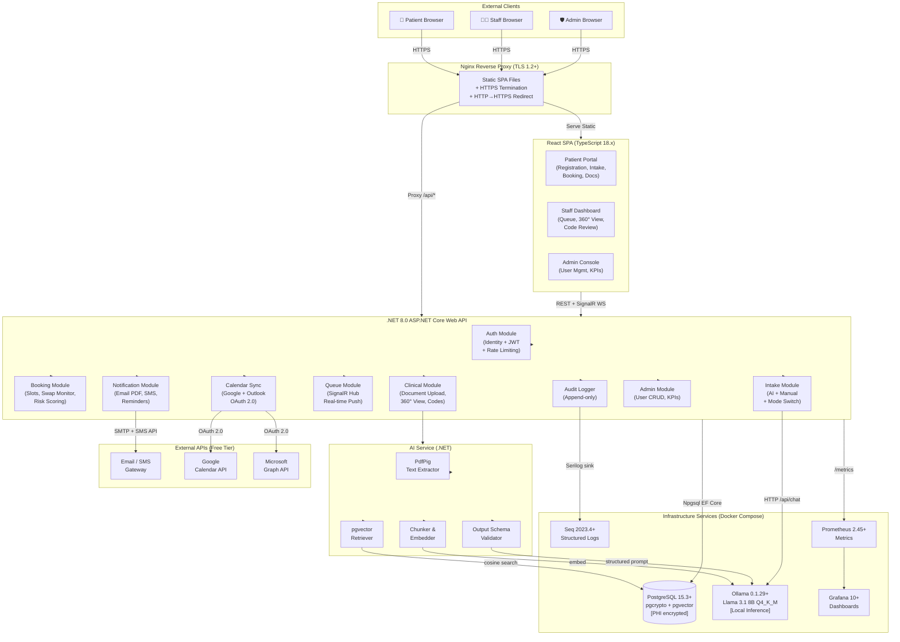
```mermaid
graph TB
    subgraph Browsers["External Clients"]
        PAT["🧑 Patient Browser"]
        STA["👩‍⚕️ Staff Browser"]
        ADM["🛡️ Admin Browser"]
    end

    subgraph NGINX["Nginx Reverse Proxy (TLS 1.2+)"]
        NX["Static SPA Files\n+ HTTPS Termination\n+ HTTP→HTTPS Redirect"]
    end

    subgraph SPA["React SPA (TypeScript 18.x)"]
        PP["Patient Portal\n(Registration, Intake,\nBooking, Docs)"]
        SD["Staff Dashboard\n(Queue, 360° View,\nCode Review)"]
        AC["Admin Console\n(User Mgmt, KPIs)"]
    end

    subgraph API[".NET 8.0 ASP.NET Core Web API"]
        AUTH["Auth Module\n(Identity + JWT\n+ Rate Limiting)"]
        BOOK["Booking Module\n(Slots, Swap Monitor,\nRisk Scoring)"]
        INT["Intake Module\n(AI + Manual\n+ Mode Switch)"]
        CLIN["Clinical Module\n(Document Upload,\n360° View, Codes)"]
        QUE["Queue Module\n(SignalR Hub\nReal-time Push)"]
        NOTIF["Notification Module\n(Email PDF, SMS,\nReminders)"]
        CAL["Calendar Sync\n(Google + Outlook\nOAuth 2.0)"]
        ADMIN["Admin Module\n(User CRUD, KPIs)"]
        AUDIT["Audit Logger\n(Append-only)"]
    end

    subgraph AISERVICE["AI Service (.NET)"]
        PDFPIG["PdfPig\nText Extractor"]
        CHUNK["Chunker &\nEmbedder"]
        RETR["pgvector\nRetriever"]
        VALID["Output Schema\nValidator"]
    end

    subgraph INFRA["Infrastructure Services (Docker Compose)"]
        PG[("PostgreSQL 15.3+\npgcrypto + pgvector\n[PHI encrypted]")]
        OL["Ollama 0.1.29+\nLlama 3.1 8B Q4_K_M\n[Local Inference]"]
        SEQ["Seq 2023.4+\nStructured Logs"]
        PROM["Prometheus 2.45+\nMetrics"]
        GRAF["Grafana 10+\nDashboards"]
    end

    subgraph EXT["External APIs (Free Tier)"]
        GW["Email / SMS\nGateway"]
        GCAL["Google\nCalendar API"]
        MSCAL["Microsoft\nGraph API"]
    end

    PAT & STA & ADM -->|HTTPS| NX
    NX -->|Serve Static| SPA
    NX -->|Proxy /api/*| API
    SPA -->|REST + SignalR WS| API

    API --> AUTH & BOOK & INT & CLIN & QUE & NOTIF & CAL & ADMIN & AUDIT
    CLIN --> AISERVICE
    AISERVICE --> PDFPIG & CHUNK & RETR & VALID
    CHUNK -->|embed| OL
    RETR -->|cosine search| PG
    VALID -->|structured prompt| OL

    API -->|Npgsql EF Core| PG
    AUDIT -->|Serilog sink| SEQ
    API -->|/metrics| PROM
    PROM --> GRAF
    NOTIF -->|SMTP + SMS API| GW
    CAL -->|OAuth 2.0| GCAL & MSCAL
    INT -->|HTTP /api/chat| OL
```

---

### Deployment Architecture Diagram

<!-- RENDER type="plantuml" src="./uml-models/deployment-architecture.png" -->

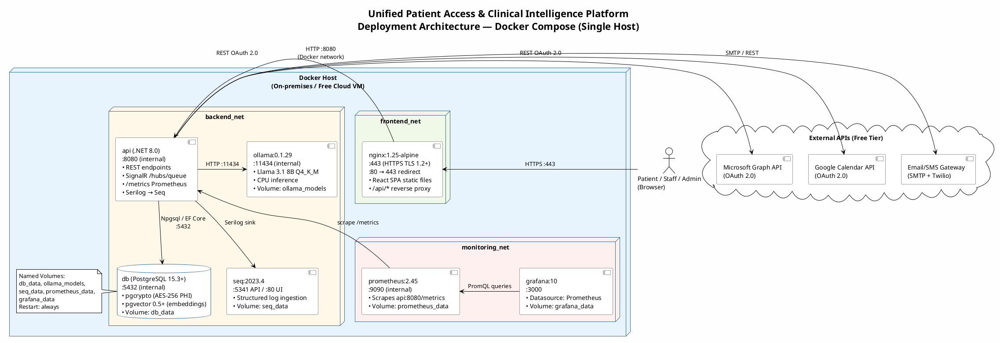
```plantuml
@startuml deployment-architecture
!theme plain
skinparam backgroundColor #FEFEFE
skinparam defaultFontName Arial
skinparam NodeBorderColor #336699
skinparam DatabaseBorderColor #336699
skinparam ComponentBorderColor #999999

title Unified Patient Access & Clinical Intelligence Platform\nDeployment Architecture — Docker Compose (Single Host)

node "Docker Host\n(On-premises / Free Cloud VM)" as HOST #E8F4FD {

    node "frontend_net" as FRONTNET #F0F8E8 {
        component "nginx:1.25-alpine\n:443 (HTTPS TLS 1.2+)\n:80 → 443 redirect\n• React SPA static files\n• /api/* reverse proxy" as NGINX
    }

    node "backend_net" as BACKNET #FFF8E8 {
        component "api (.NET 8.0)\n:8080 (internal)\n• REST endpoints\n• SignalR /hubs/queue\n• /metrics Prometheus\n• Serilog → Seq" as API

        database "db (PostgreSQL 15.3+)\n:5432 (internal)\n• pgcrypto (AES-256 PHI)\n• pgvector 0.5+ (embeddings)\n• Volume: db_data" as DB

        component "ollama:0.1.29\n:11434 (internal)\n• Llama 3.1 8B Q4_K_M\n• CPU inference\n• Volume: ollama_models" as OLLAMA

        component "seq:2023.4\n:5341 API / :80 UI\n• Structured log ingestion\n• Volume: seq_data" as SEQ
    }

    node "monitoring_net" as MONNET #FFF0F0 {
        component "prometheus:2.45\n:9090 (internal)\n• Scrapes api:8080/metrics\n• Volume: prometheus_data" as PROM

        component "grafana:10\n:3000\n• Datasource: Prometheus\n• Volume: grafana_data" as GRAF
    }

    note right of DB
        Named Volumes:
        db_data, ollama_models,
        seq_data, prometheus_data,
        grafana_data
        Restart: always
    end note
}

cloud "External APIs (Free Tier)" as EXT {
    component "Email/SMS Gateway\n(SMTP + Twilio)" as GW
    component "Google Calendar API\n(OAuth 2.0)" as GCAL
    component "Microsoft Graph API\n(OAuth 2.0)" as MSCAL
}

actor "Patient / Staff / Admin\n(Browser)" as USER

USER -right-> NGINX : HTTPS :443
NGINX -right-> API : HTTP :8080\n(Docker network)
API -down-> DB : Npgsql / EF Core\n:5432
API -right-> OLLAMA : HTTP :11434
API -down-> SEQ : Serilog sink
PROM -up-> API : scrape /metrics
GRAF -left-> PROM : PromQL queries
API -right-> GW : SMTP / REST
API -right-> GCAL : REST OAuth 2.0
API -right-> MSCAL : REST OAuth 2.0

@enduml
```

#### Enhanced Deployment Details

| Component | Specification | Source |
|-----------|---------------|--------|
| Compute | Single Docker host; minimum 8 GB RAM for Ollama (Q4_K_M ~5 GB) + API + DB | TR-004, Assumption 10 |
| Database | PostgreSQL 15.3+, single instance, volume-backed, pgcrypto + pgvector extensions | TR-003, DR-001, DR-006 |
| AI Inference | Ollama CPU-only, Llama 3.1 8B Q4_K_M, 128K context, volume-backed model cache | TR-004, AIR-001, AIR-008 |
| Security | Nginx TLS 1.2+ termination, HTTP→HTTPS redirect, JWT auth on all API routes | TR-008, NFR-005, NFR-004 |
| Monitoring | Prometheus scrapes `/metrics` every 15s; Grafana dashboards on port 3000 | TR-015, NFR-002 |
| Logging | Seq single-instance free tier; Serilog structured sink from .NET API | TR-016, NFR-006 |

---

### Data Flow Diagram

<!-- RENDER type="plantuml" src="./uml-models/data-flow.png" -->

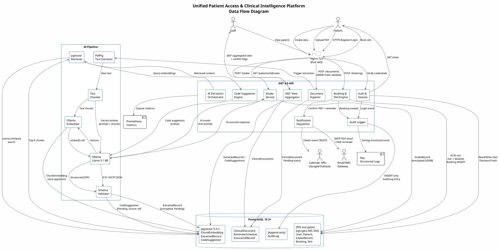
```plantuml
@startuml data-flow
!theme plain
skinparam backgroundColor #FEFEFE
skinparam defaultFontName Arial
skinparam ArrowColor #555555
skinparam RectangleBorderColor #336699
skinparam DatabaseBorderColor #336699
skinparam BoundaryBorderColor #999999

title Unified Patient Access & Clinical Intelligence Platform\nData Flow Diagram

' External entities
actor "Patient" as PAT
actor "Staff" as STA
actor "Email/SMS\nGateway" as GW
actor "Calendar APIs\n(Google/Outlook)" as CAL

boundary "Nginx TLS\n(Port 443)" as NGINX

' Main system
rectangle ".NET 8.0 API" as APIBOX {
    rectangle "Auth &\nSession" as AUTHSVC
    rectangle "Booking &\nSlot Engine" as BOOKSVC
    rectangle "Intake\nService" as INTSVC
    rectangle "Notification\nDispatcher" as NOTIFSVC
    rectangle "Document\nIngestor" as DOCSVC
    rectangle "AI Extraction\nOrchestrator" as AIORCH
    rectangle "Code Suggestion\nEngine" as CODESVC
    rectangle "360° View\nAggregator" as VIEWSVC
    rectangle "Audit Logger" as AUDITLOG
}

rectangle "AI Pipeline" as AIPIPE {
    rectangle "PdfPig\nText Extractor" as PDFEXT
    rectangle "Text\nChunker" as CHUNKER
    rectangle "Ollama\nEmbedder" as EMBEDDER
    rectangle "pgvector\nRetriever" as RETRIEVER
    rectangle "Ollama\nLlama 3.1 8B" as LLM
    rectangle "Schema\nValidator" as SCHVAL
}

database "PostgreSQL 15.3+" as DB {
    rectangle "[PHI encrypted\npgcrypto AES-256]\nUser, Patient,\nIntakeRecord,\nBooking, Slot" as DB1
    rectangle "[Append-only]\nAuditLog" as DB2
    rectangle "[pgvector 0.5+]\nChunkEmbedding\nExtractedRecord\nCodeSuggestion" as DB3
    rectangle "ClinicalDocument\nReminderSchedule\nInsuranceRecord" as DB4
}

component "Seq\nStructured Logs" as SEQ
component "Prometheus\n/metrics" as PROM

' ── Registration & Auth ──
PAT -right-> NGINX : HTTPS Register/Login
NGINX -right-> AUTHSVC : Verify credentials
AUTHSVC --> DB1 : Read/Write User\nPassword hash
AUTHSVC -down-> AUDITLOG : Login event
AUTHSVC --> PAT : JWT token

' ── Booking Flow ──
PAT -right-> NGINX : Book slot
NGINX --> BOOKSVC : POST /bookings
BOOKSVC --> DB1 : ACID txn:\nslot → Booked,\nBooking INSERT
BOOKSVC --> NOTIFSVC : Confirm PDF + reminder
NOTIFSVC --> GW : SMTP PDF email\n+ SMS reminder
NOTIFSVC --> CAL : OAuth event CREATE
BOOKSVC --> AUDITLOG : Booking created

' ── Intake Flow ──
PAT -right-> NGINX : Intake data
NGINX --> INTSVC : POST /intake
INTSVC --> LLM : AI mode:\nchat prompt
LLM --> INTSVC : Structured response
INTSVC --> DB1 : IntakeRecord\n[encrypted JSONB]

' ── Document Upload ──
PAT --> NGINX : Upload PDF
NGINX --> DOCSVC : POST /documents\n(MIME+hash validate)
DOCSVC --> DB4 : ClinicalDocument\nPending status

' ── AI Extraction Pipeline ──
DOCSVC -down-> PDFEXT : Trigger extraction
PDFEXT --> CHUNKER : Raw text
CHUNKER --> EMBEDDER : Text chunks
EMBEDDER --> LLM : embed() call
LLM --> EMBEDDER : Vectors
EMBEDDER --> DB3 : ChunkEmbedding\nstore (pgvector)
CHUNKER --> LLM : Extract entities\n(prompt + chunks)
LLM --> SCHVAL : Structured JSON
SCHVAL --> DB3 : ExtractedRecord\n[encrypted, Pending]

' ── Code Suggestion ──
AIORCH --> RETRIEVER : Query embeddings
RETRIEVER --> DB3 : cosine similarity\nsearch
DB3 --> RETRIEVER : Top-K chunks
RETRIEVER --> CODESVC : Retrieved context
CODESVC --> LLM : Code suggestion\nprompt
LLM --> SCHVAL : ICD-10/CPT JSON
SCHVAL --> DB3 : CodeSuggestion\n[Pending, source ref]

' ── 360° View ──
STA --> NGINX : View patient
NGINX --> VIEWSVC : GET /patients/{id}/view
VIEWSVC --> DB3 : ExtractedRecords +\nCodeSuggestions
VIEWSVC --> DB4 : ClinicalDocuments
VIEWSVC --> STA : 360° aggregated view\n+ conflict flags

' ── Audit & Monitoring ──
AUDITLOG --> DB2 : INSERT-only\nAuditLog entry
AUDITLOG --> SEQ : Serilog structured event
APIBOX --> PROM : Expose /metrics

@enduml
```

---

### Logical Data Model (ERD)

<!-- RENDER type="mermaid" src="./uml-models/logical-data-model.png" -->

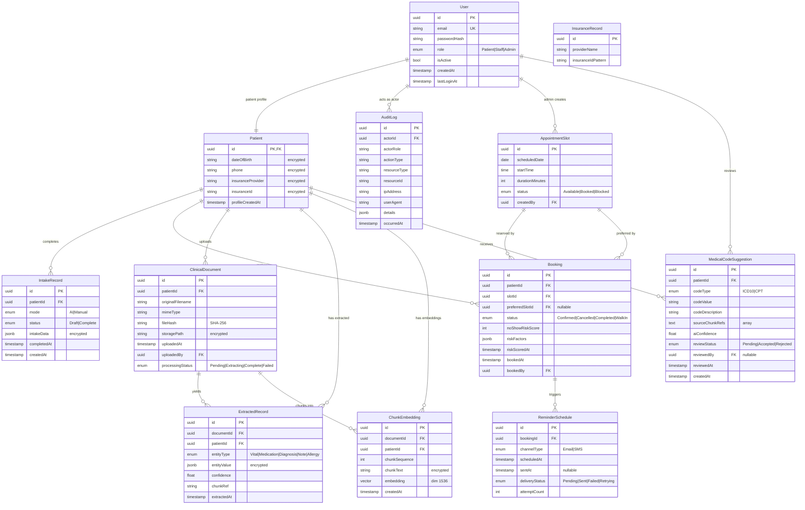
```mermaid
erDiagram
    User {
        uuid id PK
        string email UK
        string passwordHash
        enum role "Patient|Staff|Admin"
        bool isActive
        timestamp createdAt
        timestamp lastLoginAt
    }

    Patient {
        uuid id PK,FK
        string dateOfBirth "encrypted"
        string phone "encrypted"
        string insuranceProvider "encrypted"
        string insuranceId "encrypted"
        timestamp profileCreatedAt
    }

    IntakeRecord {
        uuid id PK
        uuid patientId FK
        enum mode "AI|Manual"
        enum status "Draft|Complete"
        jsonb intakeData "encrypted"
        timestamp completedAt
        timestamp createdAt
    }

    AppointmentSlot {
        uuid id PK
        date scheduledDate
        time startTime
        int durationMinutes
        enum status "Available|Booked|Blocked"
        uuid createdBy FK
    }

    Booking {
        uuid id PK
        uuid patientId FK
        uuid slotId FK
        uuid preferredSlotId FK "nullable"
        enum status "Confirmed|Cancelled|Completed|WalkIn"
        int noShowRiskScore
        jsonb riskFactors
        timestamp riskScoredAt
        timestamp bookedAt
        uuid bookedBy FK
    }

    ClinicalDocument {
        uuid id PK
        uuid patientId FK
        string originalFilename
        string mimeType
        string fileHash "SHA-256"
        string storagePath "encrypted"
        timestamp uploadedAt
        uuid uploadedBy FK
        enum processingStatus "Pending|Extracting|Complete|Failed"
    }

    ExtractedRecord {
        uuid id PK
        uuid documentId FK
        uuid patientId FK
        enum entityType "Vital|Medication|Diagnosis|Note|Allergy"
        jsonb entityValue "encrypted"
        float confidence
        string chunkRef
        timestamp extractedAt
    }

    ChunkEmbedding {
        uuid id PK
        uuid documentId FK
        uuid patientId FK
        int chunkSequence
        string chunkText "encrypted"
        vector embedding "dim 1536"
        timestamp createdAt
    }

    MedicalCodeSuggestion {
        uuid id PK
        uuid patientId FK
        enum codeType "ICD10|CPT"
        string codeValue
        string codeDescription
        text sourceChunkRefs "array"
        float aiConfidence
        enum reviewStatus "Pending|Accepted|Rejected"
        uuid reviewedBy FK "nullable"
        timestamp reviewedAt
        timestamp createdAt
    }

    AuditLog {
        uuid id PK
        uuid actorId FK
        string actorRole
        string actionType
        string resourceType
        string resourceId
        string ipAddress
        string userAgent
        jsonb details
        timestamp occurredAt
    }

    ReminderSchedule {
        uuid id PK
        uuid bookingId FK
        enum channelType "Email|SMS"
        timestamp scheduledAt
        timestamp sentAt "nullable"
        enum deliveryStatus "Pending|Sent|Failed|Retrying"
        int attemptCount
    }

    InsuranceRecord {
        uuid id PK
        string providerName
        string insuranceIdPattern
    }

    User ||--|| Patient : "patient profile"
    User ||--o{ AuditLog : "acts as actor"
    User ||--o{ AppointmentSlot : "admin creates"
    Patient ||--o{ IntakeRecord : "completes"
    Patient ||--o{ Booking : "makes"
    Patient ||--o{ ClinicalDocument : "uploads"
    Patient ||--o{ ExtractedRecord : "has extracted"
    Patient ||--o{ ChunkEmbedding : "has embeddings"
    Patient ||--o{ MedicalCodeSuggestion : "receives"
    AppointmentSlot ||--o{ Booking : "reserved by"
    AppointmentSlot ||--o{ Booking : "preferred by"
    Booking ||--o{ ReminderSchedule : "triggers"
    ClinicalDocument ||--o{ ExtractedRecord : "yields"
    ClinicalDocument ||--o{ ChunkEmbedding : "chunks into"
    User ||--o{ MedicalCodeSuggestion : "reviews"
```

---

### AI Architecture Diagrams

#### RAG Pipeline Diagram

<!-- RENDER type="plantuml" src="./uml-models/rag-pipeline.png" -->

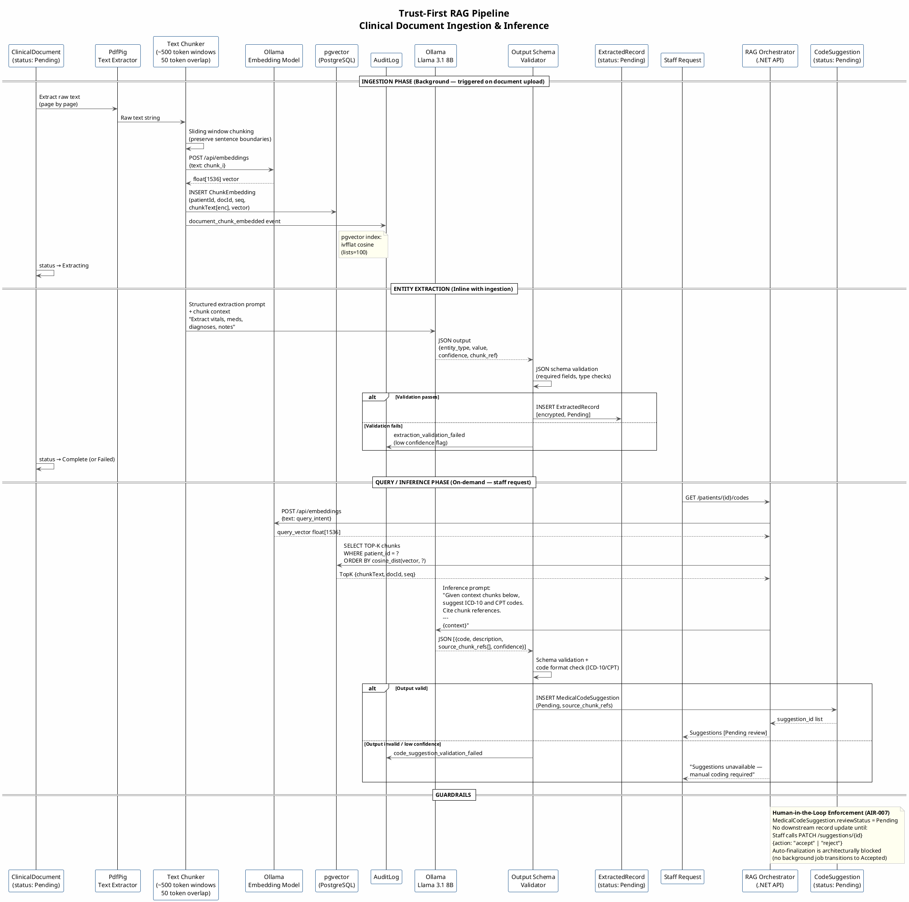
```plantuml
@startuml rag-pipeline
!theme plain
skinparam backgroundColor #FEFEFE
skinparam defaultFontName Arial
skinparam ArrowColor #555555
skinparam SequenceBoxBorderColor #336699
skinparam ParticipantBorderColor #336699
skinparam NoteBackgroundColor #FFFFF0
skinparam NoteBorderColor #CCCCCC

title Trust-First RAG Pipeline\nClinical Document Ingestion & Inference

== INGESTION PHASE (Background — triggered on document upload) ==

participant "ClinicalDocument\n(status: Pending)" as DOC
participant "PdfPig\nText Extractor" as PDF
participant "Text Chunker\n(~500 token windows\n50 token overlap)" as CHUNK
participant "Ollama\nEmbedding Model" as EMBED
participant "pgvector\n(PostgreSQL)" as VEC
participant "AuditLog" as AUDIT

DOC -> PDF : Extract raw text\n(page by page)
PDF -> CHUNK : Raw text string
CHUNK -> CHUNK : Sliding window chunking\n(preserve sentence boundaries)
CHUNK -> EMBED : POST /api/embeddings\n{text: chunk_i}
EMBED --> CHUNK : float[1536] vector
CHUNK -> VEC : INSERT ChunkEmbedding\n(patientId, docId, seq,\nchunkText[enc], vector)
CHUNK -> AUDIT : document_chunk_embedded event

note right of VEC
    pgvector index:
    ivfflat cosine
    (lists=100)
end note

DOC -> DOC : status → Extracting

== ENTITY EXTRACTION (Inline with ingestion) ==

participant "Ollama\nLlama 3.1 8B" as LLM
participant "Output Schema\nValidator" as VAL
participant "ExtractedRecord\n(status: Pending)" as ER

CHUNK -> LLM : Structured extraction prompt\n+ chunk context\n"Extract vitals, meds,\ndiagnoses, notes"
LLM --> VAL : JSON output\n{entity_type, value,\nconfidence, chunk_ref}
VAL -> VAL : JSON schema validation\n(required fields, type checks)
alt Validation passes
    VAL -> ER : INSERT ExtractedRecord\n[encrypted, Pending]
else Validation fails
    VAL -> AUDIT : extraction_validation_failed\n(low confidence flag)
end

DOC -> DOC : status → Complete (or Failed)

== QUERY / INFERENCE PHASE (On-demand — staff request) ==

participant "Staff Request" as STAFF
participant "RAG Orchestrator\n(.NET API)" as ORCH
participant "CodeSuggestion\n(status: Pending)" as CS

STAFF -> ORCH : GET /patients/{id}/codes
ORCH -> EMBED : POST /api/embeddings\n{text: query_intent}
EMBED --> ORCH : query_vector float[1536]
ORCH -> VEC : SELECT TOP-K chunks\nWHERE patient_id = ?\nORDER BY cosine_dist(vector, ?)
VEC --> ORCH : TopK {chunkText, docId, seq}

ORCH -> LLM : Inference prompt:\n"Given context chunks below,\nsuggest ICD-10 and CPT codes.\nCite chunk references.\n---\n{context}"
LLM --> VAL : JSON [{code, description,\nsource_chunk_refs[], confidence}]
VAL -> VAL : Schema validation +\ncode format check (ICD-10/CPT)
alt Output valid
    VAL -> CS : INSERT MedicalCodeSuggestion\n(Pending, source_chunk_refs)
    CS --> ORCH : suggestion_id list
    ORCH --> STAFF : Suggestions [Pending review]
else Output invalid / low confidence
    VAL -> AUDIT : code_suggestion_validation_failed
    ORCH --> STAFF : "Suggestions unavailable —\nmanual coding required"
end

== GUARDRAILS ==

note over CS
    **Human-in-the-Loop Enforcement (AIR-007)**
    MedicalCodeSuggestion.reviewStatus = Pending
    No downstream record update until:
    Staff calls PATCH /suggestions/{id}
    {action: "accept" | "reject"}
    Auto-finalization is architecturally blocked
    (no background job transitions to Accepted)
end note

@enduml
```

#### AI Sequence Diagram — UC-007: AI Conversational Intake

<!-- RENDER type="mermaid" src="./uml-models/ai-seq-uc-007.png" -->

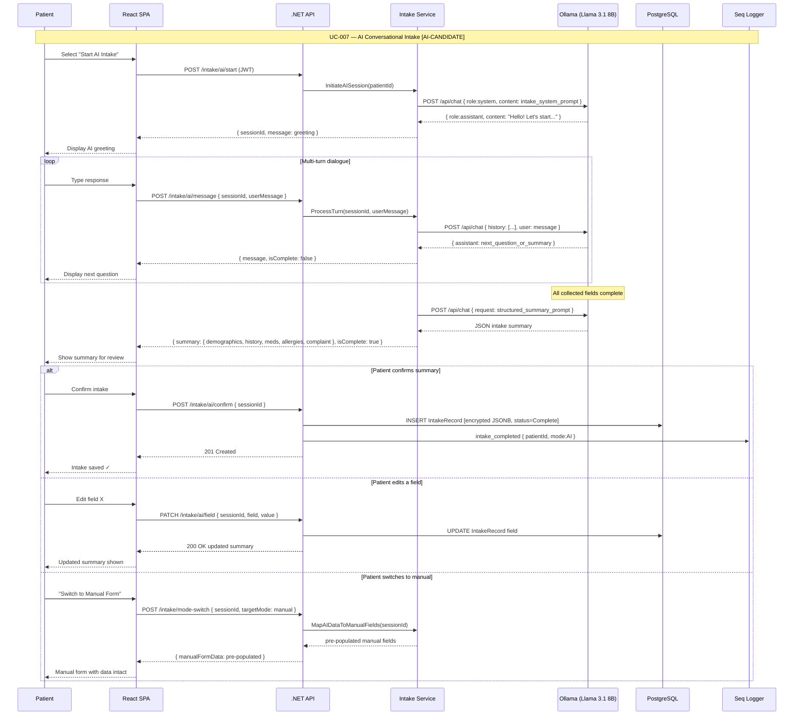
```mermaid
sequenceDiagram
    participant P as Patient
    participant SPA as React SPA
    participant API as .NET API
    participant INTSVC as Intake Service
    participant OL as Ollama (Llama 3.1 8B)
    participant DB as PostgreSQL
    participant SEQ as Seq Logger

    Note over P,SEQ: UC-007 — AI Conversational Intake [AI-CANDIDATE]

    P->>SPA: Select "Start AI Intake"
    SPA->>API: POST /intake/ai/start (JWT)
    API->>INTSVC: InitiateAISession(patientId)
    INTSVC->>OL: POST /api/chat { role:system, content: intake_system_prompt }
    OL-->>INTSVC: { role:assistant, content: "Hello! Let's start..." }
    INTSVC-->>SPA: { sessionId, message: greeting }
    SPA-->>P: Display AI greeting

    loop Multi-turn dialogue
        P->>SPA: Type response
        SPA->>API: POST /intake/ai/message { sessionId, userMessage }
        API->>INTSVC: ProcessTurn(sessionId, userMessage)
        INTSVC->>OL: POST /api/chat { history: [...], user: message }
        OL-->>INTSVC: { assistant: next_question_or_summary }
        INTSVC-->>SPA: { message, isComplete: false }
        SPA-->>P: Display next question
    end

    Note over OL: All collected fields complete
    INTSVC->>OL: POST /api/chat { request: structured_summary_prompt }
    OL-->>INTSVC: JSON intake summary
    INTSVC-->>SPA: { summary: { demographics, history, meds, allergies, complaint }, isComplete: true }
    SPA-->>P: Show summary for review

    alt Patient confirms summary
        P->>SPA: Confirm intake
        SPA->>API: POST /intake/ai/confirm { sessionId }
        API->>DB: INSERT IntakeRecord [encrypted JSONB, status=Complete]
        API->>SEQ: intake_completed { patientId, mode:AI }
        API-->>SPA: 201 Created
        SPA-->>P: Intake saved ✓
    else Patient edits a field
        P->>SPA: Edit field X
        SPA->>API: PATCH /intake/ai/field { sessionId, field, value }
        API->>DB: UPDATE IntakeRecord field
        API-->>SPA: 200 OK updated summary
        SPA-->>P: Updated summary shown
    else Patient switches to manual
        P->>SPA: "Switch to Manual Form"
        SPA->>API: POST /intake/mode-switch { sessionId, targetMode: manual }
        API->>INTSVC: MapAIDataToManualFields(sessionId)
        INTSVC-->>API: pre-populated manual fields
        API-->>SPA: { manualFormData: pre-populated }
        SPA-->>P: Manual form with data intact
    end
```

#### AI Sequence Diagram — UC-026: AI Extracts and De-duplicates Clinical Data

<!-- RENDER type="mermaid" src="./uml-models/ai-seq-uc-026.png" -->

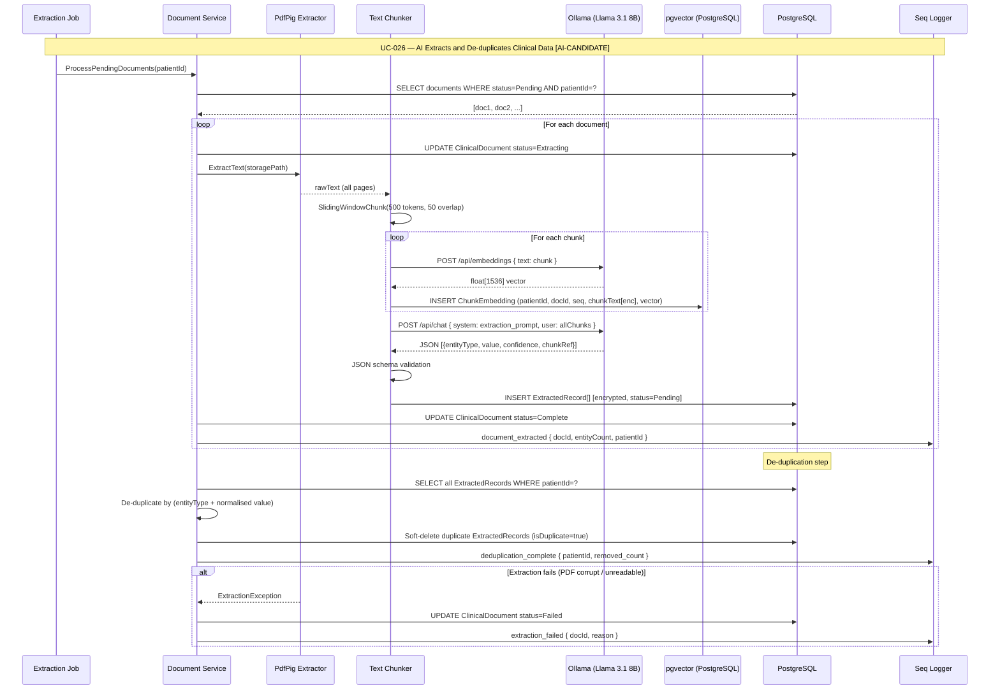
```mermaid
sequenceDiagram
    participant TRIGGER as Extraction Job
    participant DOCSVC as Document Service
    participant PDFPIG as PdfPig Extractor
    participant CHUNKER as Text Chunker
    participant OL as Ollama (Llama 3.1 8B)
    participant VEC as pgvector (PostgreSQL)
    participant DB as PostgreSQL
    participant SEQ as Seq Logger

    Note over TRIGGER,SEQ: UC-026 — AI Extracts and De-duplicates Clinical Data [AI-CANDIDATE]

    TRIGGER->>DOCSVC: ProcessPendingDocuments(patientId)
    DOCSVC->>DB: SELECT documents WHERE status=Pending AND patientId=?
    DB-->>DOCSVC: [doc1, doc2, ...]

    loop For each document
        DOCSVC->>DB: UPDATE ClinicalDocument status=Extracting
        DOCSVC->>PDFPIG: ExtractText(storagePath)
        PDFPIG-->>CHUNKER: rawText (all pages)
        CHUNKER->>CHUNKER: SlidingWindowChunk(500 tokens, 50 overlap)
        loop For each chunk
            CHUNKER->>OL: POST /api/embeddings { text: chunk }
            OL-->>CHUNKER: float[1536] vector
            CHUNKER->>VEC: INSERT ChunkEmbedding (patientId, docId, seq, chunkText[enc], vector)
        end
        CHUNKER->>OL: POST /api/chat { system: extraction_prompt, user: allChunks }
        OL-->>CHUNKER: JSON [{entityType, value, confidence, chunkRef}]
        CHUNKER->>CHUNKER: JSON schema validation
        CHUNKER->>DB: INSERT ExtractedRecord[] [encrypted, status=Pending]
        DOCSVC->>DB: UPDATE ClinicalDocument status=Complete
        DOCSVC->>SEQ: document_extracted { docId, entityCount, patientId }
    end

    Note over DB: De-duplication step
    DOCSVC->>DB: SELECT all ExtractedRecords WHERE patientId=?
    DOCSVC->>DOCSVC: De-duplicate by (entityType + normalised value)
    DOCSVC->>DB: Soft-delete duplicate ExtractedRecords (isDuplicate=true)
    DOCSVC->>SEQ: deduplication_complete { patientId, removed_count }

    alt Extraction fails (PDF corrupt / unreadable)
        PDFPIG-->>DOCSVC: ExtractionException
        DOCSVC->>DB: UPDATE ClinicalDocument status=Failed
        DOCSVC->>SEQ: extraction_failed { docId, reason }
    end
```

#### AI Sequence Diagram — UC-027: Data Conflict Detected and Surfaced

<!-- RENDER type="mermaid" src="./uml-models/ai-seq-uc-027.png" -->

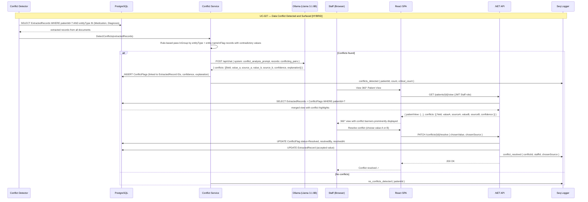
```mermaid
sequenceDiagram
    participant TRIGGER as Conflict Detector
    participant DB as PostgreSQL
    participant CONFLICTSVC as Conflict Service
    participant OL as Ollama (Llama 3.1 8B)
    participant STAFF as Staff (Browser)
    participant SPA as React SPA
    participant API as .NET API
    participant SEQ as Seq Logger

    Note over TRIGGER,SEQ: UC-027 — Data Conflict Detected and Surfaced [HYBRID]

    TRIGGER->>DB: SELECT ExtractedRecords WHERE patientId=? AND entityType IN (Medication, Diagnosis)
    DB-->>TRIGGER: extracted records from all documents

    TRIGGER->>CONFLICTSVC: DetectConflicts(extractedRecords)
    CONFLICTSVC->>CONFLICTSVC: Rule-based pass:\nGroup by entityType + entity name\nFlag records with contradictory values

    alt Conflicts found
        CONFLICTSVC->>OL: POST /api/chat { system: conflict_analysis_prompt, records: conflicting_pairs }
        OL-->>CONFLICTSVC: { conflicts: [{field, value_a, source_a, value_b, source_b, confidence, explanation}] }
        CONFLICTSVC->>DB: INSERT ConflictFlags (linked to ExtractedRecord IDs, confidence, explanation)
        CONFLICTSVC->>SEQ: conflicts_detected { patientId, count, critical_count }

        STAFF->>SPA: View 360° Patient View
        SPA->>API: GET /patients/{id}/view (JWT Staff role)
        API->>DB: SELECT ExtractedRecords + ConflictFlags WHERE patientId=?
        DB-->>API: merged view with conflict highlights
        API-->>SPA: { patientView: {...}, conflicts: [{ field, valueA, sourceA, valueB, sourceB, confidence }] }
        SPA-->>STAFF: 360° view with conflict banners prominently displayed

        STAFF->>SPA: Resolve conflict (choose value A or B)
        SPA->>API: PATCH /conflicts/{id}/resolve { chosenValue, chosenSource }
        API->>DB: UPDATE ConflictFlag status=Resolved, resolvedBy, resolvedAt
        API->>DB: UPDATE ExtractedRecord (accepted value)
        API->>SEQ: conflict_resolved { conflictId, staffId, chosenSource }
        API-->>SPA: 200 OK
        SPA-->>STAFF: Conflict resolved ✓
    else No conflicts
        CONFLICTSVC->>SEQ: no_conflicts_detected { patientId }
    end
```

#### AI Sequence Diagram — UC-030: AI Suggests Medical Codes

<!-- RENDER type="mermaid" src="./uml-models/ai-seq-uc-030.png" -->

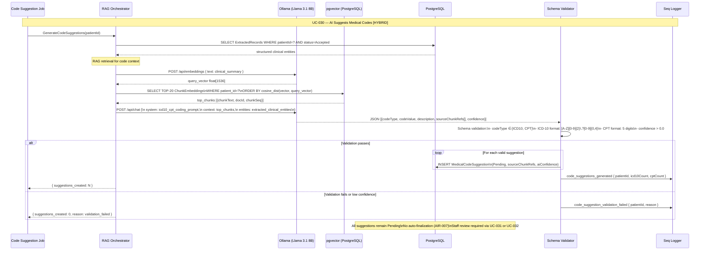
```mermaid
sequenceDiagram
    participant TRIGGER as Code Suggestion Job
    participant ORCH as RAG Orchestrator
    participant OL as Ollama (Llama 3.1 8B)
    participant VEC as pgvector (PostgreSQL)
    participant DB as PostgreSQL
    participant VAL as Schema Validator
    participant SEQ as Seq Logger

    Note over TRIGGER,SEQ: UC-030 — AI Suggests Medical Codes [HYBRID]

    TRIGGER->>ORCH: GenerateCodeSuggestions(patientId)
    ORCH->>DB: SELECT ExtractedRecords WHERE patientId=? AND status=Accepted
    DB-->>ORCH: structured clinical entities

    Note over ORCH: RAG retrieval for code context
    ORCH->>OL: POST /api/embeddings { text: clinical_summary }
    OL-->>ORCH: query_vector float[1536]
    ORCH->>VEC: SELECT TOP-20 ChunkEmbeddings\nWHERE patient_id=?\nORDER BY cosine_dist(vector, query_vector)
    VEC-->>ORCH: top_chunks [{chunkText, docId, chunkSeq}]

    ORCH->>OL: POST /api/chat {\n  system: icd10_cpt_coding_prompt,\n  context: top_chunks,\n  entities: extracted_clinical_entities\n}
    OL-->>VAL: JSON [{codeType, codeValue, description, sourceChunkRefs[], confidence}]

    VAL->>VAL: Schema validation:\n- codeType ∈ {ICD10, CPT}\n- ICD-10 format: [A-Z][0-9]{2}\.?[0-9]{0,4}\n- CPT format: 5 digits\n- confidence > 0.0

    alt Validation passes
        loop For each valid suggestion
            VAL->>DB: INSERT MedicalCodeSuggestion\n(Pending, sourceChunkRefs, aiConfidence)
        end
        VAL->>SEQ: code_suggestions_generated { patientId, icd10Count, cptCount }
        ORCH-->>TRIGGER: { suggestions_created: N }
    else Validation fails or low confidence
        VAL->>SEQ: code_suggestion_validation_failed { patientId, reason }
        ORCH-->>TRIGGER: { suggestions_created: 0, reason: validation_failed }
    end

    Note over DB: All suggestions remain Pending\nNo auto-finalization (AIR-007)\nStaff review required via UC-031 or UC-032
```

---

## Use Case Sequence Diagrams

### UC-001: Patient Self-Registration
**Source:** `spec.md#UC-001`

<!-- RENDER type="mermaid" src="./uml-models/seq-uc-001.png" -->

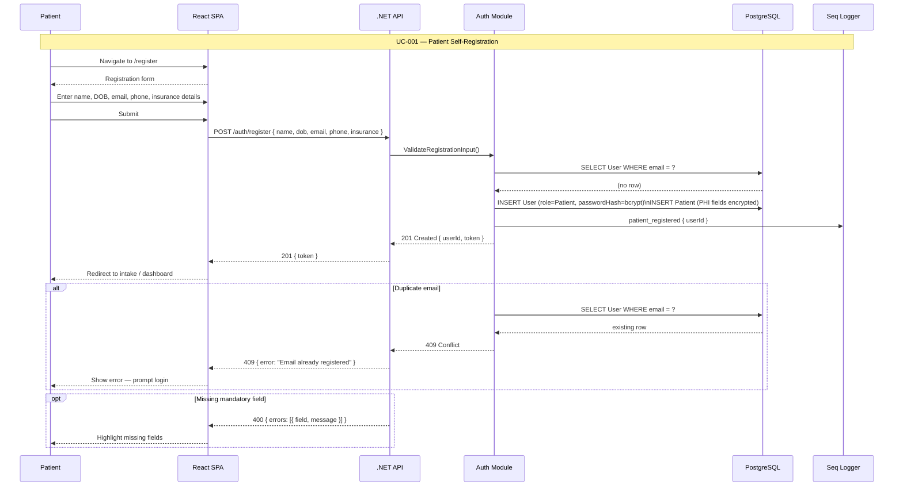
```mermaid
sequenceDiagram
    participant P as Patient
    participant SPA as React SPA
    participant API as .NET API
    participant AUTH as Auth Module
    participant DB as PostgreSQL
    participant SEQ as Seq Logger

    Note over P,SEQ: UC-001 — Patient Self-Registration

    P->>SPA: Navigate to /register
    SPA-->>P: Registration form
    P->>SPA: Enter name, DOB, email, phone, insurance details
    P->>SPA: Submit
    SPA->>API: POST /auth/register { name, dob, email, phone, insurance }
    API->>AUTH: ValidateRegistrationInput()
    AUTH->>DB: SELECT User WHERE email = ?
    DB-->>AUTH: (no row)
    AUTH->>DB: INSERT User (role=Patient, passwordHash=bcrypt)\nINSERT Patient (PHI fields encrypted)
    AUTH->>SEQ: patient_registered { userId }
    AUTH-->>API: 201 Created { userId, token }
    API-->>SPA: 201 { token }
    SPA-->>P: Redirect to intake / dashboard

    alt Duplicate email
        AUTH->>DB: SELECT User WHERE email = ?
        DB-->>AUTH: existing row
        AUTH-->>API: 409 Conflict
        API-->>SPA: 409 { error: "Email already registered" }
        SPA-->>P: Show error — prompt login
    end

    opt Missing mandatory field
        API-->>SPA: 400 { errors: [{ field, message }] }
        SPA-->>P: Highlight missing fields
    end
```

---

### UC-002: Staff-Assisted Walk-in Account Creation
**Source:** `spec.md#UC-002`

<!-- RENDER type="mermaid" src="./uml-models/seq-uc-002.png" -->

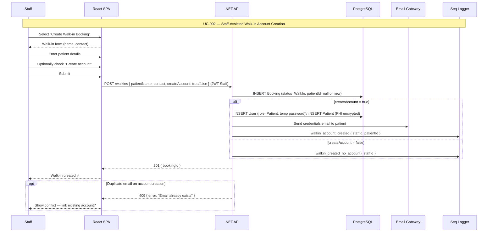
```mermaid
sequenceDiagram
    participant S as Staff
    participant SPA as React SPA
    participant API as .NET API
    participant DB as PostgreSQL
    participant GW as Email Gateway
    participant SEQ as Seq Logger

    Note over S,SEQ: UC-002 — Staff-Assisted Walk-in Account Creation

    S->>SPA: Select "Create Walk-in Booking"
    SPA-->>S: Walk-in form (name, contact)
    S->>SPA: Enter patient details
    S->>SPA: Optionally check "Create account"
    S->>SPA: Submit
    SPA->>API: POST /walkins { patientName, contact, createAccount: true/false } (JWT Staff)
    API->>DB: INSERT Booking (status=WalkIn, patientId=null or new)

    alt createAccount = true
        API->>DB: INSERT User (role=Patient, temp password)\nINSERT Patient (PHI encrypted)
        API->>GW: Send credentials email to patient
        API->>SEQ: walkin_account_created { staffId, patientId }
    else createAccount = false
        API->>SEQ: walkin_created_no_account { staffId }
    end

    API-->>SPA: 201 { bookingId }
    SPA-->>S: Walk-in created ✓

    opt Duplicate email on account creation
        API-->>SPA: 409 { error: "Email already exists" }
        SPA-->>S: Show conflict — link existing account?
    end
```

---

### UC-003: Multi-Role User Login
**Source:** `spec.md#UC-003`

<!-- RENDER type="mermaid" src="./uml-models/seq-uc-003.png" -->

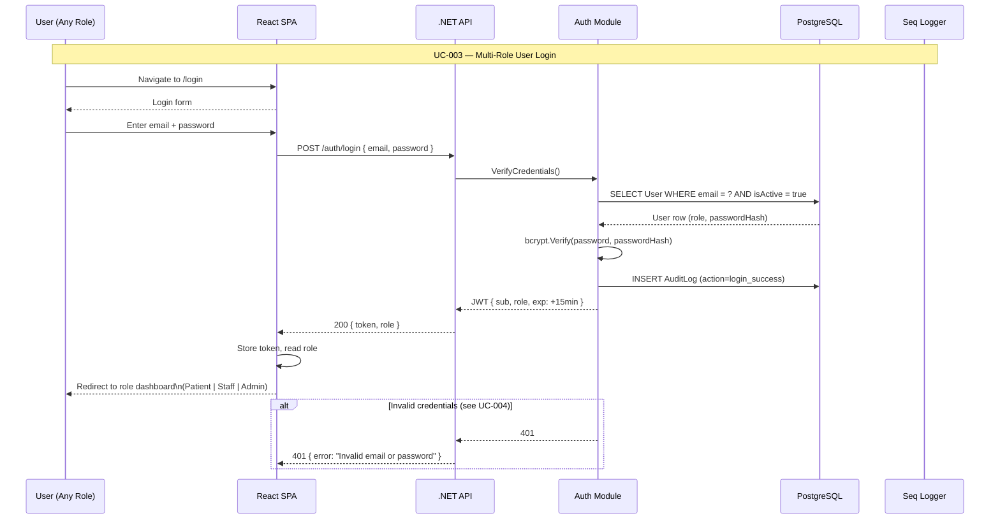
```mermaid
sequenceDiagram
    participant U as User (Any Role)
    participant SPA as React SPA
    participant API as .NET API
    participant AUTH as Auth Module
    participant DB as PostgreSQL
    participant SEQ as Seq Logger

    Note over U,SEQ: UC-003 — Multi-Role User Login

    U->>SPA: Navigate to /login
    SPA-->>U: Login form
    U->>SPA: Enter email + password
    SPA->>API: POST /auth/login { email, password }
    API->>AUTH: VerifyCredentials()
    AUTH->>DB: SELECT User WHERE email = ? AND isActive = true
    DB-->>AUTH: User row (role, passwordHash)
    AUTH->>AUTH: bcrypt.Verify(password, passwordHash)
    AUTH->>DB: INSERT AuditLog (action=login_success)
    AUTH-->>API: JWT { sub, role, exp: +15min }
    API-->>SPA: 200 { token, role }
    SPA->>SPA: Store token, read role
    SPA-->>U: Redirect to role dashboard\n(Patient | Staff | Admin)

    alt Invalid credentials (see UC-004)
        AUTH-->>API: 401
        API-->>SPA: 401 { error: "Invalid email or password" }
    end
```

---

### UC-004: Login Failure
**Source:** `spec.md#UC-004`

<!-- RENDER type="mermaid" src="./uml-models/seq-uc-004.png" -->

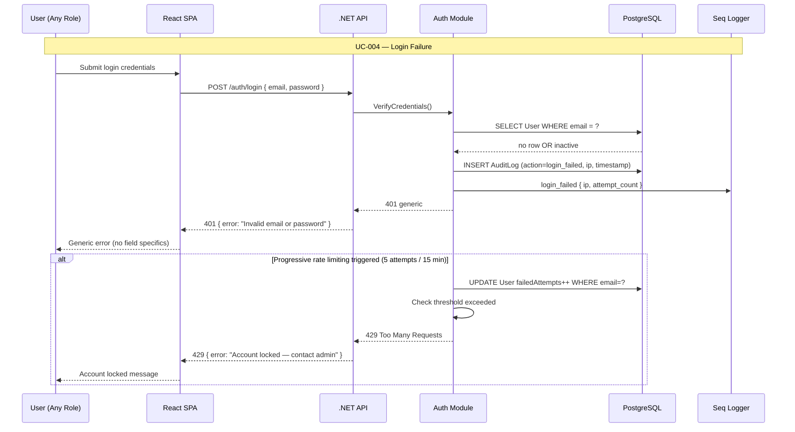
```mermaid
sequenceDiagram
    participant U as User (Any Role)
    participant SPA as React SPA
    participant API as .NET API
    participant AUTH as Auth Module
    participant DB as PostgreSQL
    participant SEQ as Seq Logger

    Note over U,SEQ: UC-004 — Login Failure

    U->>SPA: Submit login credentials
    SPA->>API: POST /auth/login { email, password }
    API->>AUTH: VerifyCredentials()
    AUTH->>DB: SELECT User WHERE email = ?
    DB-->>AUTH: no row OR inactive
    AUTH->>DB: INSERT AuditLog (action=login_failed, ip, timestamp)
    AUTH->>SEQ: login_failed { ip, attempt_count }
    AUTH-->>API: 401 generic
    API-->>SPA: 401 { error: "Invalid email or password" }
    SPA-->>U: Generic error (no field specifics)

    alt Progressive rate limiting triggered (5 attempts / 15 min)
        AUTH->>DB: UPDATE User failedAttempts++ WHERE email=?
        AUTH->>AUTH: Check threshold exceeded
        AUTH-->>API: 429 Too Many Requests
        API-->>SPA: 429 { error: "Account locked — contact admin" }
        SPA-->>U: Account locked message
    end
```

---

### UC-005: Session Timeout
**Source:** `spec.md#UC-005`

<!-- RENDER type="mermaid" src="./uml-models/seq-uc-005.png" -->

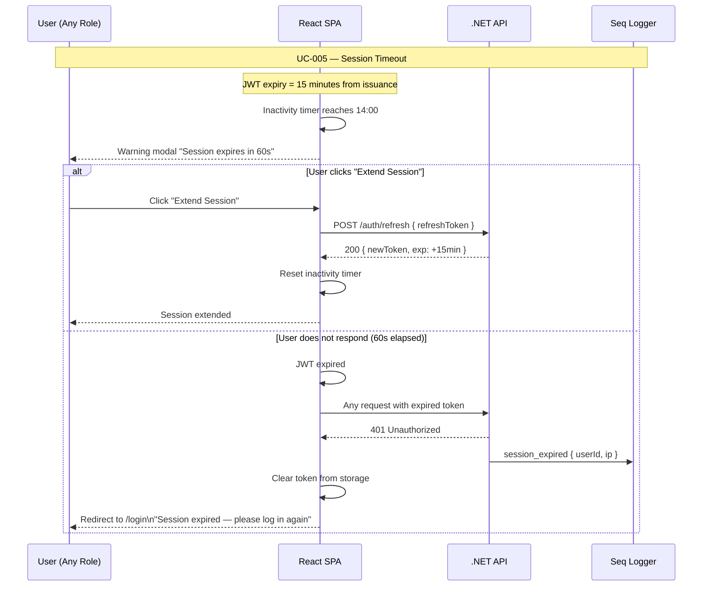
```mermaid
sequenceDiagram
    participant U as User (Any Role)
    participant SPA as React SPA
    participant API as .NET API
    participant SEQ as Seq Logger

    Note over U,SEQ: UC-005 — Session Timeout

    Note over SPA: JWT expiry = 15 minutes from issuance
    SPA->>SPA: Inactivity timer reaches 14:00
    SPA-->>U: Warning modal "Session expires in 60s"

    alt User clicks "Extend Session"
        U->>SPA: Click "Extend Session"
        SPA->>API: POST /auth/refresh { refreshToken }
        API-->>SPA: 200 { newToken, exp: +15min }
        SPA->>SPA: Reset inactivity timer
        SPA-->>U: Session extended
    else User does not respond (60s elapsed)
        SPA->>SPA: JWT expired
        SPA->>API: Any request with expired token
        API-->>SPA: 401 Unauthorized
        API->>SEQ: session_expired { userId, ip }
        SPA->>SPA: Clear token from storage
        SPA-->>U: Redirect to /login\n"Session expired — please log in again"
    end
```

---

### UC-006: Admin Manages Users and Roles
**Source:** `spec.md#UC-006`

<!-- RENDER type="mermaid" src="./uml-models/seq-uc-006.png" -->

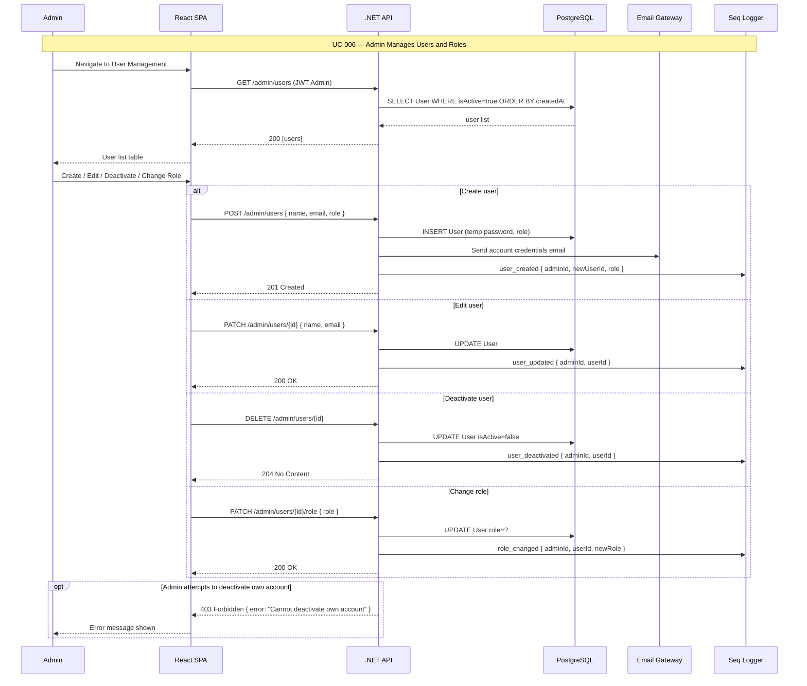
```mermaid
sequenceDiagram
    participant A as Admin
    participant SPA as React SPA
    participant API as .NET API
    participant DB as PostgreSQL
    participant GW as Email Gateway
    participant SEQ as Seq Logger

    Note over A,SEQ: UC-006 — Admin Manages Users and Roles

    A->>SPA: Navigate to User Management
    SPA->>API: GET /admin/users (JWT Admin)
    API->>DB: SELECT User WHERE isActive=true ORDER BY createdAt
    DB-->>API: user list
    API-->>SPA: 200 [users]
    SPA-->>A: User list table

    A->>SPA: Create / Edit / Deactivate / Change Role

    alt Create user
        SPA->>API: POST /admin/users { name, email, role }
        API->>DB: INSERT User (temp password, role)
        API->>GW: Send account credentials email
        API->>SEQ: user_created { adminId, newUserId, role }
        API-->>SPA: 201 Created
    else Edit user
        SPA->>API: PATCH /admin/users/{id} { name, email }
        API->>DB: UPDATE User
        API->>SEQ: user_updated { adminId, userId }
        API-->>SPA: 200 OK
    else Deactivate user
        SPA->>API: DELETE /admin/users/{id}
        API->>DB: UPDATE User isActive=false
        API->>SEQ: user_deactivated { adminId, userId }
        API-->>SPA: 204 No Content
    else Change role
        SPA->>API: PATCH /admin/users/{id}/role { role }
        API->>DB: UPDATE User role=?
        API->>SEQ: role_changed { adminId, userId, newRole }
        API-->>SPA: 200 OK
    end

    opt Admin attempts to deactivate own account
        API-->>SPA: 403 Forbidden { error: "Cannot deactivate own account" }
        SPA-->>A: Error message shown
    end
```

---

### UC-007: AI Conversational Intake
**Source:** `spec.md#UC-007`

<!-- RENDER type="mermaid" src="./uml-models/seq-uc-007.png" -->

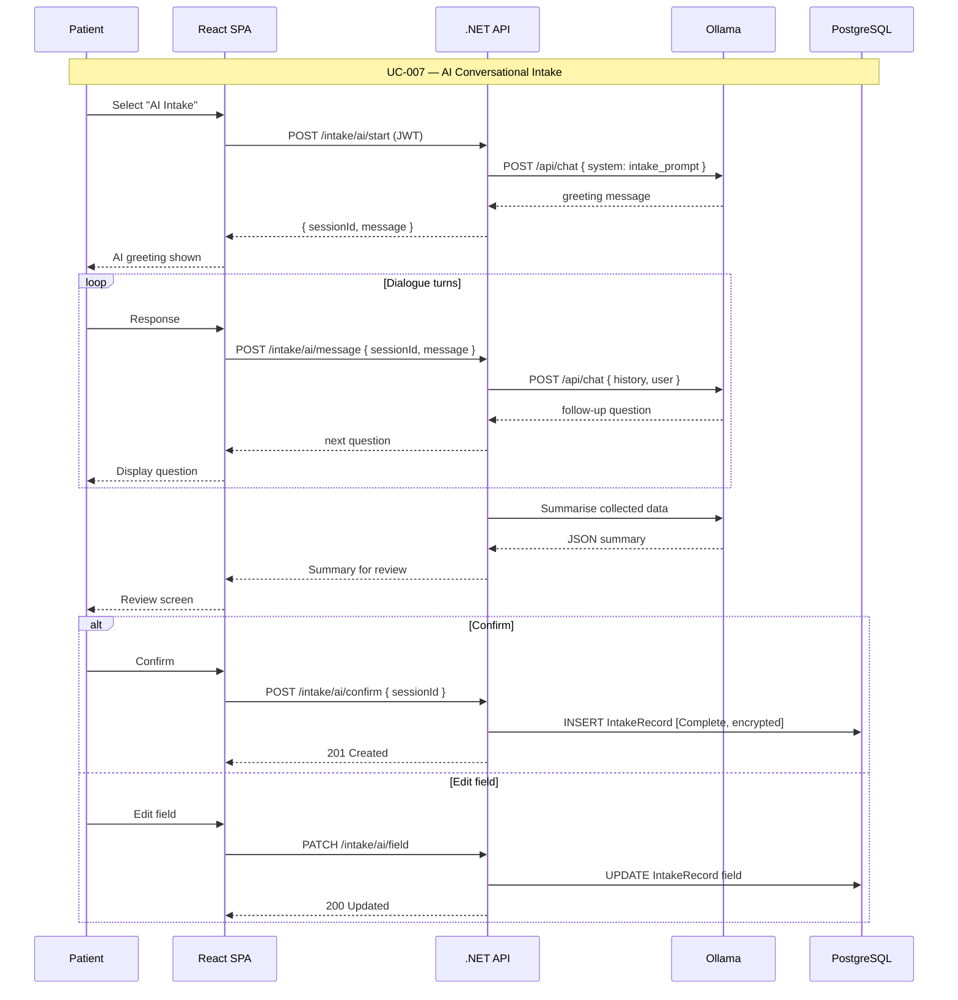
```mermaid
sequenceDiagram
    participant P as Patient
    participant SPA as React SPA
    participant API as .NET API
    participant OL as Ollama
    participant DB as PostgreSQL

    Note over P,DB: UC-007 — AI Conversational Intake

    P->>SPA: Select "AI Intake"
    SPA->>API: POST /intake/ai/start (JWT)
    API->>OL: POST /api/chat { system: intake_prompt }
    OL-->>API: greeting message
    API-->>SPA: { sessionId, message }
    SPA-->>P: AI greeting shown

    loop Dialogue turns
        P->>SPA: Response
        SPA->>API: POST /intake/ai/message { sessionId, message }
        API->>OL: POST /api/chat { history, user }
        OL-->>API: follow-up question
        API-->>SPA: next question
        SPA-->>P: Display question
    end

    API->>OL: Summarise collected data
    OL-->>API: JSON summary
    API-->>SPA: Summary for review
    SPA-->>P: Review screen

    alt Confirm
        P->>SPA: Confirm
        SPA->>API: POST /intake/ai/confirm { sessionId }
        API->>DB: INSERT IntakeRecord [Complete, encrypted]
        API-->>SPA: 201 Created
    else Edit field
        P->>SPA: Edit field
        SPA->>API: PATCH /intake/ai/field
        API->>DB: UPDATE IntakeRecord field
        API-->>SPA: 200 Updated
    end
```

---

### UC-008: Manual Intake Form Submission
**Source:** `spec.md#UC-008`

<!-- RENDER type="mermaid" src="./uml-models/seq-uc-008.png" -->

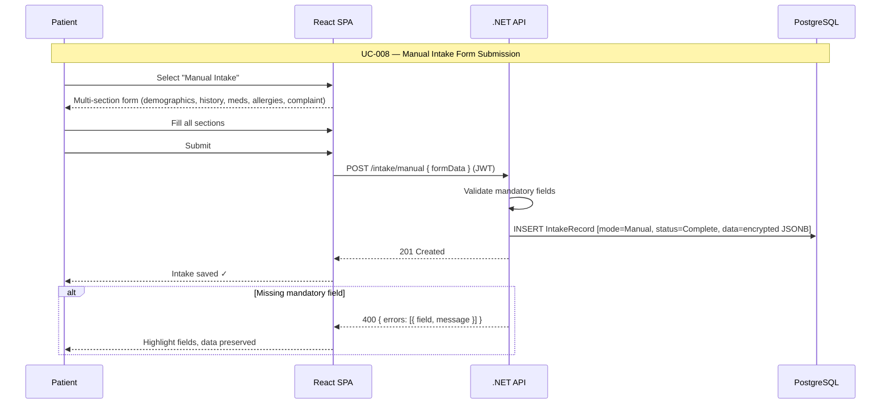
```mermaid
sequenceDiagram
    participant P as Patient
    participant SPA as React SPA
    participant API as .NET API
    participant DB as PostgreSQL

    Note over P,DB: UC-008 — Manual Intake Form Submission

    P->>SPA: Select "Manual Intake"
    SPA-->>P: Multi-section form (demographics, history, meds, allergies, complaint)
    P->>SPA: Fill all sections
    P->>SPA: Submit
    SPA->>API: POST /intake/manual { formData } (JWT)
    API->>API: Validate mandatory fields
    API->>DB: INSERT IntakeRecord [mode=Manual, status=Complete, data=encrypted JSONB]
    API-->>SPA: 201 Created
    SPA-->>P: Intake saved ✓

    alt Missing mandatory field
        API-->>SPA: 400 { errors: [{ field, message }] }
        SPA-->>P: Highlight fields, data preserved
    end
```

---

### UC-009: Intake Mode Switch Mid-Session
**Source:** `spec.md#UC-009`

<!-- RENDER type="mermaid" src="./uml-models/seq-uc-009.png" -->

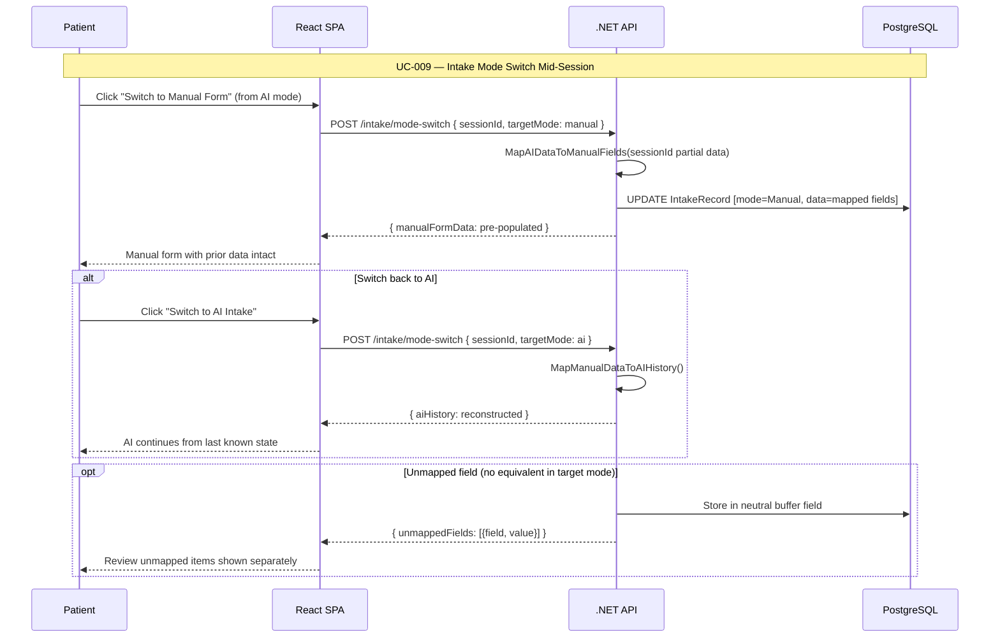
```mermaid
sequenceDiagram
    participant P as Patient
    participant SPA as React SPA
    participant API as .NET API
    participant DB as PostgreSQL

    Note over P,DB: UC-009 — Intake Mode Switch Mid-Session

    P->>SPA: Click "Switch to Manual Form" (from AI mode)
    SPA->>API: POST /intake/mode-switch { sessionId, targetMode: manual }
    API->>API: MapAIDataToManualFields(sessionId partial data)
    API->>DB: UPDATE IntakeRecord [mode=Manual, data=mapped fields]
    API-->>SPA: { manualFormData: pre-populated }
    SPA-->>P: Manual form with prior data intact

    alt Switch back to AI
        P->>SPA: Click "Switch to AI Intake"
        SPA->>API: POST /intake/mode-switch { sessionId, targetMode: ai }
        API->>API: MapManualDataToAIHistory()
        API-->>SPA: { aiHistory: reconstructed }
        SPA-->>P: AI continues from last known state
    end

    opt Unmapped field (no equivalent in target mode)
        API->>DB: Store in neutral buffer field
        API-->>SPA: { unmappedFields: [{field, value}] }
        SPA-->>P: Review unmapped items shown separately
    end
```

---

### UC-010: Intake Validation Failure
**Source:** `spec.md#UC-010`

<!-- RENDER type="mermaid" src="./uml-models/seq-uc-010.png" -->

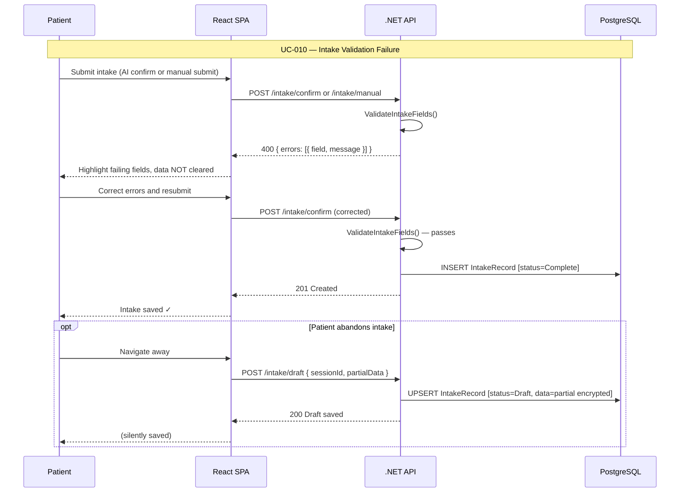
```mermaid
sequenceDiagram
    participant P as Patient
    participant SPA as React SPA
    participant API as .NET API
    participant DB as PostgreSQL

    Note over P,DB: UC-010 — Intake Validation Failure

    P->>SPA: Submit intake (AI confirm or manual submit)
    SPA->>API: POST /intake/confirm or /intake/manual
    API->>API: ValidateIntakeFields()
    API-->>SPA: 400 { errors: [{ field, message }] }
    SPA-->>P: Highlight failing fields, data NOT cleared

    P->>SPA: Correct errors and resubmit
    SPA->>API: POST /intake/confirm (corrected)
    API->>API: ValidateIntakeFields() — passes
    API->>DB: INSERT IntakeRecord [status=Complete]
    API-->>SPA: 201 Created
    SPA-->>P: Intake saved ✓

    opt Patient abandons intake
        P->>SPA: Navigate away
        SPA->>API: POST /intake/draft { sessionId, partialData }
        API->>DB: UPSERT IntakeRecord [status=Draft, data=partial encrypted]
        API-->>SPA: 200 Draft saved
        SPA-->>P: (silently saved)
    end
```

---

### UC-011: Patient Books Available Slot
**Source:** `spec.md#UC-011`

<!-- RENDER type="mermaid" src="./uml-models/seq-uc-011.png" -->

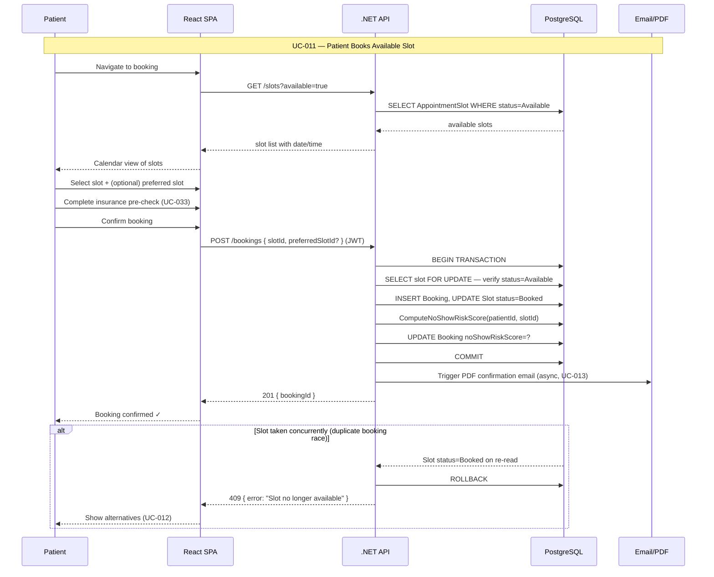
```mermaid
sequenceDiagram
    participant P as Patient
    participant SPA as React SPA
    participant API as .NET API
    participant DB as PostgreSQL
    participant GW as Email/PDF

    Note over P,GW: UC-011 — Patient Books Available Slot

    P->>SPA: Navigate to booking
    SPA->>API: GET /slots?available=true
    API->>DB: SELECT AppointmentSlot WHERE status=Available
    DB-->>API: available slots
    API-->>SPA: slot list with date/time
    SPA-->>P: Calendar view of slots

    P->>SPA: Select slot + (optional) preferred slot
    P->>SPA: Complete insurance pre-check (UC-033)
    P->>SPA: Confirm booking
    SPA->>API: POST /bookings { slotId, preferredSlotId? } (JWT)
    API->>DB: BEGIN TRANSACTION
    API->>DB: SELECT slot FOR UPDATE — verify status=Available
    API->>DB: INSERT Booking, UPDATE Slot status=Booked
    API->>DB: ComputeNoShowRiskScore(patientId, slotId)
    API->>DB: UPDATE Booking noShowRiskScore=?
    API->>DB: COMMIT
    API->>GW: Trigger PDF confirmation email (async, UC-013)
    API-->>SPA: 201 { bookingId }
    SPA-->>P: Booking confirmed ✓

    alt Slot taken concurrently (duplicate booking race)
        DB-->>API: Slot status=Booked on re-read
        API->>DB: ROLLBACK
        API-->>SPA: 409 { error: "Slot no longer available" }
        SPA-->>P: Show alternatives (UC-012)
    end
```

---

### UC-012: No Slots Available / Booking Conflict
**Source:** `spec.md#UC-012`

<!-- RENDER type="mermaid" src="./uml-models/seq-uc-012.png" -->

```mermaid
sequenceDiagram
    participant P as Patient
    participant SPA as React SPA
    participant API as .NET API
    participant DB as PostgreSQL

    Note over P,DB: UC-012 — No Slots Available / Booking Conflict

    P->>SPA: Attempt to book slot X
    SPA->>API: POST /bookings { slotId: X }
    API->>DB: SELECT slot X FOR UPDATE
    DB-->>API: status=Booked (conflict)
    API-->>SPA: 409 { error: "Slot no longer available", alternatives: [...] }
    SPA-->>P: "This slot is no longer available"\n+ show nearest alternatives

    alt Patient selects alternative
        P->>SPA: Select alternative slot Y
        SPA->>API: POST /bookings { slotId: Y }
        API->>DB: Transaction — book slot Y
        API-->>SPA: 201 Created
    else No alternatives available
        API->>DB: SELECT COUNT(*) WHERE status=Available
        DB-->>API: 0
        API-->>SPA: { noSlotsAvailable: true }
        SPA-->>P: "No slots currently available"\n+ waitlist option
    end
```

---

### UC-013: PDF Confirmation Email Delivery
**Source:** `spec.md#UC-013`

<!-- RENDER type="mermaid" src="./uml-models/seq-uc-013.png" -->

```mermaid
sequenceDiagram
    participant NOTIF as Notification Module
    participant PDF as QuestPDF Service
    participant GW as Email Gateway
    participant DB as PostgreSQL
    participant SEQ as Seq Logger

    Note over NOTIF,SEQ: UC-013 — PDF Confirmation Email Delivery

    NOTIF->>PDF: GeneratePDF(bookingId, patientEmail, slotDetails)
    PDF-->>NOTIF: byte[] pdfDocument
    NOTIF->>GW: SMTP SendEmail(to: patientEmail, attachment: pdf)
    GW-->>NOTIF: 200 Accepted

    NOTIF->>DB: INSERT ReminderSchedule (type=Confirmation, status=Sent)
    NOTIF->>SEQ: confirmation_email_sent { bookingId, patientId }

    alt Email delivery fails (attempt 1)
        GW-->>NOTIF: 5xx / timeout
        NOTIF->>NOTIF: Wait 2^1 seconds (exponential back-off)
        NOTIF->>GW: Retry attempt 2
        GW-->>NOTIF: 5xx
        NOTIF->>NOTIF: Wait 2^2 seconds
        NOTIF->>GW: Retry attempt 3
        GW-->>NOTIF: 5xx
        NOTIF->>DB: UPDATE ReminderSchedule status=Failed, attemptCount=3
        NOTIF->>SEQ: confirmation_email_failed { bookingId, reason }
    end
```

---

### UC-014: Patient Designates Preferred Slot at Booking
**Source:** `spec.md#UC-014`

<!-- RENDER type="mermaid" src="./uml-models/seq-uc-014.png" -->

```mermaid
sequenceDiagram
    participant P as Patient
    participant SPA as React SPA
    participant API as .NET API
    participant DB as PostgreSQL

    Note over P,DB: UC-014 — Patient Designates Preferred Slot at Booking

    P->>SPA: During booking, click "I'd prefer a different slot"
    SPA-->>P: Show calendar with unavailable slots highlighted
    P->>SPA: Select preferred (unavailable) slot
    SPA->>SPA: Store preferredSlotId alongside current booking selection
    P->>SPA: Confirm booking
    SPA->>API: POST /bookings { slotId: X, preferredSlotId: Y }
    API->>DB: INSERT Booking { slotId: X, preferredSlotId: Y, status: Confirmed }
    API->>DB: INSERT SlotMonitor (bookingId, monitoredSlotId: Y, active: true)
    API-->>SPA: 201 { bookingId }
    SPA-->>P: Booking confirmed on slot X\n"We'll notify you if slot Y opens"

    opt Patient cancels preferred slot designation
        P->>SPA: Cancel preferred slot from profile
        SPA->>API: DELETE /bookings/{id}/preferred-slot
        API->>DB: UPDATE Booking preferredSlotId=null\nUPDATE SlotMonitor active=false
        API-->>SPA: 200 OK
    end
```

---

### UC-015: System Auto-Executes Preferred Slot Swap
**Source:** `spec.md#UC-015`

<!-- RENDER type="mermaid" src="./uml-models/seq-uc-015.png" -->

```mermaid
sequenceDiagram
    participant MONITOR as Slot Monitor (Background Job)
    participant DB as PostgreSQL
    participant API as .NET API
    participant GW as Email/SMS Gateway
    participant PDF as QuestPDF
    participant SEQ as Seq Logger

    Note over MONITOR,SEQ: UC-015 — System Auto-Executes Preferred Slot Swap

    MONITOR->>DB: Poll: SELECT monitors WHERE active=true AND monitoredSlotId IN (newly-freed slots)
    DB-->>MONITOR: [{ bookingId, patientId, originalSlotId, preferredSlotId }]

    loop For each triggered monitor
        MONITOR->>DB: BEGIN TRANSACTION
        MONITOR->>DB: UPDATE Booking slotId=preferredSlotId
        MONITOR->>DB: UPDATE Slot (originalSlot) status=Available
        MONITOR->>DB: UPDATE Slot (preferredSlot) status=Booked
        MONITOR->>DB: UPDATE SlotMonitor active=false
        MONITOR->>DB: COMMIT
        MONITOR->>PDF: GenerateUpdatedPDF(bookingId)
        PDF-->>MONITOR: byte[] updated pdf
        MONITOR->>GW: Send email (swap notification + new PDF)
        MONITOR->>GW: Send SMS (swap notification)
        MONITOR->>DB: INSERT AuditLog (action=slot_swap_executed)
        MONITOR->>SEQ: slot_swap_executed { bookingId, patientId }
    end

    alt Notification delivery fails
        GW-->>MONITOR: delivery error
        MONITOR->>MONITOR: Retry up to 3× (exponential back-off)
        MONITOR->>SEQ: notification_retry { attempt, bookingId }
    end
```

---

### UC-016: Preferred Slot Never Opens
**Source:** `spec.md#UC-016`

<!-- RENDER type="mermaid" src="./uml-models/seq-uc-016.png" -->

```mermaid
sequenceDiagram
    participant MONITOR as Slot Monitor
    participant DB as PostgreSQL
    participant SEQ as Seq Logger

    Note over MONITOR,SEQ: UC-016 — Preferred Slot Never Opens

    Note over MONITOR: Appointment date arrives\nPreferred slot still unavailable
    MONITOR->>DB: SELECT monitors WHERE active=true AND booking.scheduledDate <= today
    DB-->>MONITOR: expired monitors list
    MONITOR->>DB: UPDATE SlotMonitor active=false (batch)
    MONITOR->>DB: UPDATE Booking preferredSlotId=null
    MONITOR->>SEQ: preferred_slot_monitor_expired { bookingIds: [...] }

    Note over DB: Original booking remains Confirmed\nPatient attends at original slot — no notification needed
```

---

### UC-017: Patient Receives Automated Reminders
**Source:** `spec.md#UC-017`

<!-- RENDER type="mermaid" src="./uml-models/seq-uc-017.png" -->

```mermaid
sequenceDiagram
    participant SCHED as Reminder Scheduler
    participant DB as PostgreSQL
    participant GW as Email/SMS Gateway
    participant SEQ as Seq Logger

    Note over SCHED,SEQ: UC-017 — Patient Receives Automated Reminders

    SCHED->>DB: SELECT ReminderSchedule WHERE scheduledAt <= NOW() AND status=Pending
    DB-->>SCHED: due reminders

    loop For each due reminder
        SCHED->>DB: SELECT Booking, Patient (contact, opt-out prefs)
        DB-->>SCHED: booking details

        alt SMS channel + not opted out
            SCHED->>GW: Send SMS reminder (appointment time, location)
            GW-->>SCHED: 200 OK
            SCHED->>DB: UPDATE ReminderSchedule status=Sent, sentAt=NOW()
        else Email channel + not opted out
            SCHED->>GW: Send email reminder
            GW-->>SCHED: 200 OK
            SCHED->>DB: UPDATE ReminderSchedule status=Sent
        else Channel opted out
            SCHED->>DB: UPDATE ReminderSchedule status=Skipped
        end
        SCHED->>SEQ: reminder_sent { bookingId, channel, patientId }
    end

    opt Delivery fails (retry)
        GW-->>SCHED: delivery failure
        SCHED->>SCHED: Retry up to 3× exponential back-off
        SCHED->>DB: UPDATE ReminderSchedule status=Failed, attemptCount=3
        SCHED->>SEQ: reminder_failed { bookingId, reason }
    end
```

---

### UC-018: Google Calendar Sync
**Source:** `spec.md#UC-018`

<!-- RENDER type="mermaid" src="./uml-models/seq-uc-018.png" -->

```mermaid
sequenceDiagram
    participant P as Patient
    participant SPA as React SPA
    participant API as .NET API
    participant GCAL as Google Calendar API
    participant DB as PostgreSQL

    Note over P,DB: UC-018 — Google Calendar Sync

    P->>SPA: Click "Sync to Google Calendar" post-booking
    SPA->>API: POST /calendar/google/sync { bookingId } (JWT)
    API->>DB: SELECT Patient.googleOAuthToken WHERE patientId=?

    alt Token exists and valid
        API->>GCAL: POST /calendars/primary/events { summary, start, end, description }
        GCAL-->>API: 201 { eventId }
        API->>DB: UPDATE Booking googleCalEventId=?
        API-->>SPA: 200 { synced: true }
        SPA-->>P: Calendar sync ✓
    else No token (not yet authorised)
        API-->>SPA: 302 { authUrl: Google OAuth consent URL }
        SPA-->>P: Redirect to Google OAuth
        P->>GCAL: Consent granted
        GCAL-->>SPA: OAuth callback with code
        SPA->>API: POST /auth/google/callback { code }
        API->>GCAL: Exchange code → access + refresh tokens
        API->>DB: UPDATE Patient googleOAuthToken (encrypted)
        API->>GCAL: Create calendar event
        GCAL-->>API: 201 eventId
        API-->>SPA: 200 { synced: true }
    end

    opt Patient opted out of calendar sync
        API-->>SPA: 200 { synced: false, reason: "opted_out" }
    end
```

---

### UC-019: Outlook Calendar Sync
**Source:** `spec.md#UC-019`

<!-- RENDER type="mermaid" src="./uml-models/seq-uc-019.png" -->

```mermaid
sequenceDiagram
    participant P as Patient
    participant SPA as React SPA
    participant API as .NET API
    participant MSCAL as Microsoft Graph API
    participant DB as PostgreSQL

    Note over P,DB: UC-019 — Outlook Calendar Sync

    P->>SPA: Click "Sync to Outlook Calendar" post-booking
    SPA->>API: POST /calendar/outlook/sync { bookingId } (JWT)
    API->>DB: SELECT Patient.outlookOAuthToken WHERE patientId=?

    alt Token exists and valid
        API->>MSCAL: POST /me/events { subject, start, end, body }
        MSCAL-->>API: 201 { id }
        API->>DB: UPDATE Booking outlookCalEventId=?
        API-->>SPA: 200 { synced: true }
        SPA-->>P: Outlook sync ✓
    else No token (not authorised)
        API-->>SPA: 302 { authUrl: Microsoft OAuth consent URL }
        SPA-->>P: Redirect to Microsoft OAuth
        P->>MSCAL: Consent granted
        MSCAL-->>SPA: OAuth callback with code
        SPA->>API: POST /auth/microsoft/callback { code }
        API->>MSCAL: Exchange code → tokens
        API->>DB: UPDATE Patient outlookOAuthToken (encrypted)
        API->>MSCAL: Create calendar event
        MSCAL-->>API: 201 eventId
        API-->>SPA: 200 { synced: true }
    end
```

---

### UC-020: Calendar Sync Failure
**Source:** `spec.md#UC-020`

<!-- RENDER type="mermaid" src="./uml-models/seq-uc-020.png" -->

```mermaid
sequenceDiagram
    participant API as .NET API
    participant GCAL as Google/Outlook Calendar API
    participant DB as PostgreSQL
    participant SEQ as Seq Logger

    Note over API,SEQ: UC-020 — Calendar Sync Failure

    API->>GCAL: POST /events (calendar sync attempt)
    GCAL-->>API: 5xx / network timeout

    API->>SEQ: calendar_sync_failed { bookingId, provider, reason }
    API->>DB: UPDATE Booking calendarSyncStatus=Failed

    Note over API: Booking is NOT rolled back\nCalendar sync failure is non-blocking (Assumption 8)

    API-->>SPA: 200 { synced: false, reason: "sync_failed — booking confirmed" }
    SPA-->>P: "Booking confirmed ✓\nCalendar sync failed — retry from profile"
```

---

### UC-021: Staff Creates Walk-in Booking and Queue Updates
**Source:** `spec.md#UC-021`

<!-- RENDER type="mermaid" src="./uml-models/seq-uc-021.png" -->

```mermaid
sequenceDiagram
    participant S as Staff
    participant SPA as React SPA
    participant API as .NET API
    participant HUB as SignalR Hub
    participant DB as PostgreSQL
    participant SEQ as Seq Logger

    Note over S,SEQ: UC-021 — Staff Creates Walk-in Booking and Queue Updates

    S->>SPA: Select "New Walk-in"
    SPA-->>S: Walk-in form
    S->>SPA: Enter patient name, contact details
    S->>SPA: Submit
    SPA->>API: POST /walkins { patientName, contact } (JWT Staff)
    API->>DB: INSERT Booking (status=WalkIn, arrivalOrder=NEXT)
    API->>HUB: BroadcastQueueUpdate({ type: walkin_added, booking })
    HUB-->>SPA: SignalR push to all connected Staff clients
    SPA-->>S: Queue view updates in real-time (< 5 seconds)
    API->>SEQ: walkin_created { staffId, bookingId }
    API-->>SPA: 201 { bookingId }

    opt Staff creates patient account (see UC-002)
        SPA->>API: POST /walkins { ..., createAccount: true }
    end
```

---

### UC-022: Staff Marks Patient as Arrived
**Source:** `spec.md#UC-022`

<!-- RENDER type="mermaid" src="./uml-models/seq-uc-022.png" -->

```mermaid
sequenceDiagram
    participant S as Staff
    participant SPA as React SPA
    participant API as .NET API
    participant HUB as SignalR Hub
    participant DB as PostgreSQL
    participant SEQ as Seq Logger

    Note over S,SEQ: UC-022 — Staff Marks Patient as Arrived

    S->>SPA: Click "Mark Arrived" on patient row in queue
    SPA->>API: PATCH /bookings/{id}/status { status: Arrived } (JWT Staff)
    API->>DB: UPDATE Booking status=Arrived, arrivedAt=NOW()
    API->>DB: INSERT AuditLog (action=patient_arrived, actorId, resourceId)
    API->>HUB: BroadcastQueueUpdate({ type: status_changed, bookingId, status: Arrived })
    HUB-->>SPA: Real-time push to all Staff clients
    SPA-->>S: Patient row shows "Arrived" badge instantly
    API->>SEQ: patient_arrived { bookingId, staffId, arrivedAt }
    API-->>SPA: 200 OK
```

---

### UC-023: Unauthorized Attempt to Self-Check-In
**Source:** `spec.md#UC-023`

<!-- RENDER type="mermaid" src="./uml-models/seq-uc-023.png" -->

```mermaid
sequenceDiagram
    participant P as Patient
    participant SPA as React SPA
    participant API as .NET API
    participant DB as PostgreSQL
    participant SEQ as Seq Logger

    Note over P,SEQ: UC-023 — Unauthorized Attempt to Self-Check-In

    P->>SPA: Attempt PATCH /bookings/{id}/status { status: Arrived } (JWT Patient role)
    SPA->>API: PATCH /bookings/{id}/status { status: Arrived }
    API->>API: CheckAuthorization(user.role == Staff | Admin)
    API-->>SPA: 403 Forbidden { error: "Insufficient permissions" }
    API->>DB: INSERT AuditLog (action=unauthorized_checkin_attempt, actorId, ip)
    API->>SEQ: unauthorized_action_attempt { userId, action: self_checkin, ip }
    SPA-->>P: 403 error — action not permitted
```

---

### UC-024: Patient Uploads Clinical Documents
**Source:** `spec.md#UC-024`

<!-- RENDER type="mermaid" src="./uml-models/seq-uc-024.png" -->

```mermaid
sequenceDiagram
    participant P as Patient
    participant SPA as React SPA
    participant API as .NET API
    participant DB as PostgreSQL
    participant SEQ as Seq Logger

    Note over P,SEQ: UC-024 — Patient Uploads Clinical Documents

    P->>SPA: Navigate to "Upload Documents"
    SPA-->>P: File upload widget
    P->>SPA: Select PDF file(s)
    SPA->>API: POST /documents (multipart/form-data, JWT)
    API->>API: ValidateMimeType(file) — must be application/pdf or allowed type
    API->>API: ValidateFileSize(file) — must be ≤ 20 MB
    API->>API: ComputeSHA256Hash(file)
    API->>API: EncryptStoragePath(file)
    API->>DB: INSERT ClinicalDocument { patientId, filename, hash, mimeType, storagePath(enc), status=Pending }
    API->>DB: INSERT AuditLog (action=document_uploaded, actorId, resourceId)
    API->>SEQ: document_uploaded { patientId, docId, mimeType }
    API-->>SPA: 201 { documentId, status: Pending }
    SPA-->>P: "Document uploaded — processing queued"
    Note over API: Triggers AI extraction job (UC-026) asynchronously
```

---

### UC-025: Document Upload Validation Failure
**Source:** `spec.md#UC-025`

<!-- RENDER type="mermaid" src="./uml-models/seq-uc-025.png" -->

```mermaid
sequenceDiagram
    participant P as Patient
    participant SPA as React SPA
    participant API as .NET API
    participant SEQ as Seq Logger

    Note over P,SEQ: UC-025 — Document Upload Validation Failure

    P->>SPA: Upload file (invalid type or oversized)
    SPA->>API: POST /documents (multipart/form-data, JWT)
    API->>API: ValidateMimeType(file)

    alt Invalid MIME type
        API-->>SPA: 415 { error: "Unsupported file type. Allowed: PDF, DOC, DOCX, JPG, PNG" }
        SPA-->>P: Error: unsupported file type
    else File exceeds size limit (> 20 MB)
        API->>API: ValidateFileSize(file) — fails
        API-->>SPA: 413 { error: "File too large. Maximum size: 20 MB" }
        SPA-->>P: Error: file too large
    end

    API->>SEQ: document_upload_rejected { patientId, reason, mimeType, size }
```

---

### UC-026: AI Extracts and De-duplicates Clinical Data
**Source:** `spec.md#UC-026`

<!-- RENDER type="mermaid" src="./uml-models/seq-uc-026.png" -->

```mermaid
sequenceDiagram
    participant JOB as Extraction Job
    participant API as .NET API
    participant PDFPIG as PdfPig
    participant OL as Ollama
    participant VEC as pgvector
    participant DB as PostgreSQL

    Note over JOB,DB: UC-026 — AI Extracts and De-duplicates Clinical Data

    JOB->>API: ProcessPendingDocuments(patientId)
    API->>DB: SELECT documents WHERE status=Pending
    DB-->>API: document list

    loop Per document
        API->>DB: UPDATE status=Extracting
        API->>PDFPIG: ExtractText(path)
        PDFPIG-->>API: raw text
        API->>OL: embed + extract entities
        OL-->>API: vectors + extracted JSON
        API->>VEC: INSERT ChunkEmbeddings
        API->>DB: INSERT ExtractedRecords [Pending, encrypted]
        API->>DB: UPDATE status=Complete
    end

    API->>DB: De-duplicate ExtractedRecords by (entityType + normalised value)
    API->>DB: Mark duplicates isDuplicate=true

    alt Extraction fails
        API->>DB: UPDATE status=Failed
    end
```

---

### UC-027: Data Conflict Detected and Surfaced
**Source:** `spec.md#UC-027`

<!-- RENDER type="mermaid" src="./uml-models/seq-uc-027.png" -->

```mermaid
sequenceDiagram
    participant JOB as Conflict Detector
    participant DB as PostgreSQL
    participant OL as Ollama
    participant STAFF as Staff
    participant API as .NET API

    Note over JOB,API: UC-027 — Data Conflict Detected and Surfaced

    JOB->>DB: SELECT ExtractedRecords WHERE patientId=?
    DB-->>JOB: records from multiple documents
    JOB->>JOB: Rule-based: group by entityType\nflag contradictory values
    JOB->>OL: Analyse conflicting pairs
    OL-->>JOB: { conflicts [{field, valueA, sourceA, valueB, sourceB, confidence}] }
    JOB->>DB: INSERT ConflictFlags (linked to ExtractedRecord IDs)

    STAFF->>API: GET /patients/{id}/view (JWT Staff)
    API->>DB: SELECT ExtractedRecords + ConflictFlags
    DB-->>API: view with conflicts
    API-->>STAFF: 360° view with conflict banners

    STAFF->>API: PATCH /conflicts/{id}/resolve { chosenValue }
    API->>DB: UPDATE ConflictFlag status=Resolved
    API-->>STAFF: 200 OK

    alt No conflicts found
        JOB->>DB: (no INSERT ConflictFlags)
    end
```

---

### UC-028: Staff Views 360-Degree Patient View
**Source:** `spec.md#UC-028`

<!-- RENDER type="mermaid" src="./uml-models/seq-uc-028.png" -->

```mermaid
sequenceDiagram
    participant S as Staff
    participant SPA as React SPA
    participant API as .NET API
    participant DB as PostgreSQL
    participant SEQ as Seq Logger

    Note over S,SEQ: UC-028 — Staff Views 360-Degree Patient View

    S->>SPA: Open patient record
    SPA->>API: GET /patients/{id}/view (JWT Staff)
    API->>API: AuthorizeRole(Staff)
    API->>DB: SELECT Patient, IntakeRecord, ExtractedRecords, MedicalCodeSuggestions, ConflictFlags WHERE patientId=?
    DB-->>API: aggregated patient data
    API->>DB: INSERT AuditLog (action=patient_view_accessed, actorId, patientId)
    API->>SEQ: patient_360_viewed { staffId, patientId }
    API-->>SPA: 200 { patient, intake, extractedData, codes[Pending], conflicts[] }
    SPA-->>S: 360° view with:\n• Vitals, meds, diagnoses (with source links)\n• Conflict banners (if any)\n• Pending code suggestions

    opt Patient (unauthorized attempt)
        API->>API: AuthorizeRole(Staff) — Patient token rejected
        API-->>SPA: 403 Forbidden
    end
```

---

### UC-029: Extraction Failure / Low AI Confidence
**Source:** `spec.md#UC-029`

<!-- RENDER type="mermaid" src="./uml-models/seq-uc-029.png" -->

```mermaid
sequenceDiagram
    participant JOB as Extraction Job
    participant API as .NET API
    participant OL as Ollama
    participant DB as PostgreSQL
    participant SEQ as Seq Logger

    Note over JOB,SEQ: UC-029 — Extraction Failure / Low AI Confidence

    JOB->>API: ProcessDocument(docId)
    API->>OL: POST /api/chat { extraction_prompt, text }
    OL-->>API: JSON response

    alt Schema validation fails (malformed JSON)
        API->>DB: UPDATE ClinicalDocument status=Failed
        API->>SEQ: extraction_validation_failed { docId, reason: malformed_output }
        API-->>JOB: ExtractionFailedException
    else Low confidence (all entities confidence < 0.5)
        API->>DB: INSERT ExtractedRecords [confidence < 0.5, flagged=low_confidence]
        API->>DB: UPDATE ClinicalDocument status=Complete (partial)
        API->>SEQ: extraction_low_confidence { docId, entityCount, avgConfidence }
        API-->>JOB: LowConfidenceWarning

        Note over DB: Low-confidence records are visible\nin 360° view with a confidence indicator\nStaff can verify manually
    else Ollama timeout (AIR-008 > 120s)
        API->>DB: UPDATE ClinicalDocument status=Failed
        API->>SEQ: extraction_timeout { docId, elapsed }
        API-->>JOB: TimeoutException
    end
```

---

### UC-030: AI Suggests Medical Codes
**Source:** `spec.md#UC-030`

<!-- RENDER type="mermaid" src="./uml-models/seq-uc-030.png" -->

```mermaid
sequenceDiagram
    participant JOB as Code Suggestion Job
    participant ORCH as RAG Orchestrator
    participant OL as Ollama
    participant VEC as pgvector
    participant DB as PostgreSQL

    Note over JOB,DB: UC-030 — AI Suggests Medical Codes

    JOB->>ORCH: GenerateCodeSuggestions(patientId)
    ORCH->>OL: embed(clinical_summary)
    OL-->>ORCH: query_vector
    ORCH->>VEC: SELECT TOP-20 chunks (cosine sim)
    VEC-->>ORCH: top chunks

    ORCH->>OL: Code suggestion prompt + context
    OL-->>ORCH: [{codeType, code, description, sourceChunkRefs, confidence}]
    ORCH->>ORCH: Schema validate (ICD-10/CPT format check)

    alt Validation passes
        ORCH->>DB: INSERT MedicalCodeSuggestion[] [Pending]
    else Fails
        ORCH->>DB: log failure
    end

    Note over DB: All suggestions Pending — awaiting staff review (UC-031/032)
```

---

### UC-031: Staff Reviews and Approves Medical Codes
**Source:** `spec.md#UC-031`

<!-- RENDER type="mermaid" src="./uml-models/seq-uc-031.png" -->

```mermaid
sequenceDiagram
    participant S as Staff
    participant SPA as React SPA
    participant API as .NET API
    participant DB as PostgreSQL
    participant SEQ as Seq Logger

    Note over S,SEQ: UC-031 — Staff Reviews and Approves Medical Codes

    S->>SPA: View pending code suggestions in 360° patient view
    SPA->>API: GET /patients/{id}/codes?status=Pending (JWT Staff)
    API->>DB: SELECT MedicalCodeSuggestion WHERE patientId=? AND reviewStatus=Pending
    DB-->>API: code suggestions with sourceChunkRefs
    API-->>SPA: code list with source text links
    SPA-->>S: Code suggestions table (code, description, source excerpt, confidence)

    S->>SPA: Click "Accept" on suggestion X
    SPA->>API: PATCH /suggestions/{id} { action: accept } (JWT Staff)
    API->>DB: UPDATE MedicalCodeSuggestion reviewStatus=Accepted, reviewedBy=staffId, reviewedAt=NOW()
    API->>DB: INSERT AuditLog (action=code_accepted, actorId, resourceId)
    API->>SEQ: code_suggestion_accepted { suggestionId, codeValue, staffId }
    API-->>SPA: 200 OK
    SPA-->>S: Code marked Accepted ✓
```

---

### UC-032: Staff Rejects or Corrects AI Code Suggestion
**Source:** `spec.md#UC-032`

<!-- RENDER type="mermaid" src="./uml-models/seq-uc-032.png" -->

```mermaid
sequenceDiagram
    participant S as Staff
    participant SPA as React SPA
    participant API as .NET API
    participant DB as PostgreSQL
    participant SEQ as Seq Logger

    Note over S,SEQ: UC-032 — Staff Rejects or Corrects AI Code Suggestion

    S->>SPA: Review pending code suggestion X
    S->>SPA: Click "Reject" or "Enter correct code"

    alt Staff rejects suggestion
        SPA->>API: PATCH /suggestions/{id} { action: reject } (JWT Staff)
        API->>DB: UPDATE MedicalCodeSuggestion reviewStatus=Rejected, reviewedBy, reviewedAt
        API->>SEQ: code_suggestion_rejected { suggestionId, staffId }
        API-->>SPA: 200 OK
        SPA-->>S: Suggestion removed from pending list
    else Staff provides correction
        SPA->>API: PATCH /suggestions/{id} { action: correct, correctedCode, correctedDescription }
        API->>DB: INSERT MedicalCodeSuggestion (corrected, reviewStatus=Accepted, source=Staff)
        API->>DB: UPDATE original MedicalCodeSuggestion reviewStatus=Rejected
        API->>SEQ: code_suggestion_corrected { original, corrected, staffId }
        API-->>SPA: 200 OK
        SPA-->>S: Correction saved ✓
    end
```

---

### UC-033: Insurance Pre-Check — Validation Passes
**Source:** `spec.md#UC-033`

<!-- RENDER type="mermaid" src="./uml-models/seq-uc-033.png" -->

```mermaid
sequenceDiagram
    participant P as Patient
    participant SPA as React SPA
    participant API as .NET API
    participant DB as PostgreSQL

    Note over P,DB: UC-033 — Insurance Pre-Check — Validation Passes

    P->>SPA: Enter insurance provider + insurance ID in booking flow
    SPA->>API: POST /insurance/validate { provider, insuranceId } (JWT)
    API->>DB: SELECT InsuranceRecord WHERE providerName = ? AND insuranceId LIKE pattern
    DB-->>API: matching record found
    API-->>SPA: 200 { valid: true }
    SPA-->>P: Insurance validated ✓ (soft check, non-blocking)
    Note over P: Booking flow continues to slot selection
```

---

### UC-034: Insurance Pre-Check — Validation Fails
**Source:** `spec.md#UC-034`

<!-- RENDER type="mermaid" src="./uml-models/seq-uc-034.png" -->

```mermaid
sequenceDiagram
    participant P as Patient
    participant SPA as React SPA
    participant API as .NET API
    participant DB as PostgreSQL

    Note over P,DB: UC-034 — Insurance Pre-Check — Validation Fails

    P->>SPA: Enter insurance provider + ID
    SPA->>API: POST /insurance/validate { provider, insuranceId } (JWT)
    API->>DB: SELECT InsuranceRecord WHERE providerName = ? AND insuranceId LIKE pattern
    DB-->>API: no matching record
    API-->>SPA: 200 { valid: false, warning: "Insurance details could not be verified" }
    SPA-->>P: ⚠️ Warning: "Insurance details could not be verified.\nBooking can still proceed."
    Note over P: Warning shown — booking NOT blocked (soft validation per FR-039)
    P->>SPA: Continue to slot booking
```

---

### UC-035: Staff Views Daily Operations Dashboard
**Source:** `spec.md#UC-035`

<!-- RENDER type="mermaid" src="./uml-models/seq-uc-035.png" -->

```mermaid
sequenceDiagram
    participant S as Staff
    participant SPA as React SPA
    participant API as .NET API
    participant HUB as SignalR Hub
    participant DB as PostgreSQL

    Note over S,DB: UC-035 — Staff Views Daily Operations Dashboard

    S->>SPA: Navigate to Staff Dashboard
    SPA->>API: GET /dashboard/staff?date=today (JWT Staff)
    API->>DB: SELECT Booking JOIN Patient WHERE date=today\ninclude status, noShowRiskScore, arrivedAt
    DB-->>API: today's appointments + walk-ins
    API-->>SPA: { scheduled: [...], walkins: [...], queue: [...] }
    SPA-->>S: Daily appointments table + live queue

    SPA->>HUB: Connect SignalR /hubs/queue
    HUB-->>SPA: Real-time connection established

    Note over SPA,HUB: Queue updates arrive in real-time\n(see UC-021, UC-022)\nNo manual refresh required
```

---

### UC-036: Admin Views Platform Metrics and Manages Users
**Source:** `spec.md#UC-036`

<!-- RENDER type="mermaid" src="./uml-models/seq-uc-036.png" -->

```mermaid
sequenceDiagram
    participant A as Admin
    participant SPA as React SPA
    participant API as .NET API
    participant DB as PostgreSQL

    Note over A,DB: UC-036 — Admin Views Platform Metrics and Manages Users

    A->>SPA: Navigate to Admin Dashboard
    SPA->>API: GET /admin/metrics (JWT Admin)
    API->>DB: Aggregate:\n- COUNT(Patient) → totalPatientDashboards\n- COUNT(Booking) → totalBookings\n- AVG(noShowRate) → currentNoShowRate\n- AVG(aiAgreementRate) → aiHumanAgreement\n- COUNT(ConflictFlags) → criticalConflicts
    DB-->>API: KPI metrics
    API-->>SPA: { metrics: { totalPatients, totalBookings, noShowRate, aiAgreement, criticalConflicts } }
    SPA-->>A: KPI dashboard

    A->>SPA: Navigate to User Management
    SPA->>API: GET /admin/users (JWT Admin)
    API->>DB: SELECT User ORDER BY createdAt
    DB-->>API: user list
    API-->>SPA: user list table
    SPA-->>A: User management table (CRUD — see UC-006)
```

---

### UC-037: Audit Log Entry Created on Sensitive Action
**Source:** `spec.md#UC-037`

<!-- RENDER type="mermaid" src="./uml-models/seq-uc-037.png" -->

```mermaid
sequenceDiagram
    participant ACTOR as Any Authenticated Actor
    participant API as .NET API
    participant AUDIT as Audit Logger
    participant DB as PostgreSQL (audit_log)
    participant SEQ as Seq Logger

    Note over ACTOR,SEQ: UC-037 — Audit Log Entry Created on Sensitive Action

    ACTOR->>API: Any sensitive request\n(login, booking, PHI access, user mgmt, code review)
    API->>API: ProcessRequest()
    API->>AUDIT: LogAction(actorId, role, actionType, resourceType, resourceId, ip, details)
    AUDIT->>DB: INSERT AuditLog (append-only; INSERT-only DB user grant)
    Note over DB: No UPDATE or DELETE permitted\nINSERT-only database privilege on audit_log table
    AUDIT->>SEQ: structured_audit_event { actorId, actionType, resourceId, ip, ts }
    AUDIT-->>API: logged
    API-->>ACTOR: Normal response (audit is side-effect, non-blocking)
```

---

### UC-038: Unauthorized Access Attempt Blocked and Logged
**Source:** `spec.md#UC-038`

<!-- RENDER type="mermaid" src="./uml-models/seq-uc-038.png" -->

```mermaid
sequenceDiagram
    participant ATT as Attacker / Unauthorized User
    participant API as .NET API
    participant AUTH as Auth Middleware
    participant DB as PostgreSQL
    participant SEQ as Seq Logger

    Note over ATT,SEQ: UC-038 — Unauthorized Access Attempt Blocked and Logged

    ATT->>API: Request to protected endpoint\n(missing token, expired token, wrong role)

    alt Missing or malformed JWT
        API->>AUTH: ValidateToken() → invalid
        AUTH-->>ATT: 401 Unauthorized
        AUTH->>SEQ: auth_failure { ip, endpoint, reason: missing_token }
    else Expired JWT
        API->>AUTH: ValidateToken() → expired
        AUTH-->>ATT: 401 Unauthorized
        AUTH->>SEQ: auth_failure { ip, endpoint, reason: token_expired }
    else Valid JWT but insufficient role
        API->>AUTH: CheckRole(requiredRole) → mismatch
        AUTH-->>ATT: 403 Forbidden
        AUTH->>DB: INSERT AuditLog (action=unauthorized_access, actorId, ip, endpoint)
        AUTH->>SEQ: rbac_violation { actorId, endpoint, requiredRole, actualRole }
    end

    opt Rate limit exceeded
        AUTH->>AUTH: ThrottleCheck(ip) → over limit
        AUTH-->>ATT: 429 Too Many Requests
        AUTH->>SEQ: rate_limit_exceeded { ip, endpoint }
    end
```
