# Requirements Specification

## Feature Goal

Build a unified, standalone healthcare platform — the **Unified Patient Access & Clinical Intelligence Platform** — that combines a modern patient-centric appointment booking system with a "Trust-First" clinical intelligence engine. The platform enables patients to self-book appointments with intelligent scheduling support, allows clinical staff to perform efficient 2-minute data verification in place of a 20-minute manual extraction process, and provides administrators with centralized user and platform governance.

**Current state**: Healthcare organizations operate disconnected booking tools and manual clinical data workflows, leading to up to 15% no-show rates and 20+ minutes per patient record review.

**End state**: A single platform where patients book appointments (with smart preferred-slot swap), staff manage walk-ins and review AI-consolidated 360-degree patient views with verified ICD-10/CPT codes, and admins govern users — all within a HIPAA-compliant, free-infrastructure-only deployment.

---

## Business Justification

- **No-show rate reduction**: Up to 15% of appointments are lost due to complex booking and absent smart reminders; the platform reduces this via streamlined booking, multi-channel reminders, and preferred-slot swap automation.
- **Clinical staff productivity**: Staff spend 20+ minutes manually extracting patient data from multi-format PDFs; the AI aggregation engine collapses this to a 2-minute verification action, directly increasing throughput per provider session.
- **Market gap closure**: Existing solutions fragment booking and clinical data; this platform delivers an integrated, traceable "Trust-First" pipeline where AI suggestions are always linked to source evidence, eliminating the black-box trust deficit.
- **Operational control**: Centralizing walk-in management, same-day queue control, and arrival marking in a staff-only interface prevents unauthorized actions and ensures data integrity.
- **Data lifecycle coverage**: Covers the full patient data lifecycle — initial registration, booking, pre-visit intake, post-visit document upload, data aggregation, and medical coding — in a single system.

---

## Feature Scope

The platform covers three principal user journeys:

1. **Patient Journey**: Register → complete intake (AI or manual) → book appointment (with optional preferred-slot designation) → receive reminders and calendar sync → upload historical clinical documents.
2. **Staff Journey**: Create walk-in bookings → manage same-day queue → mark patients as Arrived → review 360-degree patient view → verify and finalize ICD-10/CPT code suggestions.
3. **Admin Journey**: Create and manage user accounts → assign roles → monitor platform KPI metrics.

**Out of scope (Phase 1)**: Provider logins, payment gateway integration, family member profiles, patient self-check-in, direct EHR integration, paid cloud infrastructure.

### Success Criteria

- [ ] No-show rate demonstrably reduced from the 15% baseline following platform adoption.
- [ ] Staff administrative time per appointment reduced (target: 360-degree view accessible within 2 minutes).
- [ ] AI-Human Agreement Rate exceeds 98% for clinical data extraction and medical code suggestions.
- [ ] Quantifiable "Critical Conflicts Identified" metric tracked and reported in the admin dashboard.
- [ ] High volume of total patient dashboards created and appointments successfully booked within first 90 days.
- [ ] 99.9% platform uptime maintained in production deployment.
- [ ] Zero HIPAA compliance violations; all audit trails complete and immutable.

---

## Functional Requirements

### User Management & Authentication

- FR-001: [DETERMINISTIC] [SOURCE:INPUT] System MUST allow patients to self-register by providing name, date of birth, contact information (email and phone), and insurance details, creating a unique patient profile.
  Basis: BRD Section 4 — "User Roles: Patients" and intake flow description; patient profile is prerequisite for all booking and clinical workflows.

- FR-002: [DETERMINISTIC] [SOURCE:INPUT] System MUST allow staff to create a patient account during walk-in booking, with account creation being optional at that point.
  Basis: BRD Section 4 — "Staff (front desk/call center) ... optionally creating an account for post-booking."

- FR-003: [DETERMINISTIC] [SOURCE:INPUT] System MUST support multi-role login (Patient, Staff, Admin) and route each role to a role-appropriate UI upon successful authentication.
  Basis: BRD Section 4 — "User Roles: Patients, Staff (front desk/call center), and Admin (user management)" with distinct capabilities per role.

- FR-004: [DETERMINISTIC] [SOURCE:INPUT] System MUST enforce strict role-based access control: patients access only their own data; staff access patient records, booking data, and queue management; admins access user management functions.
  Basis: BRD NFR section — "Strict role-based access control" and out-of-scope definition (no provider logins).

- FR-005: [DETERMINISTIC] [SOURCE:INPUT] System MUST automatically invalidate user sessions after 15 minutes of inactivity and require re-authentication.
  Basis: BRD NFR section — "robust session management (15-minute automatic timeout)."

- FR-006: [DETERMINISTIC] [SOURCE:INPUT] System MUST allow admins to create, update, and deactivate user accounts and assign roles (Patient, Staff, Admin).
  Basis: BRD Section 4 — "Admin (user management)" as a distinct role; user lifecycle management is an admin-exclusive function.

### Patient Intake

- FR-007: [AI-CANDIDATE] [SOURCE:INPUT] System MUST provide an AI-assisted conversational intake interface that collects patient demographics, medical history, and chief complaint through natural language dialogue.
  Basis: BRD Section 4 — "Flexible Patient Intake: Patients can freely choose between an AI-assisted conversational intake or a traditional manual form."

- FR-008: [DETERMINISTIC] [SOURCE:INPUT] System MUST provide a traditional manual intake form as a complete, standalone alternative to the AI conversational intake, accessible at any time.
  Basis: BRD Section 4 — "traditional manual form at any time" as an explicit alternative pathway.

- FR-009: [DETERMINISTIC] [SOURCE:INPUT] System MUST allow patients to switch between AI conversational intake and manual form mode at any point during the intake session without losing previously entered data.
  Basis: BRD Section 4 — "edits easily handled without forcing human assistance" and free choice between modes.

- FR-010: [DETERMINISTIC] [SOURCE:INPUT] System MUST allow patients to edit any intake field at any time without requiring staff intervention.
  Basis: BRD Section 4 — "edits easily handled without forcing human assistance."

### Appointment Booking

- FR-011: [DETERMINISTIC] [SOURCE:INPUT] System MUST display available appointment slots to authenticated patients, showing date, time, and availability status.
  Basis: BRD Section 4 — booking flow requires patients to view and select available slots.

- FR-012: [DETERMINISTIC] [SOURCE:INPUT] System MUST allow patients to book one of the displayed available slots, creating a confirmed appointment record linked to the patient profile.
  Basis: BRD Section 4 — "Booking & Reminders: Appointment booking with waitlist functionality."

- FR-013: [DETERMINISTIC] [SOURCE:INPUT] System MUST send the confirmed appointment details as a PDF document via email to the patient immediately after booking.
  Basis: BRD Section 4 — "After booking, appointment details are sent as a PDF via email."

- FR-014: [DETERMINISTIC] [SOURCE:INPUT] System MUST compute a no-show risk score for each booking using a rule-based assessment (factors such as booking lead time, prior no-show history, and channel used) and surface this score to staff.
  Basis: BRD Section 4 — "rule-based no-show risk assessment" as a differentiator feature; BRD Problem Statement — "High No-Show Rates" as primary business problem.

- FR-015: [DETERMINISTIC] [SOURCE:INFERRED] System MUST prevent a patient from holding duplicate active bookings for the same time window, returning a conflict error if such a booking is attempted.
  Basis: Standard booking system constraint; implied by the slot management model described in the BRD preferred slot swap feature, which requires a single active booking to release.

### Preferred Slot Swap

- FR-016: [DETERMINISTIC] [SOURCE:INPUT] System MUST allow a patient, at the time of booking an available slot, to designate a currently unavailable slot as their "preferred" slot.
  Basis: BRD Section 4 — "Dynamic Preferred Slot Swap: Patients can book an available slot while selecting a preferred unavailable slot."

- FR-017: [DETERMINISTIC] [SOURCE:INPUT] System MUST automatically swap the patient's confirmed appointment to the preferred slot as soon as the preferred slot becomes available.
  Basis: BRD Section 4 — "if the preferred slot opens, the system automatically swaps the appointment."

- FR-018: [DETERMINISTIC] [SOURCE:INPUT] System MUST release the previously booked (original) slot back into the available pool immediately upon executing a preferred slot swap.
  Basis: BRD Section 4 — "releases the original slot" as an explicit system behaviour.

- FR-019: [DETERMINISTIC] [SOURCE:INFERRED] System MUST notify the patient via email and SMS when a preferred slot swap is executed, including the new appointment time and a revised PDF confirmation.
  Basis: The BRD mandates multi-channel notification for booking events; a slot swap is a material appointment change that requires patient awareness. Directly implied by the swap feature and notification standards described.

### Reminders & Calendar Sync

- FR-020: [DETERMINISTIC] [SOURCE:INPUT] System MUST send automated appointment reminders to the patient via SMS and email on a configurable schedule prior to the appointment date.
  Basis: BRD Section 4 — "automated multi-channel reminders (SMS/Email)."

- FR-021: [DETERMINISTIC] [SOURCE:INPUT] System MUST sync confirmed appointment details to the patient's Google Calendar account via the Google Calendar API (free tier) upon booking confirmation.
  Basis: BRD Section 4 — "Google/Outlook calendar sync via free APIs."

- FR-022: [DETERMINISTIC] [SOURCE:INPUT] System MUST sync confirmed appointment details to the patient's Outlook Calendar via the free Microsoft Calendar API upon booking confirmation.
  Basis: BRD Section 4 — "Google/Outlook calendar sync via free APIs."

- FR-023: [DETERMINISTIC] [SOURCE:INFERRED] System MUST allow patients to opt out of calendar sync and/or individual reminder channels (SMS, email) during registration or from their profile settings.
  Basis: Multi-channel notification systems require opt-out mechanisms to comply with communication regulations (CAN-SPAM, TCPA) and respect patient preference; implied by patient-centric design principle.

### Walk-in & Queue Management

- FR-024: [DETERMINISTIC] [SOURCE:INPUT] System MUST restrict walk-in booking creation exclusively to staff users; patients MUST NOT be able to create walk-in bookings through any patient-facing interface.
  Basis: BRD Section 4 — "Only staff members can handle walk-in bookings."

- FR-025: [DETERMINISTIC] [SOURCE:INPUT] System MUST allow staff to optionally create a patient account when processing a walk-in, with the patient receiving account credentials post-booking.
  Basis: BRD Section 4 — "optionally creating an account for post-booking."

- FR-026: [DETERMINISTIC] [SOURCE:INPUT] System MUST provide a staff-only same-day queue view displaying all walk-in and scheduled patients for the current day, ordered by arrival sequence.
  Basis: BRD Section 4 — "manage same-day queues" as an explicit staff capability.

- FR-027: [DETERMINISTIC] [SOURCE:INPUT] System MUST allow staff to mark a patient as "Arrived", updating the patient's queue status and recording the arrival timestamp.
  Basis: BRD Section 4 — "mark patients as 'Arrived'" as an explicit staff action.

- FR-028: [DETERMINISTIC] [SOURCE:INFERRED] Walk-in bookings created by staff MUST appear in the same-day queue dashboard in real time without requiring a page refresh.
  Basis: Queue management effectiveness requires real-time visibility; implied by the operational efficiency goal and the staff-centric queue management workflow described in the BRD.

### Clinical Document Management

- FR-029: [DETERMINISTIC] [SOURCE:INPUT] System MUST allow authenticated patients to upload one or more clinical documents in PDF and other common medical document formats for inclusion in their patient record.
  Basis: BRD Section 4 — "Clinical Data Aggregation: Core 360-Degree Data Extraction utilizing uploaded clinical documents."

- FR-030: [DETERMINISTIC] [SOURCE:INFERRED] System MUST validate all uploaded files against an allowed file-type list and a maximum file-size threshold before accepting them, returning a specific error message for rejected files.
  Basis: Standard file ingestion security control (OWASP: unrestricted file upload prevention); implied by the document pipeline that feeds into clinical data aggregation.

- FR-031: [DETERMINISTIC] [SOURCE:INPUT] All uploaded clinical documents MUST be stored with encryption at rest using AES-256 or equivalent, with access restricted to the patient and authorized staff.
  Basis: BRD NFR section — "100% HIPAA-compliant data handling, transmission, and storage."

### Clinical Data Aggregation

- FR-032: [AI-CANDIDATE] [SOURCE:INPUT] System MUST use an AI extraction engine to parse uploaded clinical documents and extract structured data including patient vitals, medication history, diagnoses, and clinical notes.
  Basis: BRD Section 4 — "Ingests patient-uploaded historical documents ... to generate a unified, verified '360-Degree Patient View' ... transforming a 20-minute search task into a 2-minute verification action."

- FR-033: [DETERMINISTIC] [SOURCE:INPUT] System MUST de-duplicate aggregated patient data extracted from multiple documents, producing a single consolidated record that eliminates repeated entries for the same data point.
  Basis: BRD Section 4 — "aggregates multiple documents to surface a de-duplicated patient view."

- FR-034: [HYBRID] [SOURCE:INPUT] System MUST detect conflicting data points across aggregated documents (e.g., contradictory medication entries) and prominently surface each conflict to staff for manual review and resolution.
  Basis: BRD Section 4 — "explicitly highlighting critical data conflicts (e.g., conflicting medications)."

- FR-035: [DETERMINISTIC] [SOURCE:INPUT] System MUST present authorized staff with a 360-Degree Patient View, displaying the de-duplicated, aggregated patient data with source-document traceability for each extracted data point.
  Basis: BRD Section 4 — "unified, verified '360-Degree Patient View'" with Trust-First design principle requiring source linkage.

### Medical Coding

- FR-036: [HYBRID] [SOURCE:INPUT] System MUST suggest relevant ICD-10 diagnosis codes based on the aggregated patient data in the 360-Degree Patient View, with each suggestion linked to the source data that supports it.
  Basis: BRD Section 4 — "Mapping of ICD-10 and CPT codes based on aggregated patient data."

- FR-037: [HYBRID] [SOURCE:INPUT] System MUST suggest relevant CPT procedure codes based on the aggregated patient data and clinical notes in the 360-Degree Patient View, with each suggestion linked to the source data that supports it.
  Basis: BRD Section 4 — "Mapping of ICD-10 and CPT codes based on aggregated patient data."

- FR-038: [DETERMINISTIC] [SOURCE:INPUT] System MUST require staff to explicitly review, and either confirm or reject, each AI-suggested ICD-10 and CPT code before the code is recorded in the patient record; no code MUST be finalized without a human decision.
  Basis: BRD Section 4 — "Trust-First clinical intelligence engine" and the 98% AI-Human Agreement Rate KPI implying mandatory human verification.

### Insurance Pre-Check

- FR-039: [DETERMINISTIC] [SOURCE:INPUT] System MUST perform a soft validation of the patient-provided insurance provider name and insurance ID against a predefined set of internal dummy records during the booking flow, displaying a warning (not a blocking error) if no match is found.
  Basis: BRD Section 4 — "Insurance Pre-Check: Soft validation of insurance name and ID against an internal predefined set of dummy records."

### Staff & Admin Dashboard

- FR-040: [DETERMINISTIC] [SOURCE:INFERRED] System MUST provide a staff dashboard that displays the day's scheduled appointments, the live walk-in queue, each patient's current status (Scheduled, Walk-in, Arrived), and no-show risk scores.
  Basis: Staff role requires situational awareness of today's workload; implied by the queue management, arrival marking, and risk assessment capabilities described in the BRD.

- FR-041: [DETERMINISTIC] [SOURCE:INFERRED] System MUST provide an admin dashboard with a user management interface enabling CRUD operations on user accounts and role assignments.
  Basis: BRD Section 4 — "Admin (user management)" role; admin requires a UI to execute the capabilities defined in FR-006.

- FR-042: [DETERMINISTIC] [SOURCE:INPUT] System MUST track and display the following KPI metrics in the admin/management dashboard: total patient dashboards created, total appointments booked, current no-show rate, AI-Human Agreement Rate, and count of Critical Conflicts Identified.
  Basis: BRD Section 5 — "High-Level Success Criteria" metrics: "total patient dashboards created," "AI-Human Agreement Rate of >98%," and "Critical Conflicts Identified."

### Security & Compliance

- FR-043: [DETERMINISTIC] [SOURCE:INPUT] System MUST handle, transmit, and store all patient health information (PHI) in full compliance with HIPAA Security Rule requirements (45 CFR Part 164), including access controls, audit controls, integrity controls, and transmission security.
  Basis: BRD NFR section — "100% HIPAA-compliant data handling, transmission, and storage."

- FR-044: [DETERMINISTIC] [SOURCE:INPUT] System MUST maintain an immutable audit log recording every patient data access, modification, booking action, and user management operation, including the actor identity, timestamp, and action type.
  Basis: BRD NFR section — "immutable audit logging for all patient and staff actions."

- FR-045: [DETERMINISTIC] [SOURCE:INPUT] All patient data MUST be encrypted at rest using AES-256 (or equivalent approved cipher) and in transit using TLS 1.2 or higher.
  Basis: BRD NFR section — security and HIPAA compliance requirements; HIPAA Security Rule §164.312(e)(2)(ii) requires encryption of PHI in transit.

---

## Use Case Analysis

### Actors & System Boundary

- **Patient** (Primary Actor): Authenticated individual who books appointments, completes intake forms, and uploads clinical documents. Cannot check in or create walk-in bookings.
- **Staff / Front Desk** (Secondary Actor): Authenticated healthcare staff who manage walk-in bookings, same-day queues, patient arrivals, and review clinical intelligence outputs including 360-degree patient views and medical code suggestions.
- **Admin** (Tertiary Actor): Authenticated platform administrator who manages user accounts, assigns roles, and monitors platform KPI metrics. Has no clinical data access.
- **Email/SMS Gateway** (System Actor): External free-tier messaging service that delivers appointment confirmations, reminders, and swap notifications to patients.
- **Google Calendar API** (System Actor): External API that receives calendar event creation requests to sync patient appointments to their Google Calendar.
- **Outlook Calendar API** (System Actor): External API that receives calendar event creation requests to sync patient appointments to their Outlook Calendar.
- **AI/NLP Engine** (System Actor): Internal free/open-source engine that processes patient intake conversations, extracts data from clinical PDFs, and generates ICD-10/CPT code suggestions.
- **PDF Generator** (System Actor): Internal utility that renders appointment confirmation documents as PDFs for email delivery.

### System Context Diagram

<!-- RENDER type="plantuml" src="./uml-models/system-context.png" -->


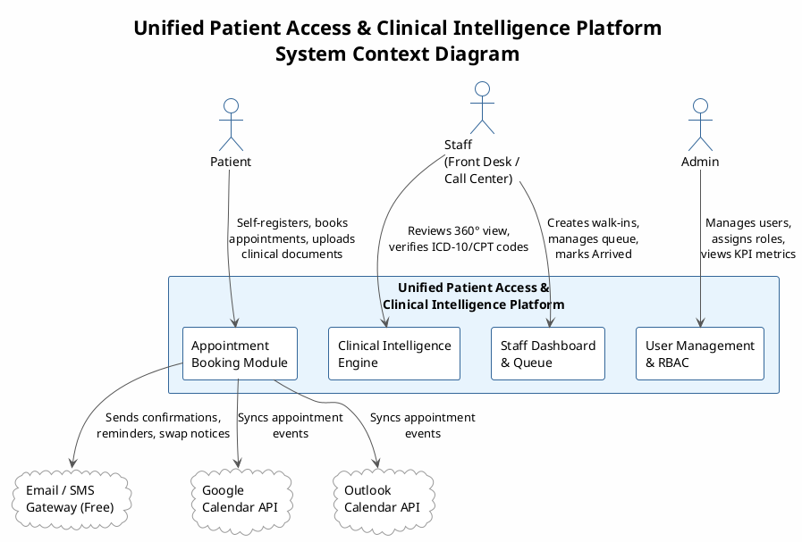

### Use Case Specifications

#### UC-001: Patient Self-Registration

- **Actor(s)**: Patient
- **Parent Requirements**: FR-001, FR-003, FR-004, FR-043
- **Goal**: A new patient creates a personal account to access the platform's booking and clinical features.
- **Preconditions**: Patient does not have an existing account. Platform registration page is accessible.
- **Success Scenario**:
  1. Patient navigates to the registration page.
  2. Patient enters name, date of birth, email, phone number, and insurance details.
  3. System validates all mandatory fields and checks for duplicate email addresses.
  4. System creates the patient account with the "Patient" role assigned.
  5. System records the registration action in the audit log.
  6. System redirects the patient to the intake form or dashboard.
- **Extensions/Alternatives**:
  - 3a. Email already registered: System returns a duplicate account error and prompts login.
  - 3b. Mandatory field missing: System highlights the missing field and prevents submission.
- **Postconditions**: A verified patient account exists in the system with RBAC role "Patient" assigned.

##### Use Case Diagram

<!-- RENDER type="plantuml" src="./uml-models/uc-001-patient-self-registration.png" -->


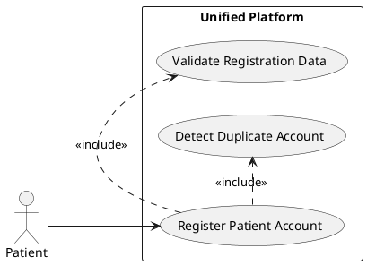

---

#### UC-002: Staff-Assisted Walk-in Account Creation

- **Actor(s)**: Staff
- **Parent Requirements**: FR-002, FR-004
- **Goal**: Staff creates a patient account on behalf of a walk-in patient to enable post-visit access.
- **Preconditions**: Staff is authenticated with the "Staff" role. Patient does not have a prior account.
- **Success Scenario**:
  1. Staff selects "Create walk-in booking" from the staff dashboard.
  2. Staff enters minimum required patient details (name, contact).
  3. Staff optionally selects "Create account for patient."
  4. System creates a patient account and generates temporary access credentials.
  5. System sends account credentials to the patient via email.
  6. System records the account creation in the audit log.
- **Extensions/Alternatives**:
  - 3a. Staff skips account creation: Walk-in booking proceeds without an associated patient account.
- **Postconditions**: Walk-in patient account (if created) exists with "Patient" role; credentials delivered.

##### Use Case Diagram

<!-- RENDER type="plantuml" src="./uml-models/uc-002-staff-walkin-account-creation.png" -->


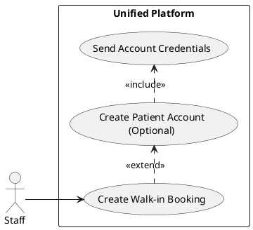

---

#### UC-003: Multi-Role User Login

- **Actor(s)**: Patient, Staff, Admin
- **Parent Requirements**: FR-003, FR-004
- **Goal**: An authenticated user gains access to their role-appropriate platform interface.
- **Preconditions**: User account exists and is active. Platform login page is accessible.
- **Success Scenario**:
  1. User navigates to the login page and enters credentials (email + password).
  2. System verifies credentials against stored hashed passwords.
  3. System determines the user's assigned role.
  4. System records the login event in the audit log.
  5. System redirects the user to the role-appropriate dashboard (Patient / Staff / Admin).
- **Extensions/Alternatives**:
  - 2a. Invalid credentials: System displays an authentication error without revealing which field is incorrect (see UC-004).
- **Postconditions**: User has an active authenticated session with role-based access enforced.

##### Use Case Diagram

<!-- RENDER type="plantuml" src="./uml-models/uc-003-multi-role-login.png" -->


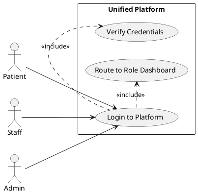

---

#### UC-004: Login Failure

- **Actor(s)**: Patient, Staff, Admin
- **Parent Requirements**: FR-003
- **Goal**: System securely handles authentication failures without leaking account existence information.
- **Preconditions**: User submits login credentials.
- **Success Scenario**:
  1. User submits email and password.
  2. System validates credentials and finds a mismatch or non-existent account.
  3. System returns a generic error message: "Invalid email or password."
  4. System records the failed login attempt in the audit log with IP and timestamp.
  5. System applies progressive rate limiting after repeated failures from the same source.
- **Extensions/Alternatives**:
  - 5a. Account locked after threshold reached: System informs the user to contact admin; stops processing further attempts.
- **Postconditions**: No session is created; audit log captures the failed attempt.

##### Use Case Diagram

<!-- RENDER type="plantuml" src="./uml-models/uc-004-login-failure.png" -->


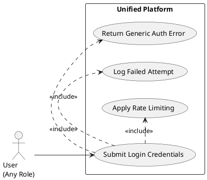

---

#### UC-005: Session Timeout

- **Actor(s)**: Patient, Staff, Admin
- **Parent Requirements**: FR-005
- **Goal**: System automatically terminates an inactive session to protect patient data.
- **Preconditions**: User has an active authenticated session.
- **Success Scenario**:
  1. 14 minutes of user inactivity elapses.
  2. System displays a 60-second inactivity warning with an option to extend the session.
  3. User does not respond within 60 seconds.
  4. System invalidates the session token.
  5. System redirects the user to the login page with a "Session expired" message.
  6. System records the session expiry in the audit log.
- **Extensions/Alternatives**:
  - 2a. User clicks "Extend Session": Session timer resets; user remains logged in.
- **Postconditions**: Session is invalidated; user must re-authenticate to resume.

##### Use Case Diagram

<!-- RENDER type="plantuml" src="./uml-models/uc-005-session-timeout.png" -->


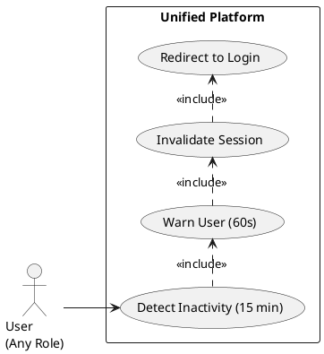

---

#### UC-006: Admin Manages Users and Roles

- **Actor(s)**: Admin
- **Parent Requirements**: FR-006
- **Goal**: Admin maintains the platform's user roster by creating, updating, or deactivating accounts and adjusting role assignments.
- **Preconditions**: Admin is authenticated.
- **Success Scenario**:
  1. Admin navigates to the User Management section of the admin dashboard.
  2. Admin selects an action: Create User, Edit User, Deactivate User, or Change Role.
  3. Admin provides the required details (e.g., name, email, role for new users).
  4. System validates the input (no duplicate email, valid role value).
  5. System saves the change and records it in the audit log.
  6. System sends a notification to the affected user (e.g., account created, role changed).
- **Extensions/Alternatives**:
  - 4a. Duplicate email detected: System prevents account creation and returns an error.
  - 4b. Admin attempts to deactivate their own account: System blocks the action and returns an error.
- **Postconditions**: User account state reflects the admin's changes; audit log updated.

##### Use Case Diagram

<!-- RENDER type="plantuml" src="./uml-models/uc-006-admin-user-management.png" -->


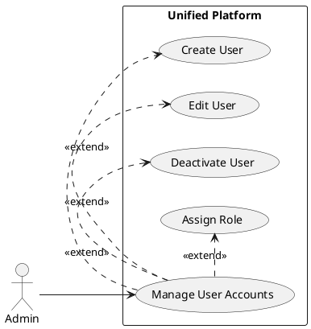

---

#### UC-007: AI Conversational Intake

- **Actor(s)**: Patient
- **Parent Requirements**: FR-007, FR-009, FR-010
- **Goal**: Patient completes their pre-visit intake using an AI-driven conversational interface.
- **Preconditions**: Patient is authenticated. Patient has not yet completed intake for the current visit cycle.
- **Success Scenario**:
  1. Patient selects "Start AI Intake" from the intake screen.
  2. AI engine presents a natural-language greeting and initial question.
  3. Patient provides responses via text input.
  4. AI engine progressively collects demographics, medical history, medications, allergies, and chief complaint.
  5. AI engine presents a structured summary of collected data for patient review.
  6. Patient confirms the summary or edits specific fields.
  7. System saves the intake record linked to the patient profile.
- **Extensions/Alternatives**:
  - 3a. Patient switches to manual form (see UC-009).
  - 6a. Patient edits a field: System updates the specific field and re-presents the summary.
- **Postconditions**: Complete intake record exists in the patient profile; editable at any future time.

##### Use Case Diagram

<!-- RENDER type="plantuml" src="./uml-models/uc-007-ai-conversational-intake.png" -->


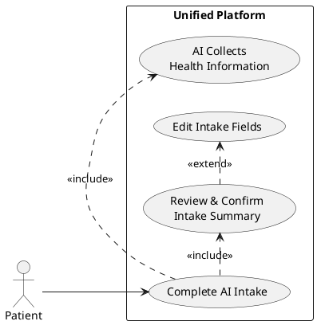

---

#### UC-008: Manual Intake Form Submission

- **Actor(s)**: Patient
- **Parent Requirements**: FR-008, FR-009, FR-010
- **Goal**: Patient completes intake using a structured form as an alternative to AI-driven intake.
- **Preconditions**: Patient is authenticated.
- **Success Scenario**:
  1. Patient selects "Manual Intake Form" from the intake screen.
  2. System presents a structured multi-section form (demographics, medical history, medications, allergies, chief complaint).
  3. Patient fills out all required sections.
  4. Patient reviews and submits the form.
  5. System validates all mandatory fields.
  6. System saves the intake record linked to the patient profile.
- **Extensions/Alternatives**:
  - 1a. Patient switches from AI intake to manual (see UC-009).
  - 5a. Mandatory field missing: System highlights the missing field and prevents submission.
- **Postconditions**: Complete intake record exists in the patient profile.

##### Use Case Diagram

<!-- RENDER type="plantuml" src="./uml-models/uc-008-manual-intake-form.png" -->


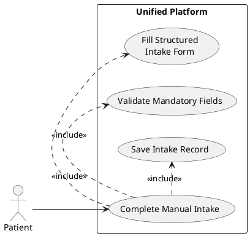

---

#### UC-009: Intake Mode Switch Mid-Session

- **Actor(s)**: Patient
- **Parent Requirements**: FR-009
- **Goal**: Patient switches between AI and manual intake modes without losing data already entered.
- **Preconditions**: Patient has an active intake session in either AI or manual mode with partial data entered.
- **Success Scenario**:
  1. Patient clicks "Switch to Manual Form" (from AI mode) or "Switch to AI Intake" (from manual mode).
  2. System maps all data collected in the current mode to the equivalent fields in the target mode.
  3. System displays the target mode with previously entered data pre-populated.
  4. Patient continues from where they left off.
- **Extensions/Alternatives**:
  - 2a. A field in the source mode has no equivalent in the target mode: Data is preserved in a neutral buffer and shown as a review item.
- **Postconditions**: Patient is in the new intake mode with all prior data intact.

##### Use Case Diagram

<!-- RENDER type="plantuml" src="./uml-models/uc-009-intake-mode-switch.png" -->


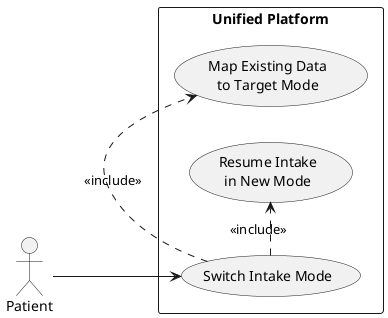

---

#### UC-010: Intake Validation Failure

- **Actor(s)**: Patient
- **Parent Requirements**: FR-007, FR-008
- **Goal**: System informs the patient of specific validation errors in their intake submission and preserves the entered data.
- **Preconditions**: Patient has submitted or confirmed the intake form/AI summary.
- **Success Scenario**:
  1. Patient submits intake.
  2. System detects missing mandatory fields or invalid data (e.g., invalid date format).
  3. System highlights each failing field or AI response with a specific error message.
  4. System does not clear entered data.
  5. Patient corrects the identified errors and resubmits.
- **Extensions/Alternatives**:
  - 5a. Patient abandons intake: Partial data is saved as a draft; patient can resume later.
- **Postconditions**: Intake is not saved in final state until all validation passes; partial draft preserved.

##### Use Case Diagram

<!-- RENDER type="plantuml" src="./uml-models/uc-010-intake-validation-failure.png" -->


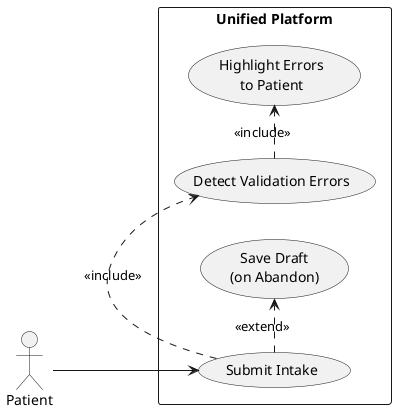

---

#### UC-011: Patient Books Available Slot

- **Actor(s)**: Patient
- **Parent Requirements**: FR-011, FR-012, FR-013, FR-014, FR-015
- **Goal**: Patient selects and confirms a booking for an available appointment slot.
- **Preconditions**: Patient is authenticated and has completed intake. Available slots exist.
- **Success Scenario**:
  1. Patient navigates to the Appointment Booking screen.
  2. System displays available slots with date, time, and availability status.
  3. Patient selects a slot and reviews booking details.
  4. Patient optionally designates a preferred (unavailable) slot (triggers UC-014).
  5. Patient completes insurance pre-check step (triggers UC-033).
  6. System checks for duplicate active booking conflicts (FR-015).
  7. System confirms the booking, computes the no-show risk score (FR-014), and records the appointment.
  8. System triggers PDF confirmation email (triggers UC-013).
  9. System offers calendar sync (triggers UC-018 / UC-019).
- **Extensions/Alternatives**:
  - 6a. Duplicate booking detected: System blocks the booking and informs the patient (see UC-012).
- **Postconditions**: Confirmed appointment exists in the patient record with a computed risk score.

##### Use Case Diagram

<!-- RENDER type="plantuml" src="./uml-models/uc-011-patient-books-slot.png" -->


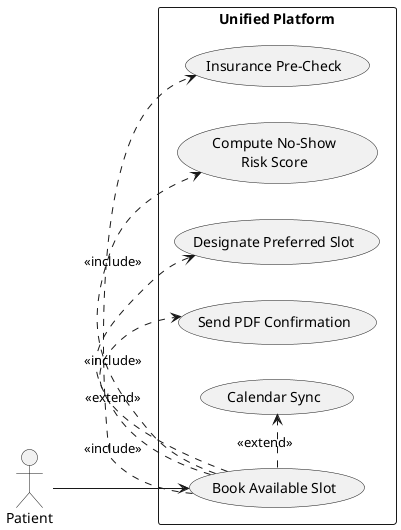

---

#### UC-012: No Slots Available / Booking Conflict

- **Actor(s)**: Patient
- **Parent Requirements**: FR-011, FR-012, FR-015
- **Goal**: System informs the patient when booking cannot proceed due to unavailable slots or a duplicate active booking, and offers alternatives.
- **Preconditions**: Patient is on the booking screen.
- **Success Scenario**:
  1. Patient selects a slot that is no longer available, or system detects a duplicate active booking.
  2. System displays an appropriate message: "This slot is no longer available" or "You already have an active booking."
  3. System displays the nearest available alternative slots.
  4. Patient selects an alternative slot and proceeds with booking.
- **Extensions/Alternatives**:
  - 3a. No alternative slots available: System displays "No slots currently available" and offers a waitlist option.
- **Postconditions**: Patient either books an alternative slot or is placed on a waitlist.

##### Use Case Diagram

<!-- RENDER type="plantuml" src="./uml-models/uc-012-no-slots-available.png" -->


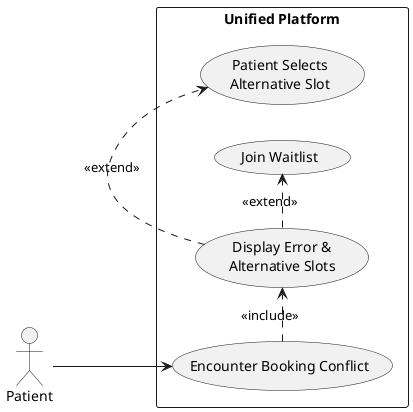

---

#### UC-013: PDF Confirmation Email Delivery

- **Actor(s)**: Email/SMS Gateway (System)
- **Parent Requirements**: FR-013
- **Goal**: System automatically generates and delivers a PDF appointment confirmation to the patient's email address immediately after booking.
- **Preconditions**: A confirmed appointment record exists. Patient email address is on file.
- **Success Scenario**:
  1. System generates a PDF containing appointment details (date, time, provider, location, reference number).
  2. System sends the PDF as an email attachment to the patient's registered email via the email gateway.
  3. Email gateway acknowledges delivery.
  4. System records the confirmation delivery in the audit log.
- **Extensions/Alternatives**:
  - 2a. Email delivery fails: System queues the email for retry up to 3 times with exponential back-off; logs the failure if all retries exhausted.
- **Postconditions**: Patient has received a PDF appointment confirmation via email.

##### Use Case Diagram

<!-- RENDER type="plantuml" src="./uml-models/uc-013-pdf-confirmation-email.png" -->


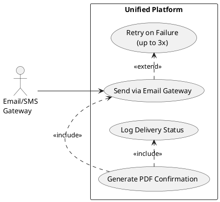

---

#### UC-014: Patient Designates Preferred Slot at Booking

- **Actor(s)**: Patient
- **Parent Requirements**: FR-016, FR-017
- **Goal**: Patient specifies an unavailable slot as their preference while confirming a booking on a currently available slot.
- **Preconditions**: Patient is in the booking flow and has selected an available slot. At least one other (unavailable) slot exists.
- **Success Scenario**:
  1. Patient selects an available slot and sees an option "I'd prefer a different slot."
  2. Patient selects an unavailable slot from the displayed calendar as their preferred slot.
  3. System records the preferred slot against the booking.
  4. System begins monitoring the preferred slot for availability.
  5. Booking is confirmed on the original available slot.
- **Extensions/Alternatives**:
  - 2a. Patient chooses not to designate a preferred slot: Booking proceeds without swap setup.
- **Postconditions**: Booking is confirmed; preferred slot monitor is active.

##### Use Case Diagram

<!-- RENDER type="plantuml" src="./uml-models/uc-014-preferred-slot-designation.png" -->


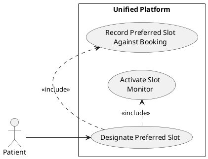

---

#### UC-015: System Auto-Executes Preferred Slot Swap

- **Actor(s)**: Email/SMS Gateway (System)
- **Parent Requirements**: FR-017, FR-018, FR-019
- **Goal**: System automatically moves the patient's appointment to the preferred slot as soon as it opens, releases the original slot, and notifies the patient.
- **Preconditions**: A booking with an active preferred slot monitor exists. The monitored preferred slot becomes available.
- **Success Scenario**:
  1. System detects the preferred slot has become available.
  2. System updates the patient's booking to the preferred slot.
  3. System releases the original slot back to the available pool.
  4. System generates an updated PDF confirmation for the new slot.
  5. System sends email and SMS notifications to the patient with the new appointment details.
  6. System deactivates the preferred slot monitor for this booking.
  7. System records the swap event in the audit log.
- **Extensions/Alternatives**:
  - 5a. Notification delivery fails: System retries up to 3 times; logs failure if all retries exhausted.
- **Postconditions**: Patient's appointment is at the preferred slot; original slot is available; patient is notified.

##### Use Case Diagram

<!-- RENDER type="plantuml" src="./uml-models/uc-015-preferred-slot-auto-swap.png" -->


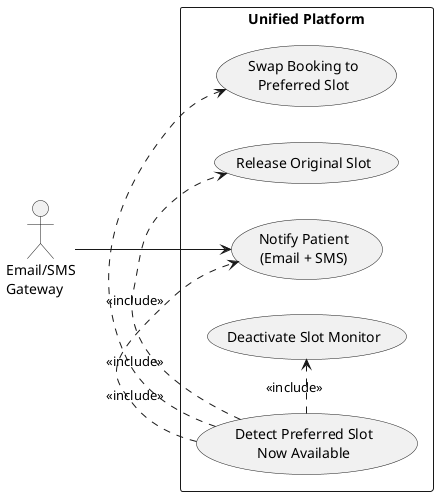

---

#### UC-016: Preferred Slot Never Opens

- **Actor(s)**: Patient
- **Parent Requirements**: FR-016
- **Goal**: Patient's original booking is preserved without modification when the preferred slot never becomes available.
- **Preconditions**: A booking with an active preferred slot monitor exists.
- **Success Scenario**:
  1. Patient's appointment date arrives with the preferred slot still unavailable.
  2. System deactivates the preferred slot monitor for this booking.
  3. Patient attends the appointment at the original booked slot.
- **Extensions/Alternatives**:
  - 1a. Patient manually cancels the preferred slot designation from their profile: Monitor is deactivated immediately.
- **Postconditions**: Original booking remains confirmed; preferred slot monitor deactivated after appointment date.

##### Use Case Diagram

<!-- RENDER type="plantuml" src="./uml-models/uc-016-preferred-slot-no-swap.png" -->


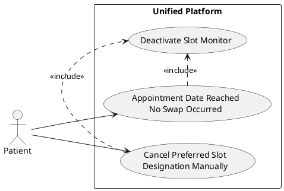

---

#### UC-017: Patient Receives Automated Reminders

- **Actor(s)**: Email/SMS Gateway (System)
- **Parent Requirements**: FR-020
- **Goal**: System automatically sends pre-appointment reminders via SMS and email on a defined schedule.
- **Preconditions**: Confirmed appointment exists. Patient has not opted out of reminders. Appointment date is in the future.
- **Success Scenario**:
  1. System evaluates the reminder schedule (e.g., 48 hours and 2 hours before appointment).
  2. System triggers an SMS and email reminder for each scheduled interval.
  3. Email/SMS gateway delivers the reminder with appointment details.
  4. System logs each reminder delivery event.
- **Extensions/Alternatives**:
  - 3a. Delivery fails: System retries up to 3 times with exponential back-off; logs final status.
  - 2a. Patient has opted out of a channel (FR-023): System skips the opted-out channel.
- **Postconditions**: Reminders delivered to patient per configured schedule; delivery status logged.

##### Use Case Diagram

<!-- RENDER type="plantuml" src="./uml-models/uc-017-automated-reminders.png" -->


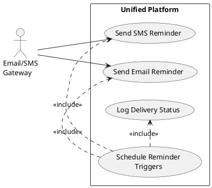

---

#### UC-018: Google Calendar Sync

- **Actor(s)**: Patient
- **Parent Requirements**: FR-021, FR-023
- **Goal**: Patient's appointment is synced to their Google Calendar after booking confirmation, with the option to opt out.
- **Preconditions**: Appointment is confirmed. Google Calendar API credentials are configured.
- **Success Scenario**:
  1. After booking confirmation, system prompts patient to authorize Google Calendar sync.
  2. Patient grants authorization via OAuth2.
  3. System creates a calendar event in the patient's Google Calendar with appointment details.
  4. System confirms sync completion to the patient.
- **Extensions/Alternatives**:
  - 1a. Patient declines or opts out: System skips calendar sync; preference is saved for future bookings.
  - 3a. API rate limit or failure: System falls back gracefully (see UC-020).
- **Postconditions**: Appointment event exists in the patient's Google Calendar (or opt-out preference is saved).

##### Use Case Diagram

<!-- RENDER type="plantuml" src="./uml-models/uc-018-google-calendar-sync.png" -->


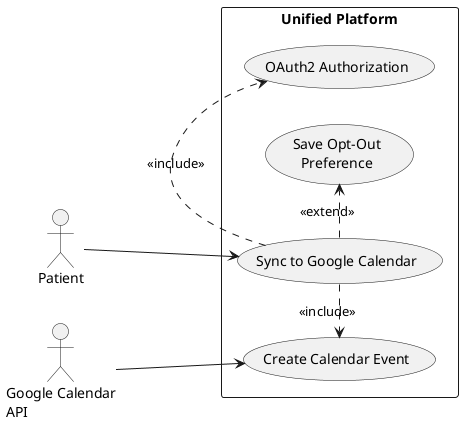

---

#### UC-019: Outlook Calendar Sync

- **Actor(s)**: Patient
- **Parent Requirements**: FR-022
- **Goal**: Patient's appointment is synced to their Outlook Calendar after booking confirmation.
- **Preconditions**: Appointment is confirmed. Outlook Calendar API credentials are configured.
- **Success Scenario**:
  1. After booking, system offers Outlook Calendar sync option.
  2. Patient grants authorization.
  3. System creates a calendar event in the patient's Outlook Calendar.
  4. System confirms sync completion.
- **Extensions/Alternatives**:
  - 1a. Patient declines: Calendar sync skipped; preference saved.
  - 3a. API failure: System falls back gracefully (see UC-020).
- **Postconditions**: Appointment event in Outlook Calendar, or opt-out preference saved.

##### Use Case Diagram

<!-- RENDER type="plantuml" src="./uml-models/uc-019-outlook-calendar-sync.png" -->


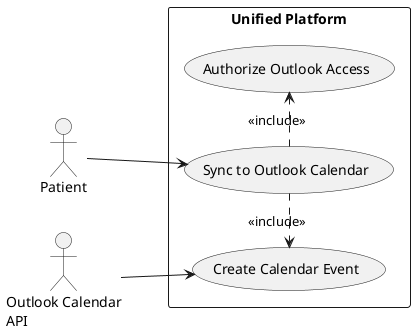

---

#### UC-020: Calendar Sync Failure

- **Actor(s)**: Google Calendar API / Outlook Calendar API (System)
- **Parent Requirements**: FR-021, FR-022
- **Goal**: System handles calendar sync failures gracefully without blocking the booking confirmation flow.
- **Preconditions**: Calendar sync was attempted and the external API returned an error.
- **Success Scenario**:
  1. External calendar API returns an error (timeout, rate limit, authorization failure).
  2. System logs the sync failure with error details.
  3. System continues the booking confirmation flow without blocking on the sync failure.
  4. System notifies the patient that calendar sync failed and offers to retry or skip.
  5. Patient retries or skips; booking remains confirmed regardless.
- **Extensions/Alternatives**:
  - 4a. Patient retries: System reattempts sync immediately.
- **Postconditions**: Booking is confirmed; calendar sync failure is logged; patient is informed.

##### Use Case Diagram

<!-- RENDER type="plantuml" src="./uml-models/uc-020-calendar-sync-failure.png" -->


```plantuml
@startuml uc-020-calendar-sync-failure
left to right direction
skinparam packageStyle rectangle
actor "Calendar API\n(Google/Outlook)" as calapi
rectangle "Unified Platform" {
  usecase "Calendar API Returns Error" as UC020
  usecase "Log Sync Failure" as UC020a
  usecase "Notify Patient\nof Failure" as UC020b
  usecase "Continue Booking\nConfirmation" as UC020c
}
calapi --> UC020
UC020 .> UC020a : <<include>>
UC020 .> UC020b : <<include>>
UC020 .> UC020c : <<include>>
@enduml
```

---

#### UC-021: Staff Creates Walk-in Booking and Queue Updates

- **Actor(s)**: Staff
- **Parent Requirements**: FR-024, FR-025, FR-026, FR-028
- **Goal**: Staff registers a walk-in patient and sees the queue update in real time.
- **Preconditions**: Staff is authenticated. Walk-in patient is present at front desk.
- **Success Scenario**:
  1. Staff selects "New Walk-In" from the staff dashboard.
  2. Staff enters patient name and contact details.
  3. Staff optionally creates a patient account (see UC-002).
  4. System creates a walk-in booking record for today.
  5. System immediately adds the walk-in to the same-day queue displayed on the staff dashboard.
  6. Queue refreshes in real time showing the new entry at the queue tail.
- **Extensions/Alternatives**:
  - 2a. Patient is already registered: Staff searches by name or DOB and links the walk-in to the existing profile.
- **Postconditions**: Walk-in booking recorded; same-day queue updated in real time.

##### Use Case Diagram

<!-- RENDER type="plantuml" src="./uml-models/uc-021-staff-walkin-booking.png" -->


```plantuml
@startuml uc-021-staff-walkin-booking
left to right direction
skinparam packageStyle rectangle
actor "Staff" as staff
rectangle "Unified Platform" {
  usecase "Create Walk-in Booking" as UC021
  usecase "Search Existing Patient" as UC021a
  usecase "Create Patient Account\n(Optional)" as UC002
  usecase "Add to Same-Day Queue\n(Real Time)" as UC021b
}
staff --> UC021
UC021 .> UC021a : <<extend>>
UC021 .> UC002 : <<extend>>
UC021 .> UC021b : <<include>>
@enduml
```

---

#### UC-022: Staff Marks Patient as Arrived

- **Actor(s)**: Staff
- **Parent Requirements**: FR-027
- **Goal**: Staff updates a patient's queue status to "Arrived" when the patient checks in at the front desk.
- **Preconditions**: Staff is authenticated. Patient has a confirmed appointment or walk-in booking for today.
- **Success Scenario**:
  1. Staff locates the patient in the same-day queue.
  2. Staff selects "Mark Arrived" for the patient.
  3. System updates the patient's status to "Arrived" and records the arrival timestamp.
  4. Queue display reflects the status change in real time.
  5. System records the arrival action in the audit log.
- **Extensions/Alternatives**:
  - 2a. Patient not found in queue: Staff searches by name or DOB and verifies the booking before marking.
- **Postconditions**: Patient status is "Arrived" in the system with timestamp; audit log updated.

##### Use Case Diagram

<!-- RENDER type="plantuml" src="./uml-models/uc-022-staff-marks-arrived.png" -->


```plantuml
@startuml uc-022-staff-marks-arrived
left to right direction
skinparam packageStyle rectangle
actor "Staff" as staff
rectangle "Unified Platform" {
  usecase "Mark Patient as Arrived" as UC022
  usecase "Update Queue Status\n& Timestamp" as UC022a
  usecase "Log Arrival Action" as UC022b
}
staff --> UC022
UC022 .> UC022a : <<include>>
UC022 .> UC022b : <<include>>
@enduml
```

---

#### UC-023: Unauthorized Attempt to Self-Check-In

- **Actor(s)**: Patient
- **Parent Requirements**: FR-024
- **Goal**: System blocks any patient attempt to perform a walk-in booking or self-check-in via the patient-facing interface.
- **Preconditions**: Patient is authenticated via the patient portal.
- **Success Scenario**:
  1. Patient navigates to the booking section of the patient portal.
  2. Patient attempts to initiate a walk-in or same-day queue entry.
  3. System detects the action is restricted to the Staff role.
  4. System blocks the action and displays an authorization error: "Walk-in bookings must be processed at the front desk."
  5. System records the unauthorized access attempt in the audit log.
- **Extensions/Alternatives**: None.
- **Postconditions**: Action is blocked; audit log captures the attempt.

##### Use Case Diagram

<!-- RENDER type="plantuml" src="./uml-models/uc-023-unauthorized-self-checkin.png" -->


```plantuml
@startuml uc-023-unauthorized-self-checkin
left to right direction
skinparam packageStyle rectangle
actor "Patient" as patient
rectangle "Unified Platform" {
  usecase "Attempt Walk-in\nSelf-Check-In" as UC023
  usecase "Block Action\n(RBAC Enforcement)" as UC023a
  usecase "Log Unauthorized Attempt" as UC023b
}
patient --> UC023
UC023 .> UC023a : <<include>>
UC023 .> UC023b : <<include>>
@enduml
```

---

#### UC-024: Patient Uploads Clinical Documents

- **Actor(s)**: Patient
- **Parent Requirements**: FR-029, FR-031
- **Goal**: Patient securely uploads historical clinical documents for inclusion in their patient record.
- **Preconditions**: Patient is authenticated. Patient record exists.
- **Success Scenario**:
  1. Patient navigates to "Upload Documents" in their profile.
  2. Patient selects one or more files from their device.
  3. System validates file type and size (see UC-025 for failure).
  4. System encrypts the file using AES-256 at rest.
  5. System stores the encrypted file linked to the patient's record.
  6. System confirms upload success and displays the document in the patient's document list.
  7. System records the upload in the audit log.
- **Extensions/Alternatives**:
  - 2a. Patient uploads multiple files: System processes each file independently.
- **Postconditions**: Document is securely stored, linked to patient record, and available for AI processing.

##### Use Case Diagram

<!-- RENDER type="plantuml" src="./uml-models/uc-024-patient-uploads-documents.png" -->


```plantuml
@startuml uc-024-patient-uploads-documents
left to right direction
skinparam packageStyle rectangle
actor "Patient" as patient
rectangle "Unified Platform" {
  usecase "Upload Clinical Documents" as UC024
  usecase "Validate File\n(Type & Size)" as UC025
  usecase "Encrypt & Store\nDocument" as UC024a
  usecase "Link to\nPatient Record" as UC024b
}
patient --> UC024
UC024 .> UC025 : <<include>>
UC024 .> UC024a : <<include>>
UC024 .> UC024b : <<include>>
@enduml
```

---

#### UC-025: Document Upload Validation Failure

- **Actor(s)**: Patient
- **Parent Requirements**: FR-029, FR-030
- **Goal**: System rejects an invalid file upload and informs the patient with a specific error message.
- **Preconditions**: Patient has selected a file for upload.
- **Success Scenario**:
  1. Patient selects a file for upload.
  2. System checks file type against the allowed list (e.g., PDF, JPG, PNG, DOCX).
  3. System checks file size against the configured maximum (e.g., 20 MB).
  4. Validation fails (disallowed file type or file too large).
  5. System rejects the file and displays a specific error: "File type not supported" or "File exceeds the size limit."
  6. System does not store the rejected file.
- **Extensions/Alternatives**:
  - 6a. Patient selects a valid file: Upload proceeds normally (see UC-024).
- **Postconditions**: Invalid file is rejected; no data stored; patient informed of specific failure reason.

##### Use Case Diagram

<!-- RENDER type="plantuml" src="./uml-models/uc-025-upload-validation-failure.png" -->


```plantuml
@startuml uc-025-upload-validation-failure
left to right direction
skinparam packageStyle rectangle
actor "Patient" as patient
rectangle "Unified Platform" {
  usecase "Submit File for Upload" as UC025
  usecase "Check File Type" as UC025a
  usecase "Check File Size" as UC025b
  usecase "Reject File & Inform\nPatient" as UC025c
}
patient --> UC025
UC025 .> UC025a : <<include>>
UC025 .> UC025b : <<include>>
UC025a .> UC025c : <<extend>>
UC025b .> UC025c : <<extend>>
@enduml
```

---

#### UC-026: AI Extracts and De-duplicates Clinical Data

- **Actor(s)**: AI/NLP Engine (System)
- **Parent Requirements**: FR-032, FR-033
- **Goal**: System processes uploaded clinical documents, extracts structured data, and produces a de-duplicated aggregated record.
- **Preconditions**: One or more validated clinical documents exist in the patient record.
- **Success Scenario**:
  1. System triggers the extraction pipeline for newly uploaded document(s).
  2. AI/NLP engine parses each document and extracts: vitals, medications, diagnoses, allergies, clinical notes.
  3. System de-duplicates entries across all extracted records (e.g., duplicate medication entries merged).
  4. System flags any detected conflicts (see UC-027).
  5. System updates the patient's aggregated data record with source-document traceability tags.
  6. System marks the extraction job as complete.
- **Extensions/Alternatives**:
  - 2a. AI confidence below threshold: System routes the extraction to exception handling (see UC-029).
- **Postconditions**: Aggregated, de-duplicated patient data record updated and ready for review.

##### Use Case Diagram

<!-- RENDER type="plantuml" src="./uml-models/uc-026-ai-clinical-extraction.png" -->


```plantuml
@startuml uc-026-ai-clinical-extraction
left to right direction
skinparam packageStyle rectangle
actor "AI/NLP Engine" as ai
rectangle "Unified Platform" {
  usecase "Extract Clinical Data\nfrom Documents" as UC026
  usecase "De-duplicate\nAggregated Records" as UC026a
  usecase "Detect Conflicts\n(-> UC-027)" as UC027
  usecase "Update Patient\nAggregated Record" as UC026b
}
ai --> UC026
UC026 .> UC026a : <<include>>
UC026 .> UC027 : <<extend>>
UC026 .> UC026b : <<include>>
@enduml
```

---

#### UC-027: Data Conflict Detected and Surfaced

- **Actor(s)**: AI/NLP Engine (System), Staff
- **Parent Requirements**: FR-034
- **Goal**: System surfaces a detected data conflict (e.g., contradictory medication entries) to staff for manual resolution.
- **Preconditions**: Extraction pipeline has detected at least one conflict in aggregated patient data.
- **Success Scenario**:
  1. System identifies contradictory data points across source documents.
  2. System creates a "Conflict Alert" record linked to the patient's aggregated view.
  3. System prominently displays the conflict in the 360-Degree Patient View with both conflicting values and their source documents.
  4. Staff reviews the conflict, selects the authoritative value, and marks the conflict as resolved.
  5. System updates the aggregated record with the resolved value and records the resolution in the audit log.
- **Extensions/Alternatives**:
  - 4a. Staff escalates the conflict for clinical review: Conflict remains flagged as "Pending Resolution."
- **Postconditions**: Conflict is either resolved (authoritative value saved) or escalated (flagged for further review).

##### Use Case Diagram

<!-- RENDER type="plantuml" src="./uml-models/uc-027-data-conflict-detection.png" -->


```plantuml
@startuml uc-027-data-conflict-detection
left to right direction
skinparam packageStyle rectangle
actor "AI/NLP Engine" as ai
actor "Staff" as staff
rectangle "Unified Platform" {
  usecase "Detect Data Conflict" as UC027
  usecase "Surface Conflict in\n360 Patient View" as UC027a
  usecase "Staff Resolves Conflict" as UC027b
  usecase "Escalate for\nClinical Review" as UC027c
}
ai --> UC027
staff --> UC027b
staff --> UC027c
UC027 .> UC027a : <<include>>
UC027a .> UC027b : <<extend>>
UC027a .> UC027c : <<extend>>
@enduml
```

---

#### UC-028: Staff Views 360-Degree Patient View

- **Actor(s)**: Staff
- **Parent Requirements**: FR-035
- **Goal**: Staff accesses a complete, source-traceable aggregated patient profile ahead of or during a patient visit.
- **Preconditions**: Staff is authenticated. Patient has at least one uploaded and processed clinical document.
- **Success Scenario**:
  1. Staff navigates to the patient's record from the dashboard.
  2. Staff selects the "360° Patient View" tab.
  3. System displays the aggregated patient data: vitals, medications, diagnoses, allergies, clinical notes.
  4. Each data point shows a source-document traceability link (document name, date).
  5. Active conflict alerts are prominently displayed at the top of the view.
  6. Staff reviews the data in preparation for the clinical visit.
- **Extensions/Alternatives**:
  - 3a. No documents uploaded: System displays "No clinical data available. Patient has not uploaded documents."
- **Postconditions**: Staff has reviewed the patient's complete aggregated profile.

##### Use Case Diagram

<!-- RENDER type="plantuml" src="./uml-models/uc-028-staff-360-patient-view.png" -->


```plantuml
@startuml uc-028-staff-360-patient-view
left to right direction
skinparam packageStyle rectangle
actor "Staff" as staff
rectangle "Unified Platform" {
  usecase "View 360 Patient Profile" as UC028
  usecase "Display Aggregated\nClinical Data" as UC028a
  usecase "Show Source\nTraceability Links" as UC028b
  usecase "Highlight Active\nConflict Alerts" as UC028c
}
staff --> UC028
UC028 .> UC028a : <<include>>
UC028 .> UC028b : <<include>>
UC028 .> UC028c : <<include>>
@enduml
```

---

#### UC-029: Extraction Failure / Low AI Confidence

- **Actor(s)**: AI/NLP Engine (System), Staff
- **Parent Requirements**: FR-032
- **Goal**: System handles AI extraction failures or low-confidence outputs by flagging the affected document for manual staff review.
- **Preconditions**: AI extraction pipeline has been triggered for a document.
- **Success Scenario**:
  1. AI engine processes the document and returns a confidence score below the configured threshold, or fails to parse the document.
  2. System marks the document as "Extraction Failed / Needs Review."
  3. System creates an alert in the staff dashboard indicating the document requires manual review.
  4. Staff reviews the flagged document manually and enters the relevant data.
  5. Manually entered data is saved to the patient's aggregated record with a "[MANUAL]" source tag.
- **Extensions/Alternatives**:
  - 2a. Complete extraction failure (engine error): System logs the error and retries once before flagging for manual review.
- **Postconditions**: Patient data from the document is either AI-extracted (confidence met) or manually entered (MANUAL tag).

##### Use Case Diagram

<!-- RENDER type="plantuml" src="./uml-models/uc-029-extraction-failure.png" -->


```plantuml
@startuml uc-029-extraction-failure
left to right direction
skinparam packageStyle rectangle
actor "AI/NLP Engine" as ai
actor "Staff" as staff
rectangle "Unified Platform" {
  usecase "Extraction Fails or\nLow Confidence" as UC029
  usecase "Flag Document for\nManual Review" as UC029a
  usecase "Staff Enters Data\nManually" as UC029b
  usecase "Save with [MANUAL]\nSource Tag" as UC029c
}
ai --> UC029
staff --> UC029b
UC029 .> UC029a : <<include>>
UC029a .> UC029b : <<extend>>
UC029b .> UC029c : <<include>>
@enduml
```

---

#### UC-030: AI Suggests Medical Codes

- **Actor(s)**: AI/NLP Engine (System)
- **Parent Requirements**: FR-036, FR-037
- **Goal**: System automatically generates ICD-10 and CPT code suggestions linked to supporting patient data.
- **Preconditions**: Patient has a complete or partial 360-Degree Patient View with aggregated clinical data.
- **Success Scenario**:
  1. System triggers the medical coding engine after data aggregation is complete.
  2. AI engine maps clinical diagnoses in the aggregated data to ICD-10 code candidates.
  3. AI engine maps clinical procedures in the aggregated data to CPT code candidates.
  4. System associates each suggested code with the specific aggregated data point(s) that support it.
  5. System presents the suggested codes in the staff coding review screen, grouped by ICD-10 and CPT.
- **Extensions/Alternatives**:
  - 2a. No diagnosable conditions found: System displays "No ICD-10 codes suggested. Review patient data manually."
- **Postconditions**: Suggested ICD-10 and CPT codes are available for staff review, each with source traceability.

##### Use Case Diagram

<!-- RENDER type="plantuml" src="./uml-models/uc-030-ai-medical-code-suggestions.png" -->


```plantuml
@startuml uc-030-ai-medical-code-suggestions
left to right direction
skinparam packageStyle rectangle
actor "AI/NLP Engine" as ai
rectangle "Unified Platform" {
  usecase "Generate Medical\nCode Suggestions" as UC030
  usecase "Map to ICD-10 Codes" as UC030a
  usecase "Map to CPT Codes" as UC030b
  usecase "Link Codes to\nSource Data" as UC030c
}
ai --> UC030
UC030 .> UC030a : <<include>>
UC030 .> UC030b : <<include>>
UC030 .> UC030c : <<include>>
@enduml
```

---

#### UC-031: Staff Reviews and Approves Medical Codes

- **Actor(s)**: Staff
- **Parent Requirements**: FR-038
- **Goal**: Staff explicitly reviews each AI-suggested code and approves those that are clinically accurate.
- **Preconditions**: AI code suggestions exist for the patient (UC-030 completed). Staff is on the coding review screen.
- **Success Scenario**:
  1. Staff navigates to the "Code Review" section of the patient's record.
  2. System displays AI-suggested ICD-10 and CPT codes, each with its supporting data link.
  3. Staff reviews each code and clicks "Approve."
  4. System marks the approved code as final, records the approving staff member's ID and timestamp.
  5. Finalized codes are added to the patient record.
  6. System records each approval in the audit log.
- **Extensions/Alternatives**:
  - 3a. Staff approves all codes at once: System marks all listed codes as final in a single action.
- **Postconditions**: All approved codes are finalized in the patient record; approval is attributable and audited.

##### Use Case Diagram

<!-- RENDER type="plantuml" src="./uml-models/uc-031-staff-approves-codes.png" -->


```plantuml
@startuml uc-031-staff-approves-codes
left to right direction
skinparam packageStyle rectangle
actor "Staff" as staff
rectangle "Unified Platform" {
  usecase "Review & Approve\nAI Code Suggestions" as UC031
  usecase "Approve Individual Code" as UC031a
  usecase "Approve All Codes" as UC031b
  usecase "Log Approval\nwith Staff ID" as UC031c
}
staff --> UC031
UC031 .> UC031a : <<extend>>
UC031 .> UC031b : <<extend>>
UC031 .> UC031c : <<include>>
@enduml
```

---

#### UC-032: Staff Rejects or Corrects AI Code Suggestion

- **Actor(s)**: Staff
- **Parent Requirements**: FR-038
- **Goal**: Staff overrides an incorrect AI-suggested code by rejecting it and optionally entering the correct code.
- **Preconditions**: AI code suggestions are displayed. Staff disagrees with one or more suggestions.
- **Success Scenario**:
  1. Staff reviews an AI-suggested code and determines it is incorrect.
  2. Staff clicks "Reject" on the code.
  3. System removes the rejected suggestion from the pending list.
  4. Staff optionally searches for and selects the correct ICD-10 or CPT code manually.
  5. System adds the manually selected code as final with the staff member's ID and timestamp.
  6. System updates the AI-Human Agreement Rate metric to reflect the rejection.
  7. System records the rejection and correction in the audit log.
- **Extensions/Alternatives**:
  - 4a. Staff rejects without providing a replacement: No code is recorded for that category; staff can return later to add a code.
- **Postconditions**: Incorrect code removed; corrected code finalized (if provided); agreement rate metric updated.

##### Use Case Diagram

<!-- RENDER type="plantuml" src="./uml-models/uc-032-staff-rejects-code.png" -->


```plantuml
@startuml uc-032-staff-rejects-code
left to right direction
skinparam packageStyle rectangle
actor "Staff" as staff
rectangle "Unified Platform" {
  usecase "Reject AI Code\nSuggestion" as UC032
  usecase "Remove Rejected Code" as UC032a
  usecase "Enter Manual\nReplacement Code" as UC032b
  usecase "Update AI-Human\nAgreement Rate" as UC032c
  usecase "Log Rejection\n& Correction" as UC032d
}
staff --> UC032
UC032 .> UC032a : <<include>>
UC032 .> UC032b : <<extend>>
UC032 .> UC032c : <<include>>
UC032 .> UC032d : <<include>>
@enduml
```

---

#### UC-033: Insurance Pre-Check — Validation Passes

- **Actor(s)**: Patient, System
- **Parent Requirements**: FR-039
- **Goal**: System performs a soft validation of patient-entered insurance details and displays a pass status without blocking the booking.
- **Preconditions**: Patient has entered insurance provider name and insurance ID during registration or booking.
- **Success Scenario**:
  1. Patient provides insurance provider name and insurance ID.
  2. System looks up the provided details against the internal dummy insurance records dataset.
  3. A matching record is found.
  4. System displays a "Pre-Check Passed" status indicator on the booking form.
  5. Booking proceeds normally.
- **Extensions/Alternatives**:
  - 3a. No match found: System displays a warning (see UC-034). Booking proceeds regardless.
- **Postconditions**: Insurance pre-check status ("Passed") is recorded on the appointment; booking is not blocked.

##### Use Case Diagram

<!-- RENDER type="plantuml" src="./uml-models/uc-033-insurance-precheck-pass.png" -->


```plantuml
@startuml uc-033-insurance-precheck-pass
left to right direction
skinparam packageStyle rectangle
actor "Patient" as patient
rectangle "Unified Platform" {
  usecase "Insurance Pre-Check\n(Validation Passes)" as UC033
  usecase "Lookup Internal\nDummy Records" as UC033a
  usecase "Display Pre-Check\nPassed Status" as UC033b
}
patient --> UC033
UC033 .> UC033a : <<include>>
UC033 .> UC033b : <<include>>
@enduml
```

---

#### UC-034: Insurance Pre-Check — Validation Fails

- **Actor(s)**: Patient, System
- **Parent Requirements**: FR-039
- **Goal**: System informs the patient of an insurance pre-check failure as a non-blocking warning, allowing booking to proceed.
- **Preconditions**: Patient has entered insurance details. Lookup returns no match.
- **Success Scenario**:
  1. System performs insurance lookup; no match found in dummy records.
  2. System displays a warning: "Insurance details could not be verified. Please confirm with the clinic before your visit."
  3. Booking proceeds without blocking.
  4. Appointment record is flagged with "Insurance: Not Verified" status for staff awareness.
- **Extensions/Alternatives**:
  - 1a. Lookup service unavailable: System bypasses the check, flags the appointment as "Insurance: Check Skipped," and logs the service error.
- **Postconditions**: Booking completed with "Insurance: Not Verified" or "Check Skipped" flag; patient and staff informed.

##### Use Case Diagram

<!-- RENDER type="plantuml" src="./uml-models/uc-034-insurance-precheck-fail.png" -->


```plantuml
@startuml uc-034-insurance-precheck-fail
left to right direction
skinparam packageStyle rectangle
actor "Patient" as patient
rectangle "Unified Platform" {
  usecase "Insurance Pre-Check\n(Validation Fails)" as UC034
  usecase "Display Non-Blocking\nWarning" as UC034a
  usecase "Flag Appointment\nInsurance: Not Verified" as UC034b
  usecase "Bypass on Service\nUnavailable" as UC034c
}
patient --> UC034
UC034 .> UC034a : <<include>>
UC034 .> UC034b : <<include>>
UC034 .> UC034c : <<extend>>
@enduml
```

---

#### UC-035: Staff Views Daily Operations Dashboard

- **Actor(s)**: Staff
- **Parent Requirements**: FR-040, FR-042
- **Goal**: Staff accesses a real-time operational view of all today's appointments, walk-ins, and queue statuses.
- **Preconditions**: Staff is authenticated.
- **Success Scenario**:
  1. Staff logs in and is routed to the Staff Dashboard.
  2. System displays: today's appointment list (time, patient name, booking type, status, no-show risk score), walk-in queue, patient arrival statuses, and unread notifications (extraction completions, coding alerts).
  3. Staff uses the dashboard to take queue actions (mark arrived, open patient record, create walk-in).
  4. System displays a KPI summary tile showing the day's no-show count vs. total scheduled.
- **Extensions/Alternatives**:
  - 2a. No appointments today: Dashboard shows "No appointments scheduled for today" for the appointment list section; walk-in queue remains operational.
- **Postconditions**: Staff has an accurate, real-time view of the current day's clinical operations.

##### Use Case Diagram

<!-- RENDER type="plantuml" src="./uml-models/uc-035-staff-daily-dashboard.png" -->


```plantuml
@startuml uc-035-staff-daily-dashboard
left to right direction
skinparam packageStyle rectangle
actor "Staff" as staff
rectangle "Unified Platform" {
  usecase "View Daily\nOperations Dashboard" as UC035
  usecase "Appointment List\n& Status" as UC035a
  usecase "Walk-in Queue\nManagement" as UC035b
  usecase "KPI Summary Tile" as UC035c
  usecase "Notifications\n& Alerts" as UC035d
}
staff --> UC035
UC035 .> UC035a : <<include>>
UC035 .> UC035b : <<include>>
UC035 .> UC035c : <<include>>
UC035 .> UC035d : <<include>>
@enduml
```

---

#### UC-036: Admin Views Platform Metrics and Manages Users

- **Actor(s)**: Admin
- **Parent Requirements**: FR-041, FR-042
- **Goal**: Admin monitors platform health KPIs and manages user accounts from a single admin panel.
- **Preconditions**: Admin is authenticated.
- **Success Scenario**:
  1. Admin logs in and is routed to the Admin Panel.
  2. System displays KPI metrics: total patient dashboards created, no-show rate trend, AI-Human Agreement Rate, and total Critical Conflicts Identified.
  3. Admin navigates to User Management to perform CRUD operations on accounts and roles (UC-006).
- **Extensions/Alternatives**:
  - 2a. No data available yet (new deployment): Metric tiles display "No data yet" placeholders.
- **Postconditions**: Admin has full visibility into platform KPIs and can manage all user accounts.

##### Use Case Diagram

<!-- RENDER type="plantuml" src="./uml-models/uc-036-admin-panel.png" -->


```plantuml
@startuml uc-036-admin-panel
left to right direction
skinparam packageStyle rectangle
actor "Admin" as admin
rectangle "Unified Platform" {
  usecase "Admin Panel:\nMetrics & User Mgmt" as UC036
  usecase "View KPI\nMetrics Dashboard" as UC036a
  usecase "Manage Users\n& Roles (UC-006)" as UC006
}
admin --> UC036
UC036 .> UC036a : <<include>>
UC036 .> UC006 : <<include>>
@enduml
```

---

#### UC-037: Audit Log Entry Created on Sensitive Action

- **Actor(s)**: System (Audit Logger)
- **Parent Requirements**: FR-043, FR-044
- **Goal**: System creates an immutable audit record for every sensitive patient data or administrative action.
- **Preconditions**: A user or system process initiates an auditable action (patient data access, booking, code finalization, user management).
- **Success Scenario**:
  1. User or system process initiates an auditable action.
  2. Audit logger intercepts the action pre-commit.
  3. System writes a log entry containing: actor ID, actor role, action type, affected record ID, timestamp (UTC), originating IP address.
  4. Log entry is written to the append-only audit store.
  5. Action is allowed to complete only after the log entry is confirmed written.
- **Extensions/Alternatives**:
  - 4a. Audit log write fails: System blocks the action and returns an error — no unlogged action is permitted to complete.
- **Postconditions**: Immutable audit entry exists; action cannot succeed without a logged record.

##### Use Case Diagram

<!-- RENDER type="plantuml" src="./uml-models/uc-037-audit-log.png" -->


```plantuml
@startuml uc-037-audit-log
left to right direction
skinparam packageStyle rectangle
actor "Any User /\nSystem Process" as actor
rectangle "Unified Platform" {
  usecase "Initiate Sensitive\nAction" as UC037
  usecase "Write Audit\nLog Entry" as UC037a
  usecase "Block Action on\nLog Write Failure" as UC037b
  usecase "Append-Only\nAudit Store" as UC037c
}
actor --> UC037
UC037 .> UC037a : <<include>>
UC037a .> UC037c : <<include>>
UC037a .> UC037b : <<extend>>
@enduml
```

---

#### UC-038: Unauthorized Access Attempt Blocked and Logged

- **Actor(s)**: Patient, unauthenticated user
- **Parent Requirements**: FR-004, FR-043, FR-044, FR-045
- **Goal**: System detects, blocks, and logs any attempt to access data or perform actions that exceed the caller's role permissions.
- **Preconditions**: A request is received for a resource or action that the caller's role does not permit.
- **Success Scenario**:
  1. Request arrives at the RBAC enforcement layer.
  2. System compares the caller's assigned role against the required permission for the requested resource.
  3. Permission check fails.
  4. System returns HTTP 403 Forbidden (or 401 Unauthorized for unauthenticated callers).
  5. System writes an audit log entry: caller identity (or anonymous), resource targeted, action attempted, timestamp, IP address.
  6. If three or more unauthorized attempts are detected from the same source IP within 10 minutes, system triggers an alert to the Admin dashboard.
- **Extensions/Alternatives**:
  - 1a. Unauthenticated request to a protected resource: System returns HTTP 401 and redirects to login page.
- **Postconditions**: Access is denied; attempt is immutably logged; Admin is alerted on repeat attempts.

##### Use Case Diagram

<!-- RENDER type="plantuml" src="./uml-models/uc-038-unauthorized-access.png" -->


```plantuml
@startuml uc-038-unauthorized-access
left to right direction
skinparam packageStyle rectangle
actor "Unauthorized\nUser / Request" as unauth
rectangle "Unified Platform" {
  usecase "Unauthorized Access\nAttempt" as UC038
  usecase "RBAC Permission\nCheck Fails" as UC038a
  usecase "Return 403 / 401" as UC038b
  usecase "Log Unauthorized\nAttempt" as UC038c
  usecase "Trigger Admin Alert\n(Threshold)" as UC038d
}
unauth --> UC038
UC038 .> UC038a : <<include>>
UC038 .> UC038b : <<include>>
UC038 .> UC038c : <<include>>
UC038 .> UC038d : <<extend>>
@enduml
```

---

## Risks & Mitigations

- **AI Extraction Accuracy Below 98% Target:** Open-source NLP models applied to heterogeneous clinical PDF formats (handwritten notes, scanned documents, non-standard layouts) may produce extraction confidence below the required threshold.
  *Mitigation:* Mandatory human review before extracted data is used clinically (UC-029); configurable confidence threshold triggers "Manual Review Required" flag; staff override available at all times; AI-Human Agreement Rate KPI tracked weekly.

- **HIPAA Compliance Failure:** Misconfigured cloud storage, missing audit log coverage, or third-party API integrations that process PHI without executed Business Associate Agreements may expose the platform to HIPAA violations.
  *Mitigation:* AES-256 encryption at rest (FR-031, FR-045); TLS 1.2+ for all transmissions (FR-045); append-only audit log that blocks actions on write failure (UC-037); RBAC enforced at every API endpoint (FR-004); BAA execution required for all third-party services handling PHI (email gateway, calendar APIs).

- **Preferred Slot Swap Race Condition:** Two patients sharing the same preferred slot when it opens simultaneously could result in a double-booking.
  *Mitigation:* Atomic database transaction on slot assignment; FIFO priority for tie-breaking (first preference registered wins); losing patient is notified immediately and preference is cleared.

- **Free-Tier API Rate Limits Exceeded at Scale:** Google Calendar API, Outlook Calendar API, and email/SMS gateways have free-tier usage ceilings that may be breached under high appointment volume.
  *Mitigation:* Exponential back-off and retry queues for all external API calls (UC-020); calendar sync is opt-in only, limiting call volume; API usage monitoring with threshold alerts; upgrade path to paid tiers documented for Phase 2.

- **Session Hijacking via Token Theft:** Exposed or stolen session tokens could allow unauthorized patient data access.
  *Mitigation:* 15-minute idle session timeout (FR-005); HTTPS-only transport enforced (FR-045); HttpOnly and Secure flags on all cookies; CSRF tokens on all state-mutating endpoints.

- **No-Show Rate Reduction Below Target:** Reminder delivery alone may be insufficient to achieve the target reduction from the 15% baseline.
  *Mitigation:* Multi-channel reminders (FR-020); preferred slot swap reduces involuntary no-shows (FR-017); rule-based risk scoring (FR-014) surfaces high-risk patients for proactive staff outreach.

- **Upstash Redis Free Tier Exhaustion:** The 10,000 command/day free limit on Upstash Redis may be insufficient at higher booking volumes, impacting caching and session management performance.
  *Mitigation:* Cache only high-frequency, short-lived read patterns (slot availability, session tokens); optimize cache key expiry; document Upstash upgrade path for Phase 2.

- **Open-Source LLM Clinical Accuracy:** Self-hosted open-source models may produce inconsistent quality on clinical terminology, abbreviations, and medical shorthand.
  *Mitigation:* Evaluate candidate models against a curated clinical document test set before go-live; implement confidence scoring; supplement with rule-based keyword extraction for structured clinical sections (medication tables, vitals grids) as a deterministic fallback.

---

## Constraints & Assumptions

- **[SOURCE:INPUT] Free-tier hosting only:** The platform must be deployable on Netlify, Vercel, GitHub Codespaces, Windows Services/IIS, or equivalent free-tier environments. AWS, Azure, and GCP are explicitly out of scope for Phase 1.

- **[SOURCE:INPUT] Technology stack (options):** Frontend — React or Angular; Backend API — .NET or Java; Primary database — PostgreSQL or SQL Server; Cache — Upstash Redis (free tier). Final stack selection is a design-phase decision; this specification is stack-agnostic unless otherwise stated.

- **[SOURCE:INPUT] Auxiliary tooling — free and open-source only:** All background processing pipelines, document parsers, AI/NLP engines, PDF generators, and utility tools must use strictly free and open-source technology. No proprietary SaaS AI APIs (e.g., OpenAI API, Azure Cognitive Services) are permitted in Phase 1.

- **[SOURCE:INPUT] HIPAA compliance is mandatory:** The platform handles Protected Health Information (PHI) and must comply fully with the HIPAA Security Rule (45 CFR Part 164) for access controls, audit controls, integrity controls, and transmission security. Business Associate Agreements (BAAs) must be executed with all third-party services that process or transmit PHI.

- **[SOURCE:INPUT] Provider-facing features are out of scope:** No provider/physician logins, provider scheduling tools, or provider-facing clinical actions are included in Phase 1.

- **[SOURCE:INPUT] Payment processing is out of scope:** Live payment gateway integration is excluded from Phase 1. Infrastructure placeholders for future reservation fee processing are permissible.

- **[SOURCE:INPUT] Patient self-check-in is out of scope:** Patients cannot mark their own arrival through any channel (app, web, QR code). Only staff may execute arrival status changes (FR-024, FR-027).

- **[SOURCE:INPUT] Insurance pre-check uses internal dummy records:** Soft validation runs exclusively against a hardcoded internal dataset. No live insurance verification API integration is included in Phase 1.

- **[SOURCE:INPUT] Direct EHR integration is out of scope:** Bi-directional EHR integration and full claims submission are deferred to Phase 2. The platform's aggregated data model must be designed to be integration-ready (structured, de-duplicated, coded).

- **[SOURCE:INPUT] 99.9% uptime target:** The chosen free-tier hosting platform must support or approximate 99.9% availability. Platforms with known sub-SLA uptime must be evaluated against this requirement before selection.

- **[SOURCE:INFERRED] ICD-10 and CPT code sets — licensing review required:** The AI coding engine uses ICD-10-CM/PCS (CMS — public domain) and CPT (AMA — proprietary). AMA CPT licensing terms must be reviewed for compliance with an open-source deployment model before go-live. A CPT license may be required.

- **[SOURCE:INFERRED] AI/NLP engine must be locally deployable:** Given the prohibition on paid cloud APIs, the clinical extraction and medical coding AI must use a self-hosted, open-source biomedical NLP model. Model selection, minimum hardware requirements, and accuracy benchmarking are Phase 1 prerequisites.

- **[SOURCE:INFERRED] Calendar sync requires patient OAuth2 consent:** Both Google Calendar and Outlook Calendar integrations require patients to grant OAuth2 authorization. Token storage must be encrypted; token revocation must be supported and honoured.

- **[SOURCE:INFERRED] Clinical documents are linked to the patient profile, not the appointment:** Uploaded documents belong to the patient record, not a specific booking. This allows the 360-Degree Patient View to aggregate data across the full patient history, regardless of which visit prompted the upload.

- **[SOURCE:INFERRED] Multi-tenant data isolation is required:** If the platform serves more than one clinic, patient and appointment data must be logically isolated by tenant at the database and API layer. Single-tenant deployment is the Phase 1 default; multi-tenant architecture must not be precluded by schema design.

- **[SOURCE:EXTERNAL] HIPAA minimum-necessary standard (45 CFR §164.502(b)):** All PHI access must be limited to the minimum amount necessary for the stated purpose. This constrains read permission scope across all roles and must be enforced at the data access layer, not only the UI.

#### UC-031: Staff Reviews and Approves Medical Codes

- **Actor(s)**: Staff
- **Parent Requirements**: FR-038
- **Goal**: Staff reviews all AI-suggested codes and approves each one to finalize the coding record.
- **Preconditions**: AI-suggested ICD-10 and CPT codes are available. Staff is authenticated.
- **Success Scenario**:
  1. Staff opens the coding review screen for a patient.
  2. System displays each suggested ICD-10 and CPT code with supporting data references.
  3. Staff reviews each code and its supporting evidence.
  4. Staff clicks "Approve" for each code they accept.
  5. System marks the approved codes as finalized and records the approval with the staff user's identity.
  6. System updates the AI-Human Agreement Rate metric.
- **Extensions/Alternatives**:
  - 4a. Staff rejects a code (see UC-032).
- **Postconditions**: All reviewed codes are either approved (finalized in record) or rejected; KPI metric updated.

##### Use Case Diagram

<!-- RENDER type="plantuml" src="./uml-models/uc-031-staff-approves-codes.png" -->


```plantuml
@startuml uc-031-staff-approves-codes
left to right direction
skinparam packageStyle rectangle
actor "Staff" as staff
rectangle "Unified Platform" {
  usecase "Review AI Code Suggestions" as UC031
  usecase "Approve Code" as UC031a
  usecase "Finalize Code in Record" as UC031b
  usecase "Update Agreement\nRate KPI" as UC031c
}
staff --> UC031
UC031 .> UC031a : <<include>>
UC031a .> UC031b : <<include>>
UC031 .> UC031c : <<include>>
@enduml
```

---

#### UC-032: Staff Rejects or Corrects AI Code Suggestion

- **Actor(s)**: Staff
- **Parent Requirements**: FR-038
- **Goal**: Staff rejects an incorrect AI-suggested code and optionally enters the correct code.
- **Preconditions**: AI-suggested code is displayed in the coding review screen.
- **Success Scenario**:
  1. Staff reviews an AI-suggested code and determines it is incorrect.
  2. Staff clicks "Reject" and optionally provides a corrected code and reason.
  3. System removes the rejected code from the proposed list.
  4. System records the rejection and correction (if provided) in the patient record.
  5. System updates the AI-Human Agreement Rate metric to reflect the rejection.
- **Extensions/Alternatives**:
  - 2a. Staff rejects without providing a correction: Code is removed; record notes "Rejected - No replacement."
- **Postconditions**: Rejected code is not finalized; correction (if provided) is saved; KPI updated.

##### Use Case Diagram

<!-- RENDER type="plantuml" src="./uml-models/uc-032-staff-rejects-code.png" -->


```plantuml
@startuml uc-032-staff-rejects-code
left to right direction
skinparam packageStyle rectangle
actor "Staff" as staff
rectangle "Unified Platform" {
  usecase "Reject AI Code Suggestion" as UC032
  usecase "Provide Corrected Code\n(Optional)" as UC032a
  usecase "Record Rejection\n& Correction" as UC032b
  usecase "Update Agreement\nRate KPI" as UC032c
}
staff --> UC032
UC032 .> UC032a : <<extend>>
UC032 .> UC032b : <<include>>
UC032 .> UC032c : <<include>>
@enduml
```

---

#### UC-033: Insurance Pre-Check — Validation Passes

- **Actor(s)**: Patient
- **Parent Requirements**: FR-039
- **Goal**: System validates the patient's insurance information during booking and confirms a match against the dummy records set.
- **Preconditions**: Patient is in the booking flow and has provided insurance name and ID.
- **Success Scenario**:
  1. Patient enters insurance provider name and insurance ID on the booking form.
  2. System performs a soft validation lookup against the internal dummy records.
  3. A matching record is found.
  4. System displays a green confirmation: "Insurance verified."
  5. Booking flow continues.
- **Extensions/Alternatives**: Failure handled in UC-034.
- **Postconditions**: Insurance pre-check passed; booking flow proceeds to confirmation.

##### Use Case Diagram

<!-- RENDER type="plantuml" src="./uml-models/uc-033-insurance-precheck-pass.png" -->


```plantuml
@startuml uc-033-insurance-precheck-pass
left to right direction
skinparam packageStyle rectangle
actor "Patient" as patient
rectangle "Unified Platform" {
  usecase "Submit Insurance Details" as UC033
  usecase "Lookup Against\nDummy Records" as UC033a
  usecase "Display Insurance\nVerified" as UC033b
}
patient --> UC033
UC033 .> UC033a : <<include>>
UC033a .> UC033b : <<include>>
@enduml
```

---

#### UC-034: Insurance Pre-Check — Validation Fails

- **Actor(s)**: Patient
- **Parent Requirements**: FR-039
- **Goal**: System warns the patient when their insurance details do not match the dummy records, without blocking the booking.
- **Preconditions**: Patient has submitted insurance details during booking.
- **Success Scenario**:
  1. System performs a soft validation and finds no matching record.
  2. System displays a warning (non-blocking): "Insurance not recognized. Please verify your details or proceed without verification."
  3. Patient reviews the warning and may update details and re-validate, or proceed with the booking.
  4. Booking proceeds regardless of insurance validation outcome.
- **Extensions/Alternatives**:
  - 3a. Patient corrects details: System re-runs validation with updated inputs.
- **Postconditions**: Booking is not blocked; insurance mismatch warning is recorded on the booking record.

##### Use Case Diagram

<!-- RENDER type="plantuml" src="./uml-models/uc-034-insurance-precheck-fail.png" -->


```plantuml
@startuml uc-034-insurance-precheck-fail
left to right direction
skinparam packageStyle rectangle
actor "Patient" as patient
rectangle "Unified Platform" {
  usecase "Insurance Lookup\nFinds No Match" as UC034
  usecase "Display Non-Blocking\nWarning" as UC034a
  usecase "Proceed with Booking\nDespite Warning" as UC034b
  usecase "Update Insurance\nDetails & Retry" as UC034c
}
patient --> UC034
UC034 .> UC034a : <<include>>
UC034a .> UC034b : <<extend>>
UC034a .> UC034c : <<extend>>
@enduml
```

---

#### UC-035: Staff Views Daily Operations Dashboard

- **Actor(s)**: Staff
- **Parent Requirements**: FR-040, FR-042
- **Goal**: Staff reviews the day's appointments, walk-in queue, patient statuses, and operational KPIs from a single dashboard.
- **Preconditions**: Staff is authenticated.
- **Success Scenario**:
  1. Staff logs into the staff dashboard.
  2. System displays today's scheduled appointments list with patient name, time, status, and no-show risk score.
  3. System displays the live walk-in queue in arrival sequence.
  4. System displays KPI summary: today's no-show rate, total appointments, and current queue depth.
  5. Staff uses the dashboard to manage patient flow throughout the day.
- **Extensions/Alternatives**:
  - 2a. No appointments today: System displays "No scheduled appointments for today."
- **Postconditions**: Staff has a complete situational view of the day's clinical operations.

##### Use Case Diagram

<!-- RENDER type="plantuml" src="./uml-models/uc-035-staff-daily-dashboard.png" -->


```plantuml
@startuml uc-035-staff-daily-dashboard
left to right direction
skinparam packageStyle rectangle
actor "Staff" as staff
rectangle "Unified Platform" {
  usecase "View Daily Operations\nDashboard" as UC035
  usecase "View Today's\nAppointments" as UC035a
  usecase "View Live Walk-In Queue" as UC035b
  usecase "View KPI Summary" as UC035c
}
staff --> UC035
UC035 .> UC035a : <<include>>
UC035 .> UC035b : <<include>>
UC035 .> UC035c : <<include>>
@enduml
```

---

#### UC-036: Admin Views Platform Metrics and Manages Users

- **Actor(s)**: Admin
- **Parent Requirements**: FR-041, FR-042
- **Goal**: Admin monitors platform-wide KPIs and manages the user roster from the admin dashboard.
- **Preconditions**: Admin is authenticated.
- **Success Scenario**:
  1. Admin logs into the admin dashboard.
  2. System displays platform KPIs: total patient dashboards created, total appointments booked, no-show rate trend, AI-Human Agreement Rate, and Critical Conflicts Identified count.
  3. Admin navigates to user management section.
  4. Admin views the complete user roster and performs CRUD operations as needed (see UC-006).
- **Extensions/Alternatives**:
  - 2a. Insufficient data for a KPI: System displays "Not enough data" for that metric.
- **Postconditions**: Admin has reviewed platform health and performed any necessary user management actions.

##### Use Case Diagram

<!-- RENDER type="plantuml" src="./uml-models/uc-036-admin-dashboard.png" -->


```plantuml
@startuml uc-036-admin-dashboard
left to right direction
skinparam packageStyle rectangle
actor "Admin" as admin
rectangle "Unified Platform" {
  usecase "View Admin Dashboard" as UC036
  usecase "View Platform KPIs" as UC036a
  usecase "Manage Users\n(-> UC-006)" as UC006
}
admin --> UC036
UC036 .> UC036a : <<include>>
UC036 .> UC006 : <<include>>
@enduml
```

---

#### UC-037: Audit Log Entry on Patient/Staff Action

- **Actor(s)**: System
- **Parent Requirements**: FR-043, FR-044
- **Goal**: System automatically records every material patient and staff action in an immutable audit log.
- **Preconditions**: Any system action that affects patient data, bookings, or user management is performed.
- **Success Scenario**:
  1. A material action occurs (booking created, document uploaded, code approved, user modified, etc.).
  2. System creates an audit log entry capturing: actor identity (user ID + role), action type, affected resource (patient ID, record ID), timestamp (UTC), and IP address.
  3. Audit log entry is written to an append-only store; no delete or update operations are permitted.
  4. Audit log is queryable by admin for compliance reporting.
- **Extensions/Alternatives**:
  - 2a. Audit log write fails: System rolls back the originating action and returns an error — no action proceeds without an audit record.
- **Postconditions**: Immutable audit entry exists for the action; compliance trail is complete.

##### Use Case Diagram

<!-- RENDER type="plantuml" src="./uml-models/uc-037-audit-log-entry.png" -->


```plantuml
@startuml uc-037-audit-log-entry
left to right direction
skinparam packageStyle rectangle
actor "System" as system
rectangle "Unified Platform" {
  usecase "Material Action Performed" as UC037
  usecase "Write Audit Log Entry\n(Append-Only)" as UC037a
  usecase "Rollback on\nLog Write Failure" as UC037b
}
system --> UC037
UC037 .> UC037a : <<include>>
UC037a .> UC037b : <<extend>>
@enduml
```

---

#### UC-038: Unauthorized Access Attempt Blocked and Logged

- **Actor(s)**: Patient, Staff, Admin
- **Parent Requirements**: FR-004, FR-043, FR-044, FR-045
- **Goal**: System detects, blocks, and logs any attempt by a user to access a resource outside their role's permission boundary.
- **Preconditions**: User is authenticated.
- **Success Scenario**:
  1. User attempts to access a resource or action not permitted for their assigned role.
  2. System's RBAC enforcement layer intercepts the request.
  3. System returns an HTTP 403 Forbidden response with a generic error message.
  4. System records the unauthorized access attempt in the audit log with actor identity, attempted resource, and timestamp.
  5. For repeated attempts from the same actor within a session: system escalates to account lock and admin alert.
- **Extensions/Alternatives**: None.
- **Postconditions**: Unauthorized request is blocked; access is not granted; audit log captures the attempt.

##### Use Case Diagram

<!-- RENDER type="plantuml" src="./uml-models/uc-038-unauthorized-access.png" -->


```plantuml
@startuml uc-038-unauthorized-access
left to right direction
skinparam packageStyle rectangle
actor "User\n(Any Role)" as user
rectangle "Unified Platform" {
  usecase "Attempt Unauthorized\nAccess" as UC038
  usecase "RBAC Enforcement\nInterception" as UC038a
  usecase "Return 403 Forbidden" as UC038b
  usecase "Log Unauthorized\nAttempt" as UC038c
  usecase "Escalate on\nRepeat Attempts" as UC038d
}
user --> UC038
UC038 .> UC038a : <<include>>
UC038a .> UC038b : <<include>>
UC038 .> UC038c : <<include>>
UC038 .> UC038d : <<extend>>
@enduml
```

---

## Risks & Mitigations

- **AI Extraction Accuracy Below 98% Target**: Clinical AI extraction confidence may fall short of the 98% AI-Human Agreement Rate KPI. Mitigation: Implement confidence thresholds with mandatory staff review for low-confidence extractions (UC-029); track agreement rate in real time and alert admin when rate drops below 98%.

- **HIPAA Compliance Gap**: Misconfigured encryption or audit logging may expose PHI. Mitigation: Apply AES-256 encryption at rest and TLS 1.2+ in transit (FR-045); enforce append-only audit log with write-failure rollback (UC-037); conduct HIPAA security risk assessment before go-live.

- **Preferred Slot Swap Race Condition**: Two patients competing for the same preferred slot simultaneously may cause a double-assignment. Mitigation: Implement optimistic concurrency control (database row versioning) on slot assignment; the first committed transaction wins; the second receives a conflict notification.

- **Calendar API Free-Tier Limits**: Google/Outlook Calendar free APIs impose usage quotas that may cause sync failures at scale. Mitigation: Implement graceful fallback (UC-020) with user notification; queue retry with exponential back-off; monitor API quota usage in the admin dashboard.

- **Free Hosting Infrastructure Reliability**: Platforms like Netlify/Vercel may have deployment or uptime constraints for healthcare workloads. Mitigation: Design for serverless/edge deployment; implement Redis-based session caching (Upstash) to reduce stateful load; target 99.9% uptime with automated health checks.

- **No-Show Rate Reduction Not Achieved**: Platform adoption may be insufficient to demonstrate measurable no-show reduction. Mitigation: Deliver multi-channel reminders (FR-020), preferred slot swap (FR-016–FR-018), and no-show risk scoring (FR-014) from Day 1; track no-show rate weekly from launch.

- **PDF Ingestion Pipeline Failures**: Malformed or scanned PDFs may fail extraction. Mitigation: Implement low-confidence fallback to manual review (UC-029); validate file type and integrity at upload (FR-030); support multiple document formats.

- **Data Conflict Resolution Delays**: Unresolved clinical data conflicts may delay clinical prep. Mitigation: Surface conflicts prominently in the 360° Patient View (FR-034); include "Conflicts Pending" count in staff dashboard KPI; set SLA for conflict resolution.

---

## Constraints & Assumptions

- **Hosting**: All infrastructure MUST use free, open-source-friendly hosting platforms (Netlify, Vercel, GitHub Codespaces, or equivalent Windows Services/IIS). Paid cloud services (AWS, Azure) are out of scope for Phase 1.
- **Technology Stack — UI**: Frontend MUST be built using React or Angular.
- **Technology Stack — API**: Backend MUST be built using .NET or Java.
- **Technology Stack — Data**: Primary data store MUST be PostgreSQL or SQL Server. Caching layer MUST use Upstash Redis.
- **Calendar APIs**: Calendar sync MUST use only free-tier Google Calendar and Outlook Calendar APIs; no paid API subscriptions permitted.
- **HIPAA Compliance**: Platform operates as a covered entity's business associate; all PHI handling MUST comply with HIPAA Security Rule (45 CFR Part 164). Full compliance verification is a prerequisite for production deployment.
- **No EHR Integration**: Direct bi-directional EHR integration is out of scope for Phase 1. Clinical data flows are unidirectional (patient-uploaded documents to platform aggregation only).
- **No Payment Gateway**: Payment processing is out of scope. UI may include placeholder elements for future integration only.
- **No Provider Logins**: Provider (clinician) role is out of scope; clinical intelligence review is performed by staff users.
- **No Patient Self-Check-In**: Patients cannot check in via any digital interface (web, mobile, QR code). All check-in is handled by staff.
- **Insurance Validation**: Insurance pre-check uses a predefined dummy record set for Phase 1; no live insurer API integration is assumed.
- **Free-Tier AI Tooling**: All AI/NLP components (intake conversation, PDF extraction, code mapping) MUST use strictly free and open-source tools; no paid AI API subscriptions are permitted.
- **Assumption — Single Provider/Location**: Phase 1 assumes a single healthcare provider location with one scheduling calendar; multi-provider/multi-location is a future consideration.
- **Assumption — English Language Only**: All platform UI, AI intake, and document processing are English-language only for Phase 1.
- **Assumption — Near-Real-Time Slot Monitoring**: Preferred slot availability monitoring is implemented as a background polling or event-driven check; near-real-time swap execution (within minutes of slot becoming available) is the target behaviour.
